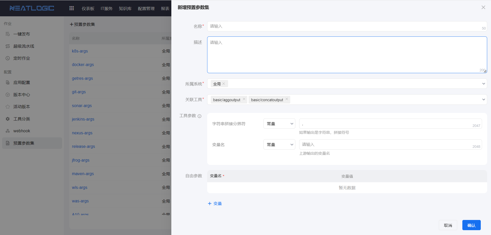
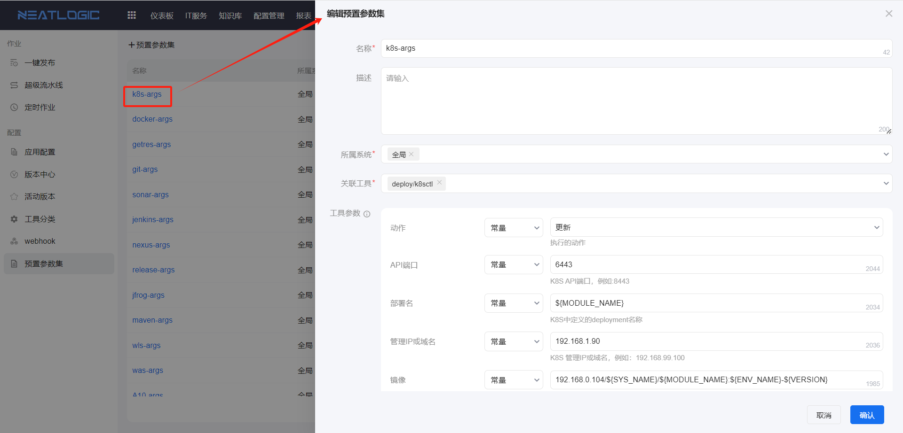
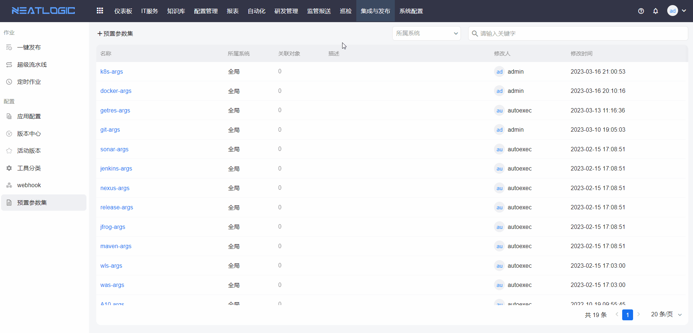
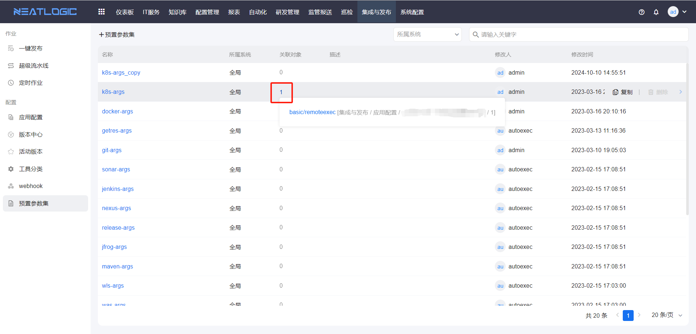

# 预置参数集

预置参数集用于将一个或多个工具脚本的常用参数值保存为可复用的参数集合。

在发布流水线中配置工具时，可以关联预置参数集，并将预置参数集中的值作为工具参数映射对象。该方式适合复用稳定的发布参数组合，减少在不同流水线中重复配置相同参数。

## 阅读路径

可根据当前要完成的操作选择阅读入口。

- 如果需要创建可复用的工具参数组合，阅读“添加预置参数集”。
- 如果需要调整已有参数集内容，阅读“编辑预置参数集”。
- 如果需要基于已有参数集创建相似配置，阅读“复制预置参数集”。
- 如果需要确认参数集被哪些配置引用，阅读“查看引用”。

## 权限

**操作权限**

- 配置：系统配置-[用户管理](../../100.系统配置/1.用户和权限/用户管理.md)-授权-自动发布管理权限
- 包含操作：访问预置参数集页面，添加、编辑、复制和查看预置参数集引用
- 配置人员：系统超级管理员

## 添加预置参数集

一个预置参数集可以关联多个工具。

创建参数集时，选择需要关联的工具，并为工具的常用参数预设参数值。后续在发布流水线中引用对应工具时，可以将预置参数集作为参数映射对象。

## 编辑预置参数集

编辑预置参数集用于调整已关联工具或已预设的参数值。

## 复制预置参数集

复制预置参数集用于基于已有参数集快速创建相似配置。

复制后，可以继续调整关联工具和参数值，避免重复创建相同的参数结构。

## 查看引用

查看引用用于确认当前预置参数集被哪些发布流水线或工具配置使用。

修改参数集前，建议先查看引用范围，避免影响已有发布流水线的参数配置。

