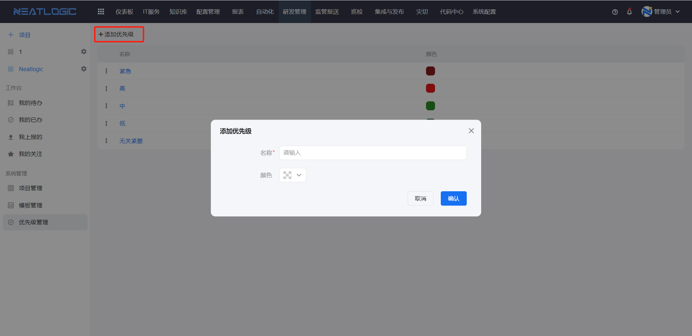

# 优先级管理
优先级是系统属性，应用于[模板管理](../7.研发管理/模板管理.md)-应用设置-属性设置，应用于定义需求、缺陷等应用紧急程度。优先级管理中可以由用户自定义优先级的数据，包括优先级名称、颜色和顺序。

相关的权限：系统配置-[权限管理](../100.系统配置/1.用户和权限/用户和权限.md)-研发管理-优先级管理权限

添加优先级

排序 
优先级左侧有排序图标，长按并拖动优先级移动到指定位置即可
