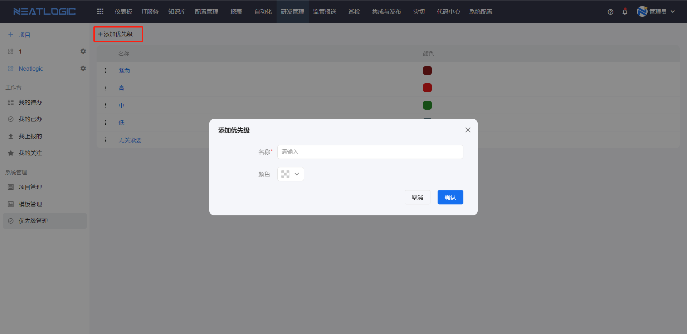
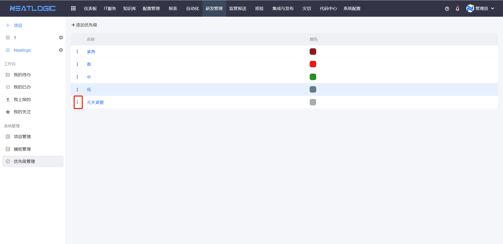

# 优先级管理

优先级是研发管理中的系统属性，应用于[模板管理](模板管理.md)-应用设置-属性设置，用于定义需求、缺陷等事务的紧急程度。

优先级管理支持自定义优先级数据，包括优先级名称、颜色和排序。

## 阅读路径

可根据当前要解决的问题选择阅读入口。

- 如果需要新增或调整优先级，阅读“添加优先级”。
- 如果需要调整优先级显示顺序，阅读“排序”。

## 权限

**操作权限**
- 配置：系统配置-[用户管理](../100.系统配置/1.用户和权限/用户管理.md)-授权-优先级管理权限
- 包含操作：新增、编辑、删除优先级，调整优先级排序
- 配置人员：系统超级管理员

## 添加优先级

添加优先级时，需要配置优先级名称和颜色。保存后，该优先级可以在模板属性或相关研发事务中使用。

## 排序

优先级左侧提供排序图标。长按并拖动优先级到目标位置后，即可调整优先级显示顺序。

