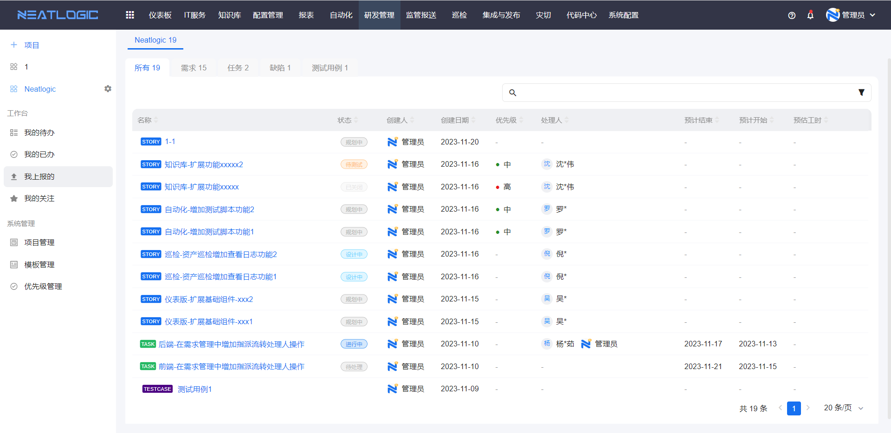
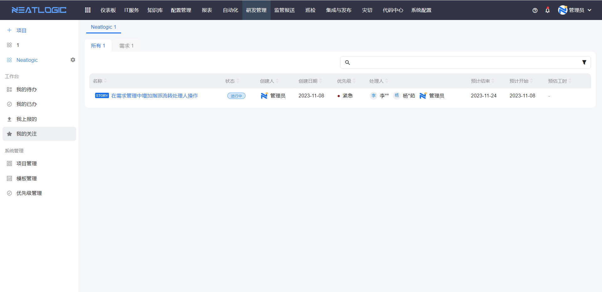
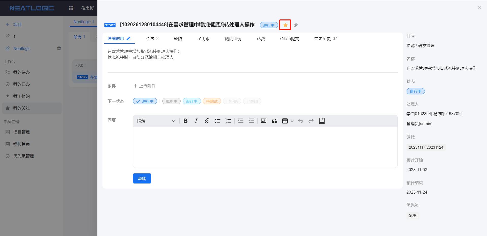

# 工作台
工作台是辅助用户快速查看自己相关内容的模块，包括“我的待办”、“我的已办”、“我的上报”和“我的关注”四个页面。

## 我的待办
我的待办列表显示当前登录人待处理的所有事务，这些事务要满足两个条件，处理人包含当前登录人，事务的状态是非关闭状态。

## 我的已办
我的一般列表显示当前登录人处理过的所有事务，这些事务不限状态，事务的变更记录中存在当前登录人的变更记录。

## 我的上报
我的上报列表显示创建人是当前登录用户的所有事务，这些事务不限状态。

## 我的关注
我的关注列表显示当前登录人关注的事务，在事务详情页面，可关注事务。

