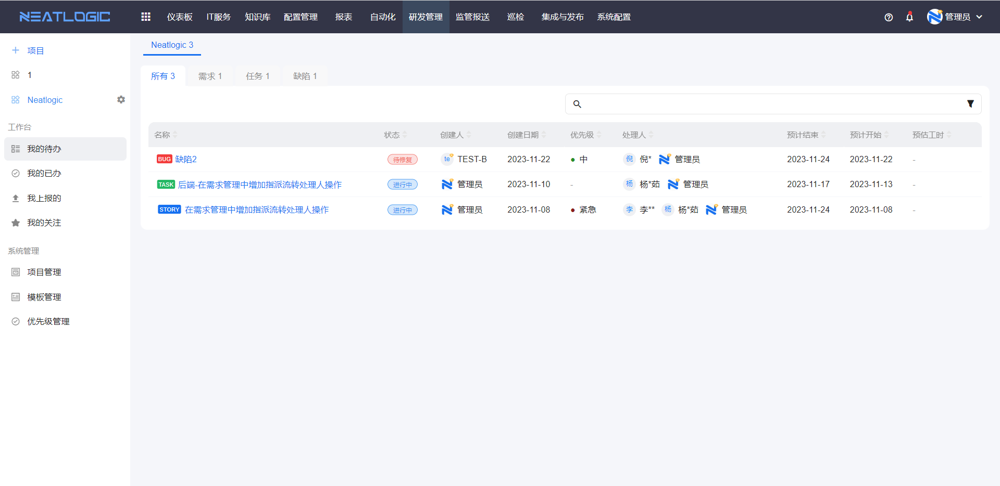
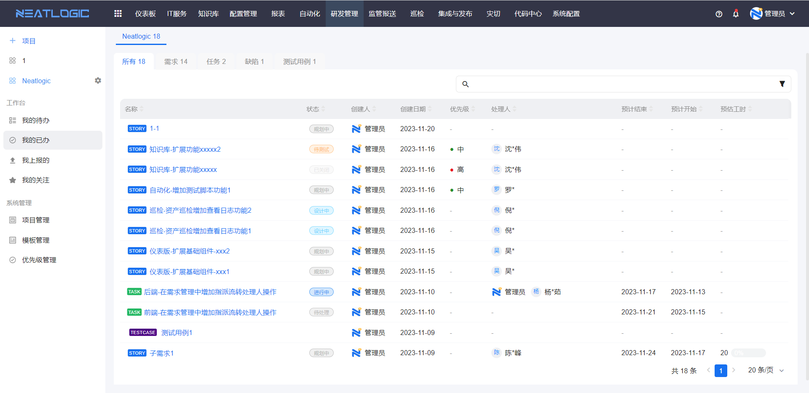
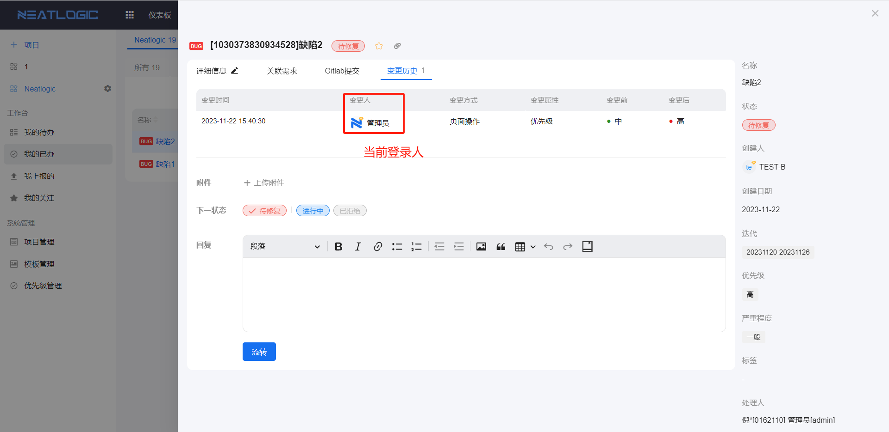
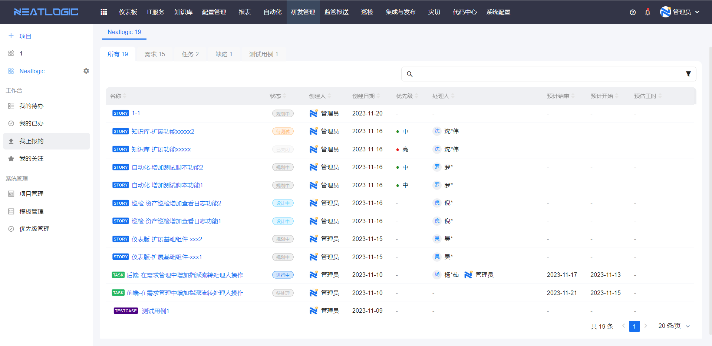
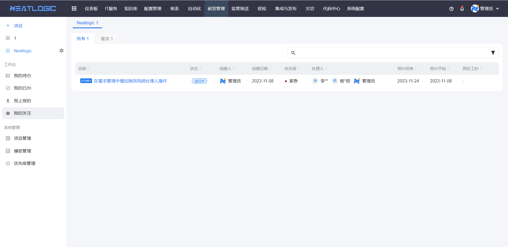
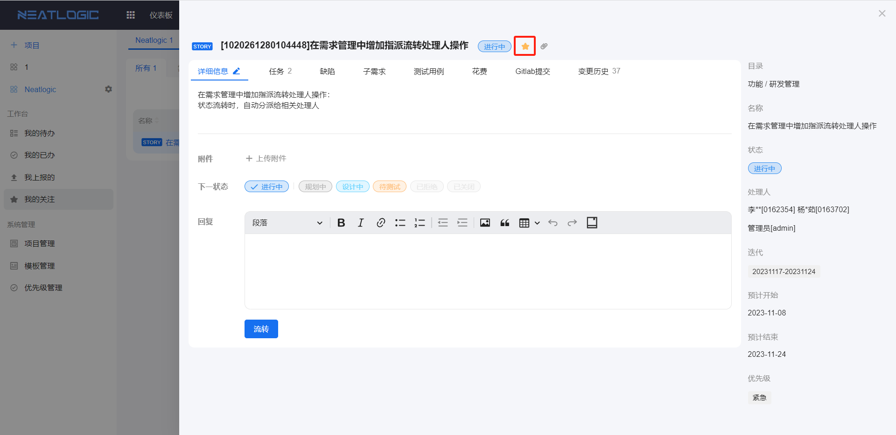

# 工作台

工作台用于集中查看与当前登录用户相关的研发事务，包括“我的待办”“我的已办”“我的上报”和“我的关注”。

## 阅读路径

可根据当前要解决的问题选择阅读入口。

- 如果需要处理分配给自己的事项，阅读“我的待办”。
- 如果需要查看自己处理过的事项，阅读“我的已办”。
- 如果需要跟踪自己创建的事项，阅读“我的上报”。
- 如果需要查看已关注事项的最新情况，阅读“我的关注”。

## 权限

**操作权限**
- 配置：系统配置-[用户管理](../100.系统配置/1.用户和权限/用户管理.md)-授权-研发管理基础权限
- 包含操作：访问我的待办、我的已办、我上报的和我的关注
- 配置人员：系统超级管理员

## 我的待办

我的待办展示当前登录用户需要处理的事务。进入该列表的事务需要同时满足两个条件：处理人包含当前登录用户，并且事务状态不是关闭状态。

## 我的已办

我的已办展示当前登录用户处理过的事务。该列表不限制事务状态，只要事务的变更记录中存在当前登录用户的操作记录，就会显示在我的已办中。

## 我的上报

我的上报展示由当前登录用户创建的事务。该列表不限制事务状态，便于用户持续跟踪自己提交的需求、缺陷或任务。

## 我的关注

我的关注展示当前登录用户已关注的事务。用户可以在事务详情页面关注事务，后续再通过该列表快速查看。

