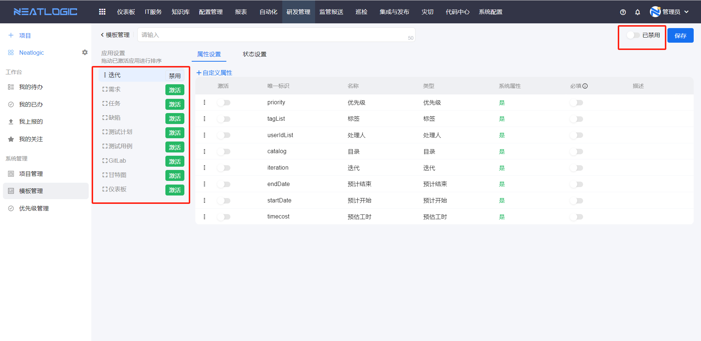
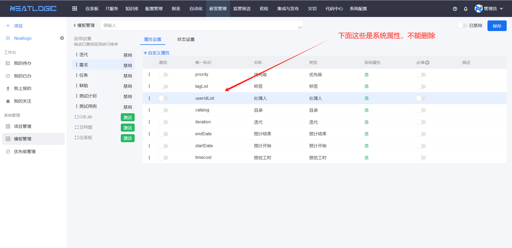
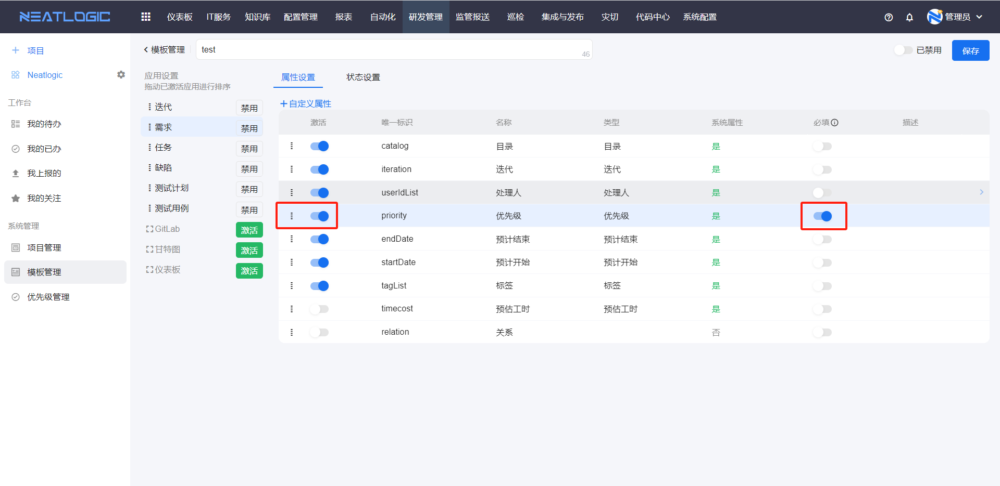
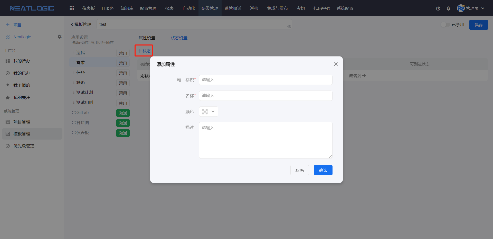
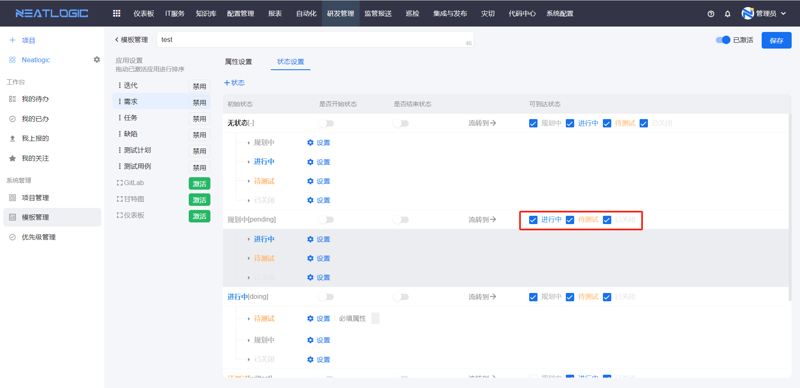
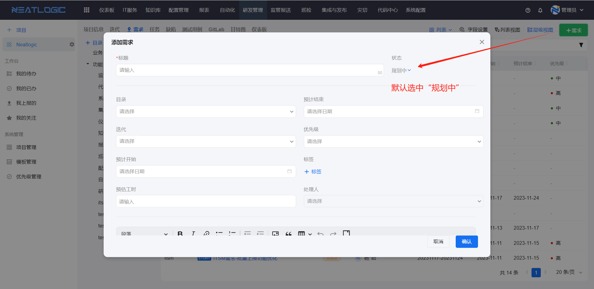
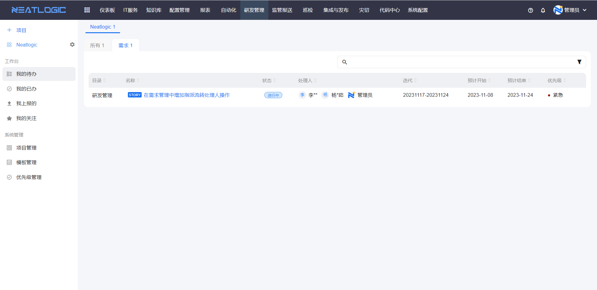
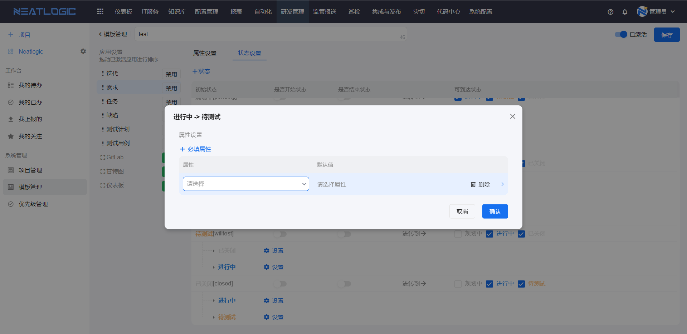
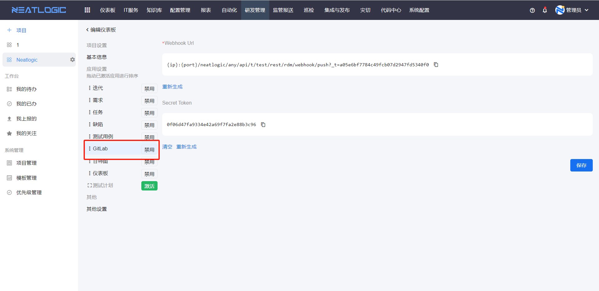

# 模板管理
模板是项目创建的基础模板，模板是由组成项目的各个应用的配置构成的，包括迭代、需求、缺陷、任务等应用，应用的配置又包括属性配置和状态配置。

相关权限：系统配置-[权限管理](../100.系统配置/用户和权限.md)-研发管理-项目模板管理权限

## 模板组成
模板中主要构成是应用设置和模板激活状态，应用设置可控制应用是否激活，以及定义激活应用的配置，模板的激活状态则是控制模板是否可以使用。

### 应用设置
应用设置总共包括迭代、需求、任务、缺陷、测试计划、测试用例、GitLab、甘特图、仪表版等应用。进行应用设置前，需激活需要配置的应用，激活的应用可以拖动排序。

迭代、需求、任务、缺陷、测试计划、测试用例的配置是相似的，由属性设置和状态设置构成，下面以需求为例来介绍具体功能。
#### 属性设置
需求属性列表中有系统属性，系统属性不能删除。

另外还支持添加自定义属性，自定义属性涵盖了常见的组件类型，比如文本、下拉框、日期类型，自定义属性可以删除。

用户根据需求激活属性，未激活的属性不能使用，属性可以定义为必填，属性还支持排序。

#### 状态设置
状态是用于跟踪进度的，比如需求的状态是在进行中或者已经处理完成。

状态是完全自定义的，包括状态基本信息、可到达状态、是否为开始状态、是否为结束状态、设置流转状态必填属性配置。

- 可到达状态：当前状态可以流转到的其他状态。
  
  例如“进行中”的需求状态可流转为“待测试”，在“进行中”的可到达状态勾选“待测试”，最终实现的效果如图。
  
- 是否为开始状态：状态被设定为开始状态，添加数据时，该状态就是默认状态。
  
  例如需求的“规划中”被设定为开始状态
  
  添加需求时，状态默认选中“规划中”。
  
- 是否为结束状态：结束状态是指状态达成关闭条件。
  
  例如迭代中的需求的结束状态包括“已关闭”，迭代的需求完成百分比是关闭的需求占所有需求的百分比。
  
  另外在待我处理的需求中，统计所有状态不是结束状态的需求。
  
- 设置流转状态必填属性：流转时属性值必填。
  

  #### Gitlab
  首先应用设置中，启用gitlab，并生成Webhook URL。
  
  然后在Gitlab（Gitee）的Webhook配置中，设置提交触发的事件，把生成的Webhook Url粘贴到配置中。
