# 模板管理

模板是创建项目时使用的基础配置，由项目中各类应用的配置组成，例如迭代、需求、缺陷、任务等。每个应用又可以包含属性配置和状态配置。

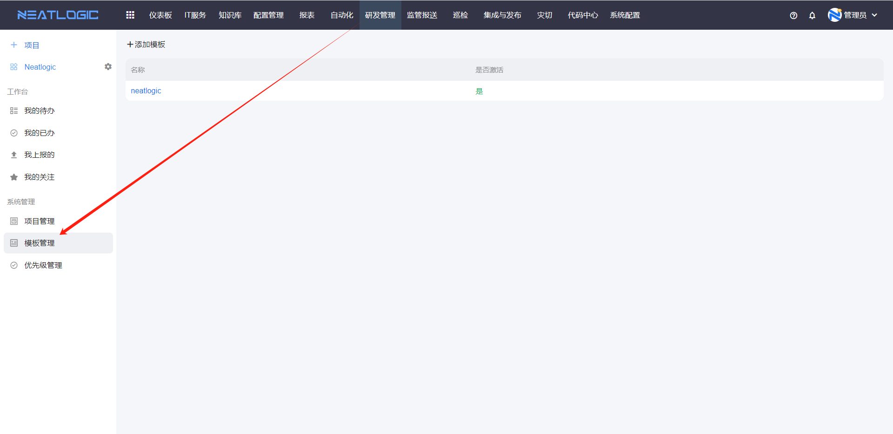

## 阅读路径

可根据当前要解决的问题选择阅读入口。

- 如果需要了解模板由哪些内容组成，阅读“模板组成”。
- 如果需要启用或调整项目应用，阅读“应用设置”。
- 如果需要配置需求、任务或缺陷的字段，阅读“属性设置”。
- 如果需要配置事务的状态和流转规则，阅读“状态设置”。
- 如果需要关联代码提交记录，阅读“GitLab”。

## 权限

**操作权限**
- 配置：系统配置-[用户管理](../100.系统配置/1.用户和权限/用户管理.md)-授权-项目模板管理权限
- 包含操作：新增、编辑、删除项目模板，维护模板中的应用设置、属性设置、状态设置和 GitLab 配置
- 配置人员：系统超级管理员

## 模板组成

模板主要由应用设置和模板激活状态组成。应用设置用于控制应用是否启用，并定义已启用应用的具体配置；模板激活状态用于控制模板是否可以被项目引用。

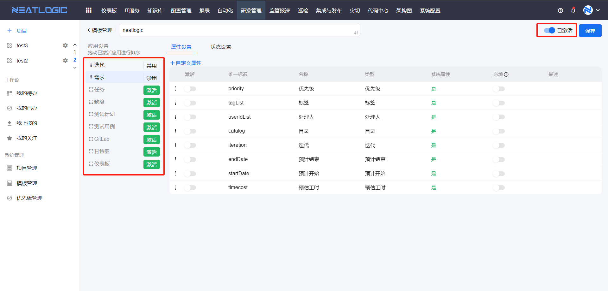

### 应用设置

应用设置包括迭代、需求、任务、缺陷、测试计划、测试用例、GitLab、甘特图、仪表板等应用。配置应用前，需要先启用对应应用；已启用的应用支持拖动排序。

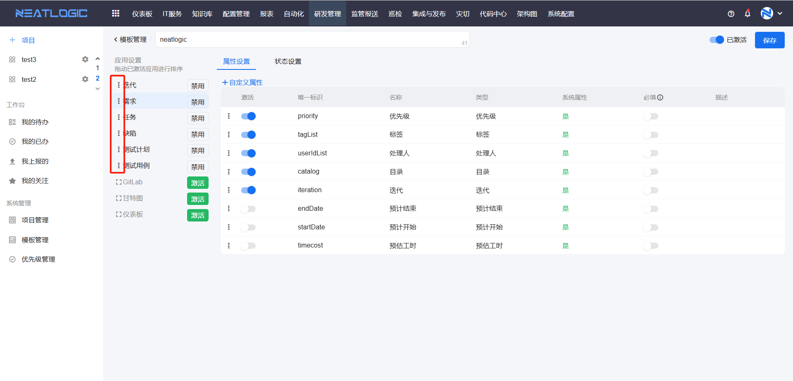

迭代、甘特图和仪表板不需要额外配置。需求、任务、缺陷、测试计划和测试用例的配置由属性设置和状态设置组成。下面以需求为例说明。

#### 属性设置

需求属性列表中包含系统属性。系统属性由系统预置，不支持修改和删除。

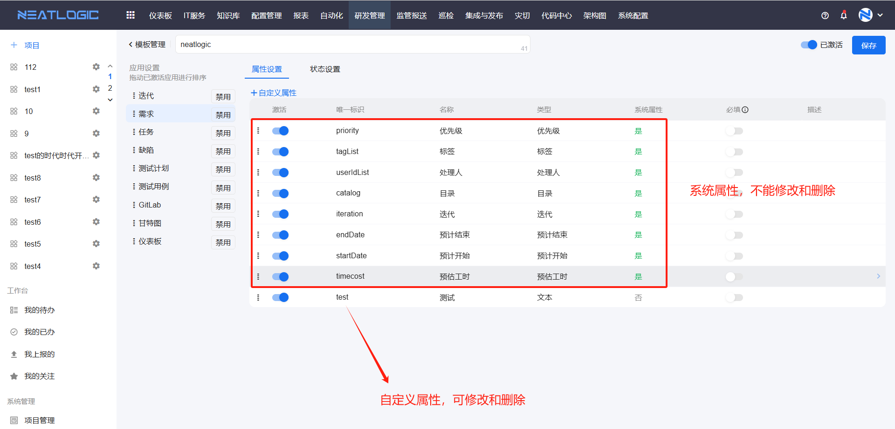

模板支持添加自定义属性。自定义属性覆盖常见组件类型，包括文本、下拉框、日期等；自定义属性可以修改和删除。

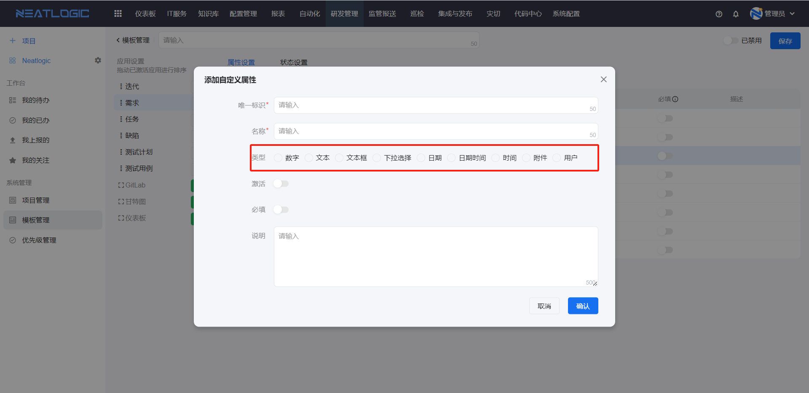

用户可以根据业务场景选择需要启用的属性。未启用的属性不会在应用中使用。属性还可以设置为必填，并支持拖动调整显示顺序。

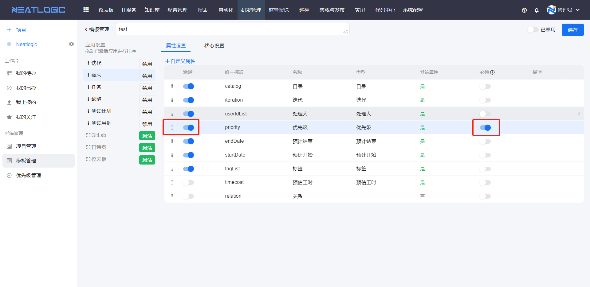

#### 状态设置

状态用于跟踪事务的处理进度，例如需求处于“进行中”或“已完成”。

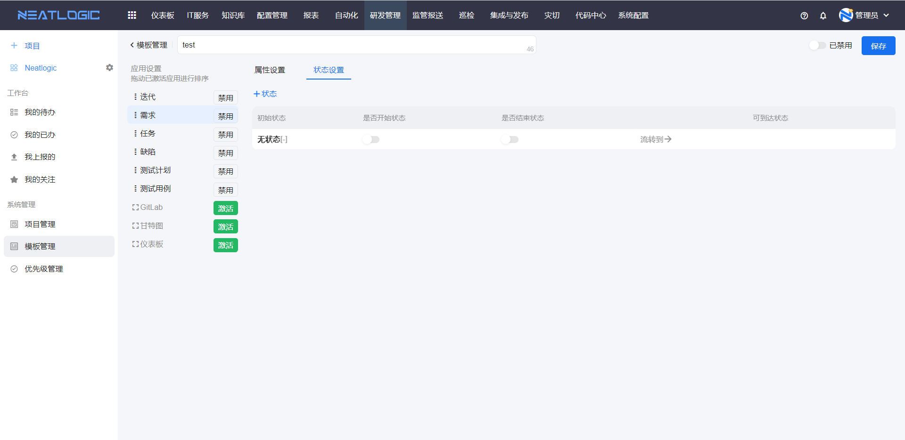

状态支持完全自定义，包括状态基本信息、可到达状态、是否为开始状态、是否为结束状态，以及流转到该状态时的必填属性配置。

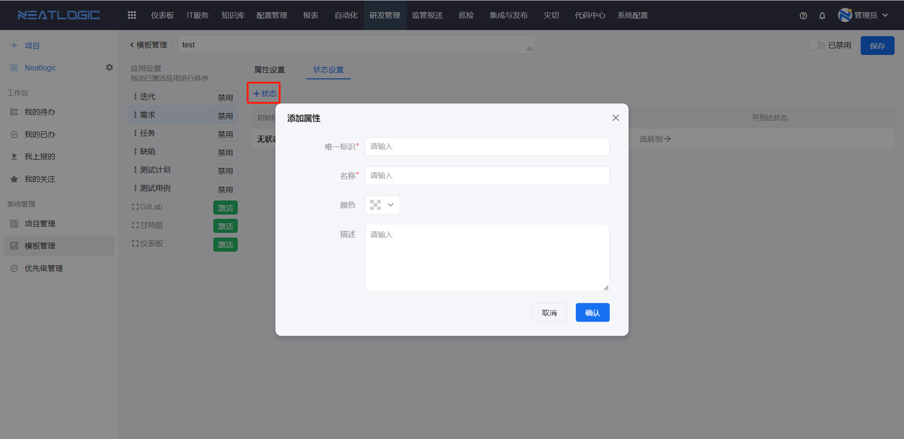

- **可到达状态**：定义当前状态可以流转到哪些其他状态。

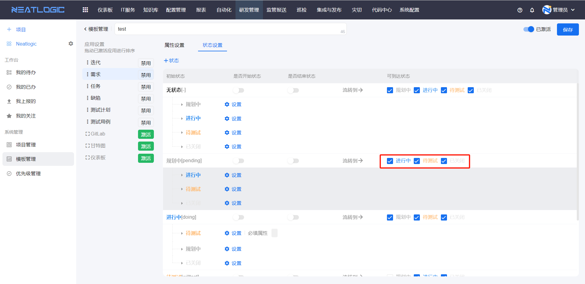

例如，“进行中”的需求可以流转为“待测试”时，需要在“进行中”的可到达状态中勾选“待测试”。最终效果如下：

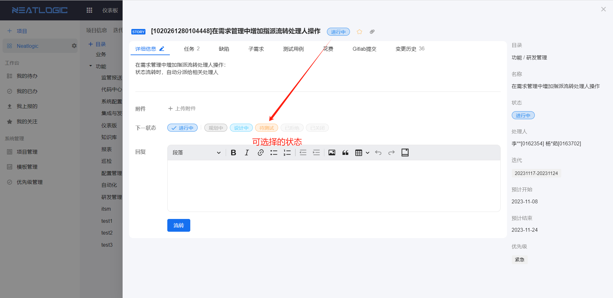

- **是否为开始状态**：状态被设置为开始状态后，新增数据时会默认选中该状态。

例如，将需求的“规划中”设置为开始状态：

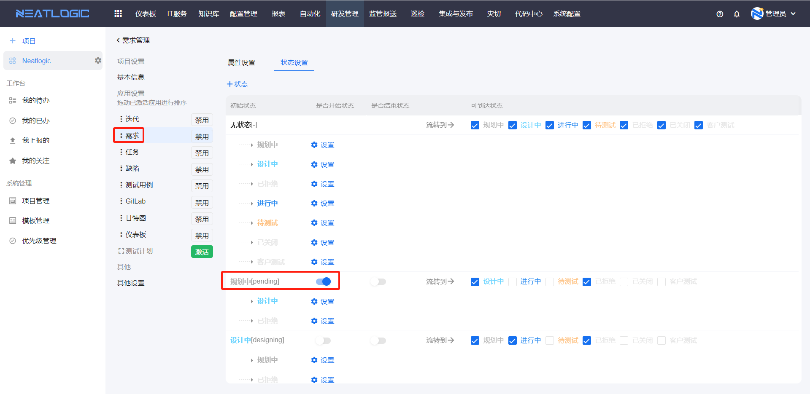

添加需求时，状态会默认选中“规划中”：

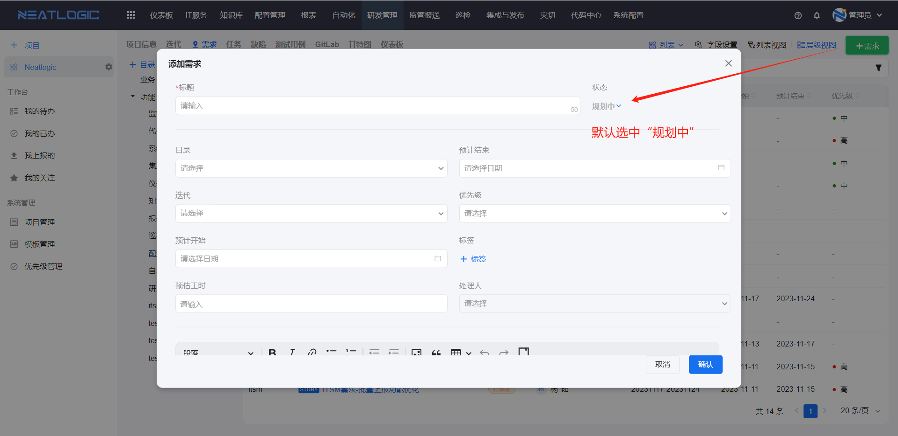

- **是否为结束状态**：结束状态表示事务已达到关闭条件。

例如，迭代中的需求结束状态包括“已关闭”时，迭代的需求完成百分比会按已关闭需求占全部需求的比例计算：

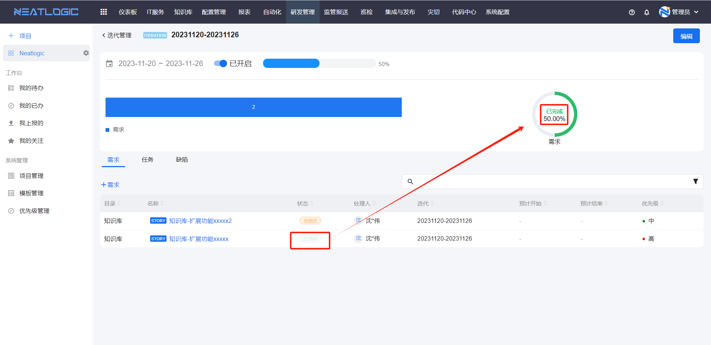

在我的待办需求中，系统会统计所有状态不是结束状态的需求：

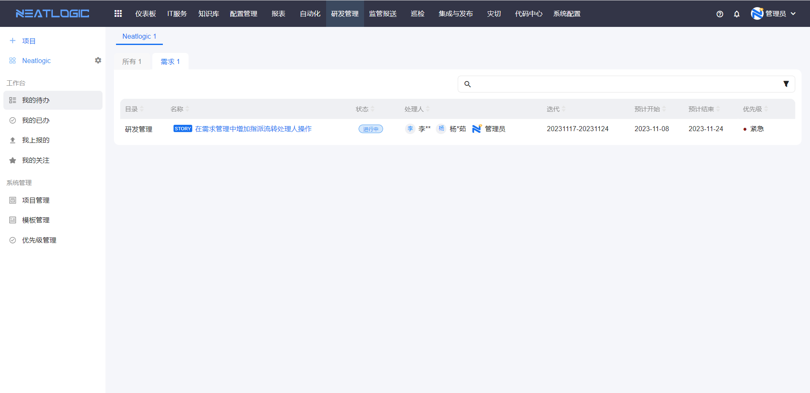

- **设置流转状态必填属性**：定义事务流转到指定状态时必须填写的属性。

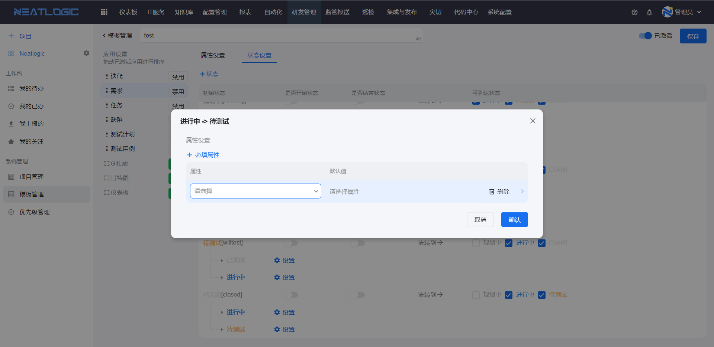

#### GitLab

在应用设置中启用 GitLab 后，系统会生成 Webhook URL。

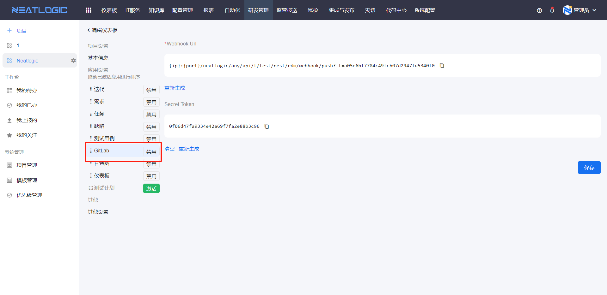

然后在 GitLab 或 Gitee 的 Webhook 配置中，选择需要触发的提交事件，并将系统生成的 Webhook URL 粘贴到对应配置中。
