# 项目应用功能

项目包括迭代、需求、缺陷和任务等应用。本文主要介绍迭代和需求功能。

## 阅读路径

可根据当前要解决的问题选择阅读入口。

- 如果需要按阶段管理项目事项，阅读“迭代”。
- 如果需要新建、编辑或关闭迭代，阅读“添加迭代”“编辑迭代”和“关闭迭代”。
- 如果需要把需求、任务、缺陷或测试用例加入迭代，阅读“管理迭代的事务”。
- 如果需要维护需求分类、列表视图和字段展示，阅读“需求目录”“需求列表”和“字段设置”。
- 如果需要推进需求处理，阅读“需求流转”和“编辑需求”。
- 如果需要拆分需求或关联任务、缺陷，阅读“子需求”和“关联任务、缺陷”。
- 如果需要关联代码提交记录，阅读“关联 GitLab”。
- 如果需要登记需求工时并查看完成度，阅读“花费”。
- 如果需要查看项目数据展示效果，阅读“仪表板”。

## 权限

**操作权限**
- 配置：系统配置-[用户管理](../100.系统配置/1.用户和权限/用户管理.md)-授权-研发管理基础权限
- 包含操作：访问项目管理菜单，查看项目内迭代、需求、缺陷和任务等应用数据
- 配置人员：系统超级管理员

> 项目内数据的新增、编辑、流转和关联操作，还会受到项目成员身份、项目配置和模板应用设置影响。

## 迭代

迭代用于按阶段管理项目事务。例如，可以将一个月作为一个迭代周期，用于集中管理该阶段内的需求、任务和缺陷。只有迭代内所有事务都关闭后，迭代才算完成。

迭代完成度为 100% 的效果如下：

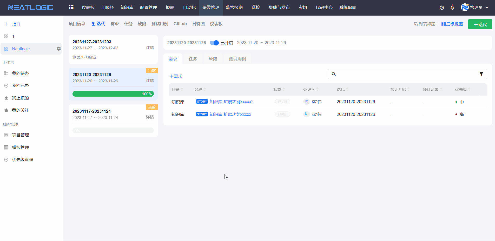

### 添加迭代

在迭代页面点击添加迭代，填写迭代信息并保存即可。

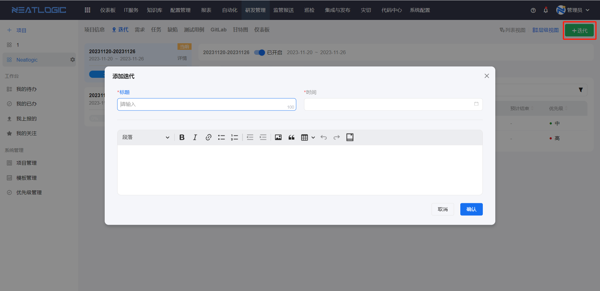

### 编辑迭代

在迭代详情页面点击编辑按钮，修改基本信息并保存即可。

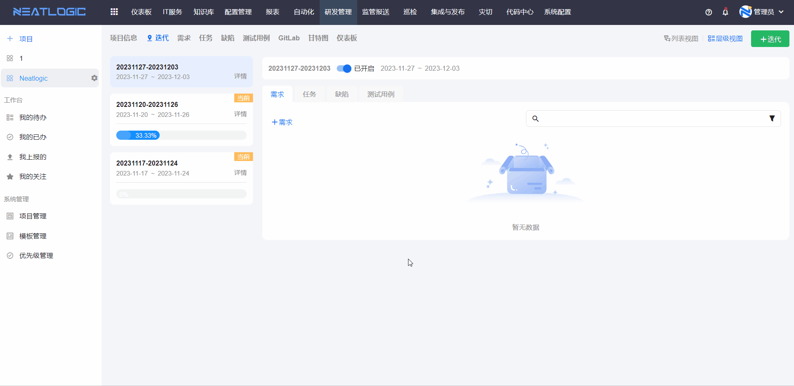

### 关闭迭代

迭代列表提供启用开关。关闭迭代后，左侧迭代列表会自动移除已关闭的迭代。

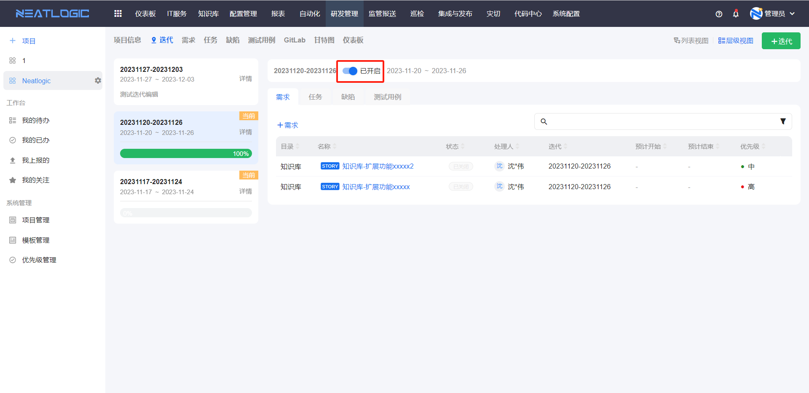

### 管理迭代的事务

在迭代中可以直接添加或移除需求、任务、缺陷和测试用例。

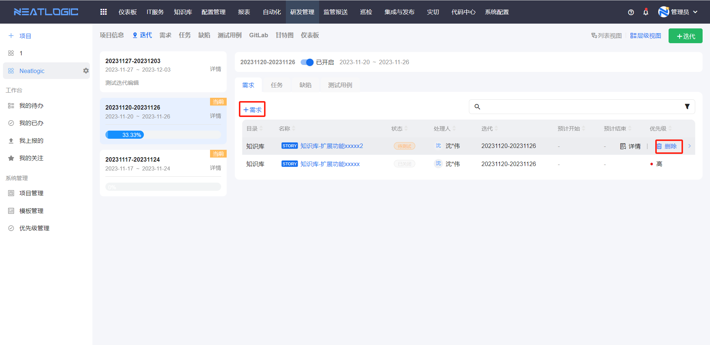

也可以在需求、缺陷等事务详情页面，通过迭代下拉框选择目标迭代。保存后，对应事务会加入该迭代。

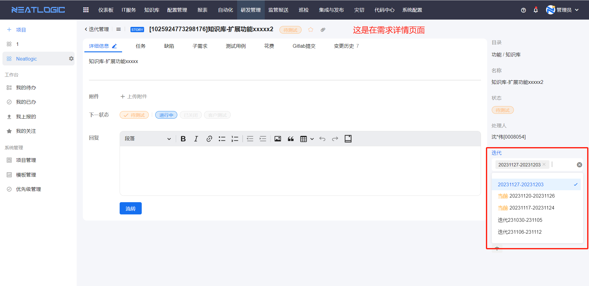

## 需求

需求页面由需求目录和需求列表组成。

### 需求目录

需求目录用于对需求进行分类管理，支持添加、编辑和删除。

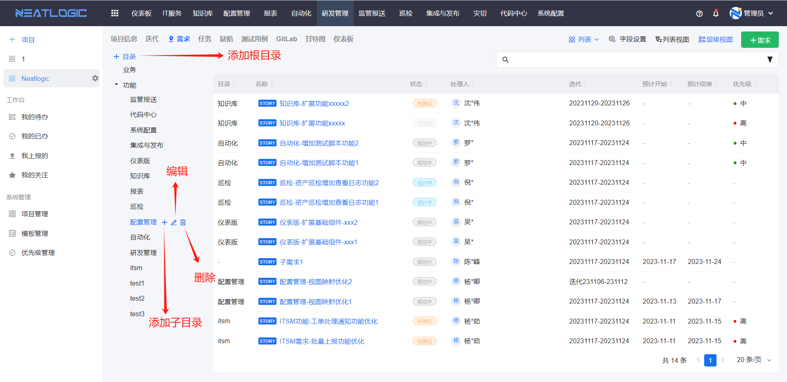

### 需求列表

需求列表默认以列表模式展示，也支持切换为故事墙和甘特图模式。

- **故事墙**：按需求状态展示需求，便于查看不同阶段的需求分布。

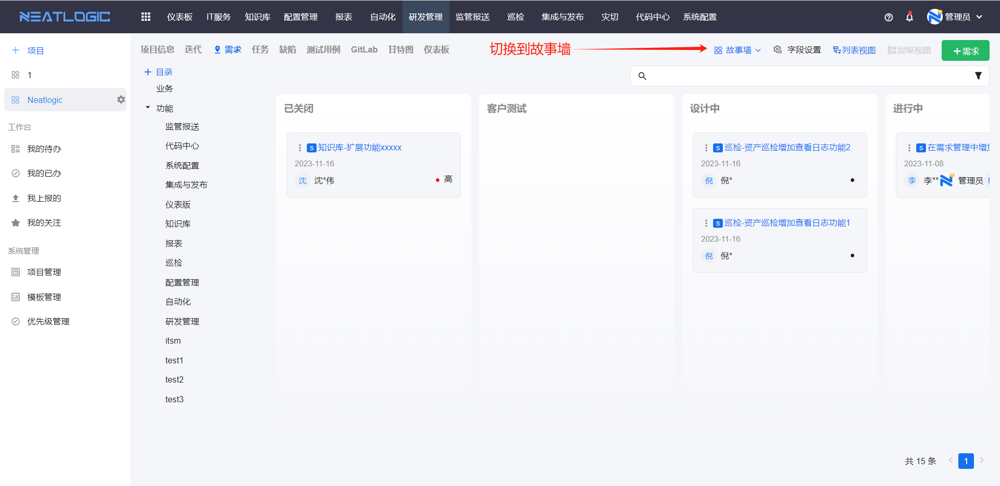

- **甘特图**：按需求计划时间展示需求，便于查看需求排期和进度。

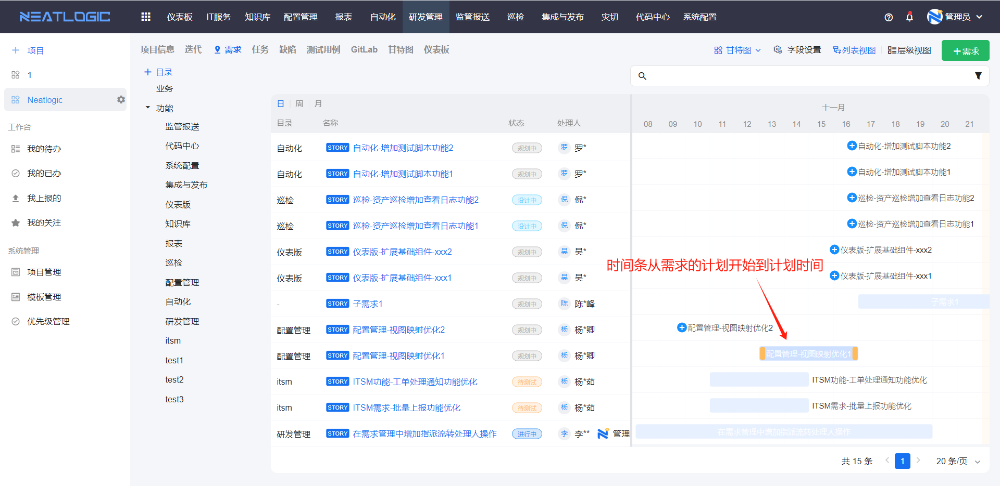

### 字段设置

表格字段可以通过字段设置调整显示方式和字段顺序。

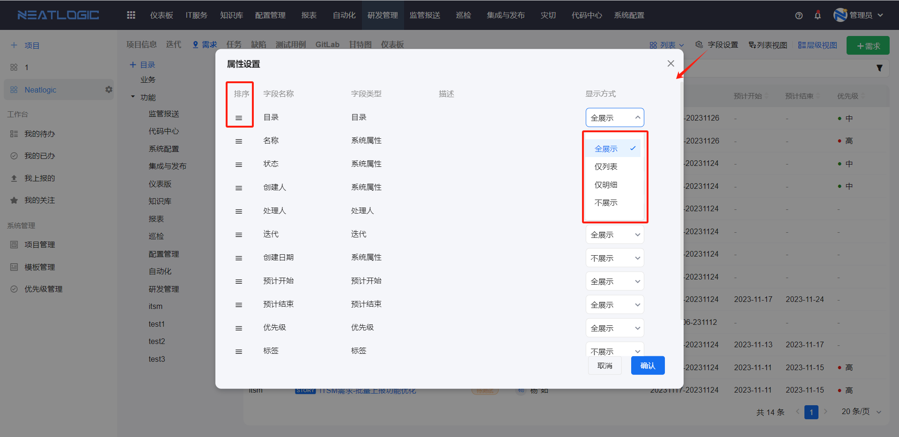

### 添加需求

在需求列表点击添加按钮，填写需求信息并保存即可。

需求中间区域展示需求属性。属性由项目的应用设置控制，详情可参考[项目管理](项目管理.md)-应用设置。

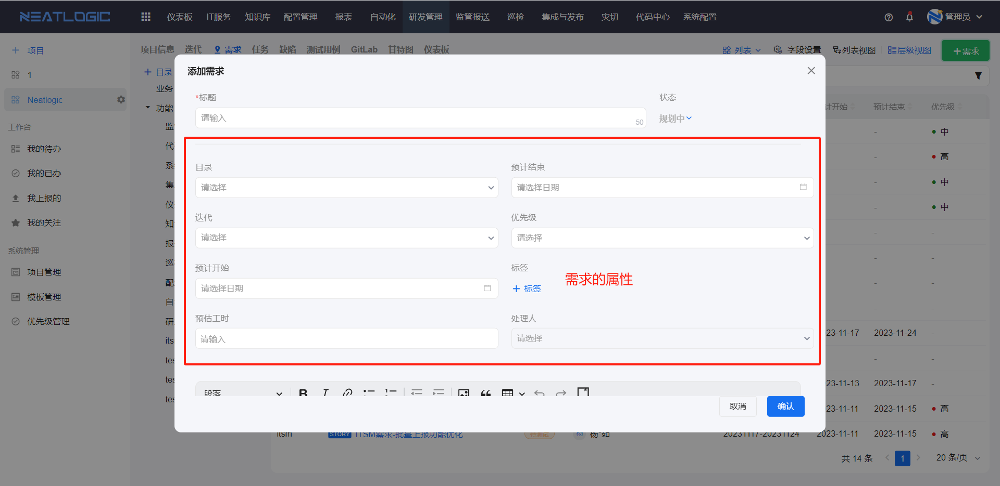

### 需求流转

需求处理主要通过状态流转完成。打开需求详情页面，选择下一状态后点击流转按钮，即可完成状态变更。

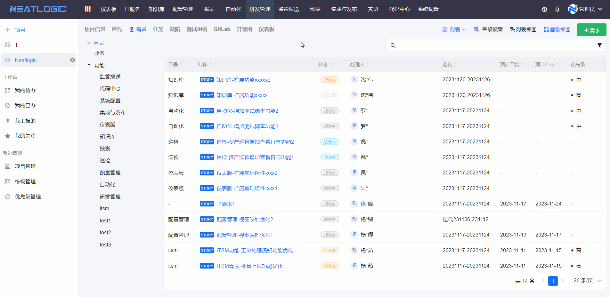

### 编辑需求

需求详情页面支持修改需求属性和基本信息。前提是该需求当前状态不是结束状态，结束状态说明可参考[模板管理](模板管理.md)-结束状态。

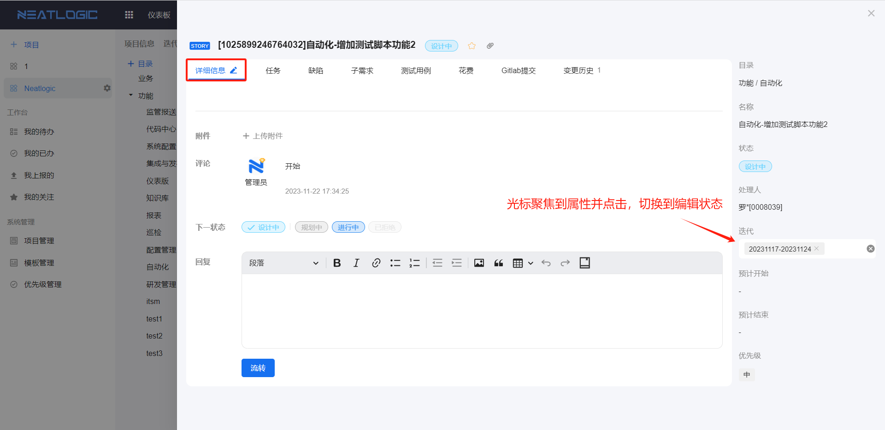

### 子需求

需求支持添加子需求，适合将较大的需求拆分为多个较小的需求。子需求支持添加、编辑、删除、断联和查看详情等操作。

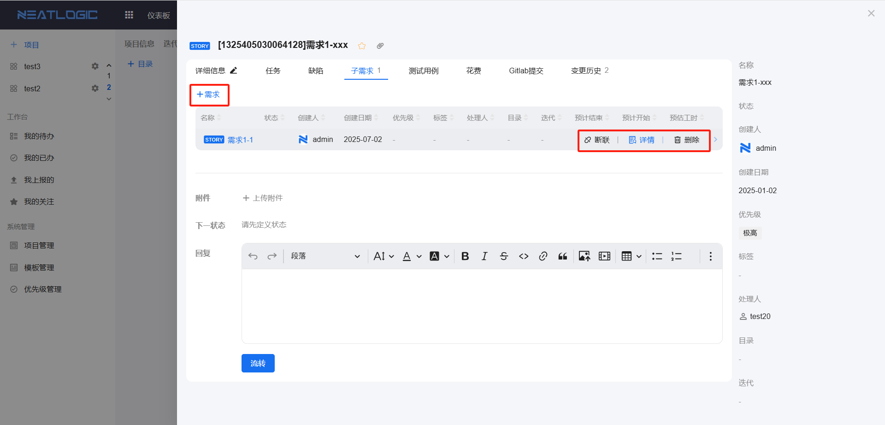

### 关联任务、缺陷

需求支持关联任务、缺陷等事务。在需求详情页面，可以快速添加任务、缺陷，也可以关联已有的任务、缺陷。

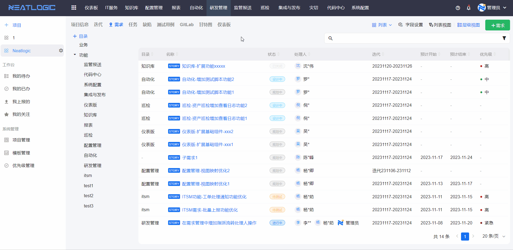

### 关联 GitLab

在 GitLab 中提交代码时，将需求的源码关键字复制到提交 message 中。提交完成后，需求详情的 GitLab 提交区域会生成对应提交记录。

GitLab 配置可参考[模板管理](模板管理.md)。

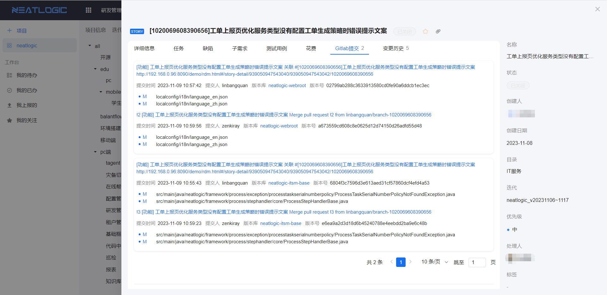

在需求详情中复制源码关键字，效果如下：

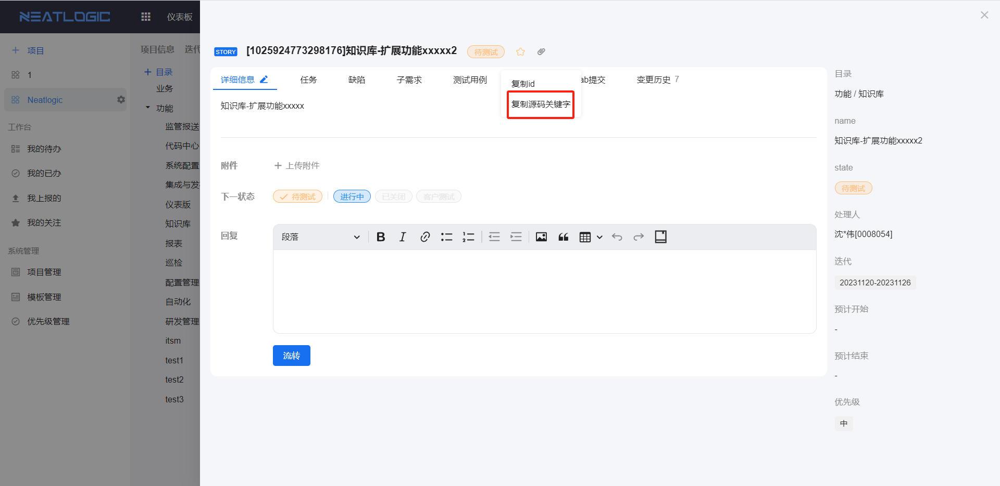

### 花费

需求花费通常与预估工时结合使用。需求列表会根据已登记花费时间占预估工时的比例，计算需求完成百分比。

**示例**：下图中的需求预估工时为 20，花费时间为 0，当前完成度为 0%。

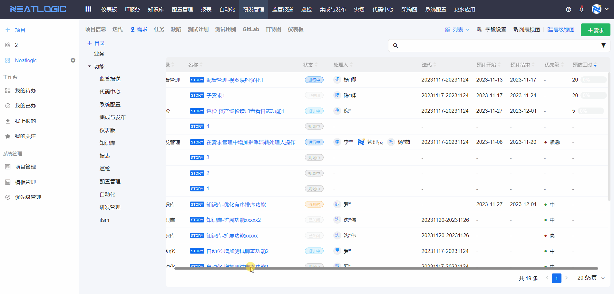

添加 5 工时的花费：

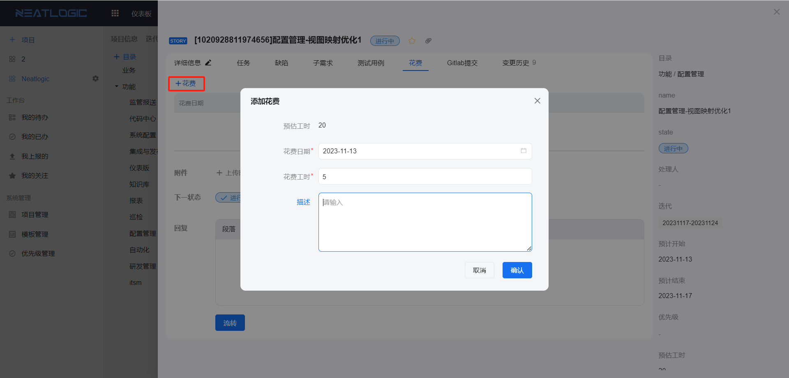

需求完成度更新为 25%：

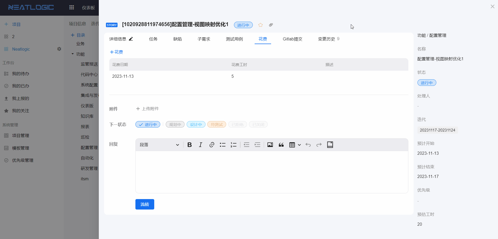

## 仪表板

项目支持配置基于研发管理模块数据的仪表板，数据源来自[数据仓库](../../100.系统配置/3.数据和集成/数据仓库.md)。

项目的仪表板配置详情可参考[仪表板管理](../../1.仪表板/仪表板管理.md)。

仪表板效果预览如下：

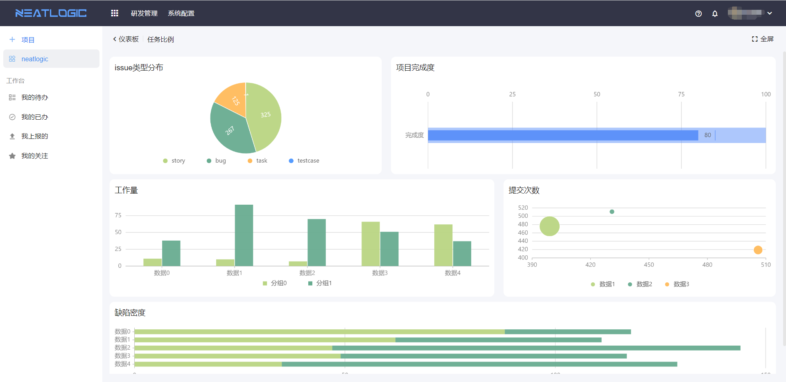
