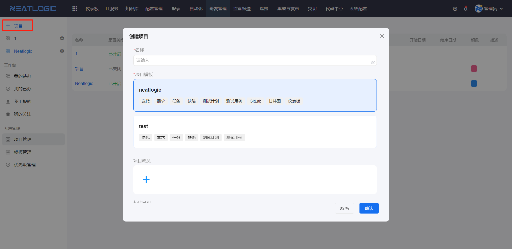
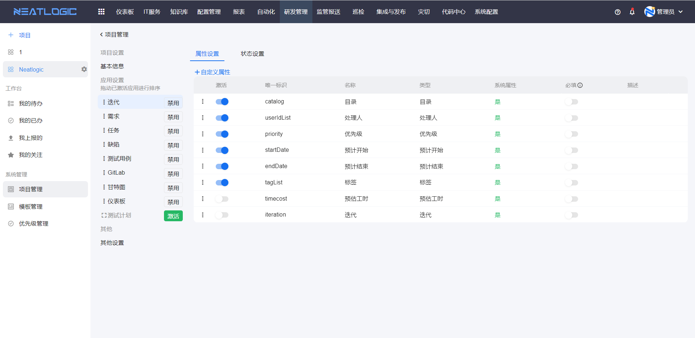
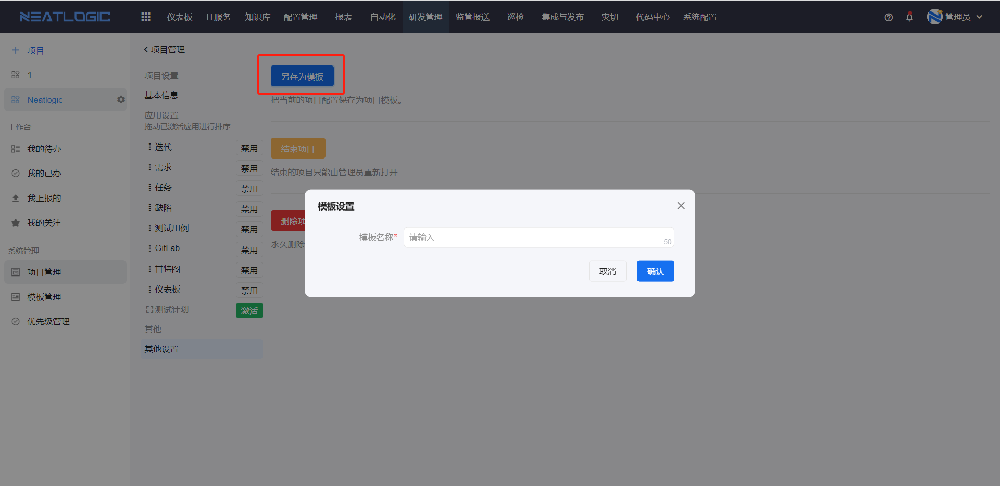

# 项目管理
项目是在引用模板的基础上创建的一个管理迭代、需求、缺陷等数据集合的载体。项目管理的功能包括了添加、编辑、删除项目和另存为模板等。

相关权限：系统配置-[权限管理](../100.系统配置/用户和权限.md)-研发管理-项目管理权限

## 添加项目
点击左上角添加项目按钮，出现添加项目弹窗，选择目标模板并配置项目的人员组成和基本信息，保存即可。

## 编辑项目
项目所有人或者有项目管理权限的用户才能编辑项目。
编辑入口如图。

编辑页面支持重新编辑项目基本信息和应用设置，应用设置的操作可以参考模板管理-[应用设置](../7.研发管理/模板管理.md/#应用设置)。

## 删除项目
在编辑项目页面-其他配置中，支持删除项目操作，删除后项目不可恢复。

## 结束项目
项目结束后，项目列表不回显相应的项目，但是项目还可以由项目管理员恢复。

## 另存为模板
项目当前配置支持另存为新的模板，这样可以方便新项目沿用该项目的配置。
