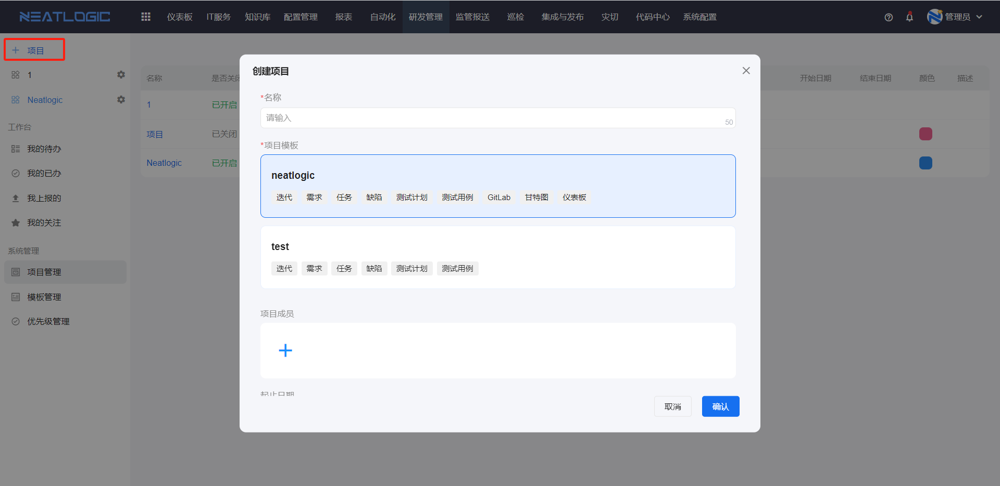
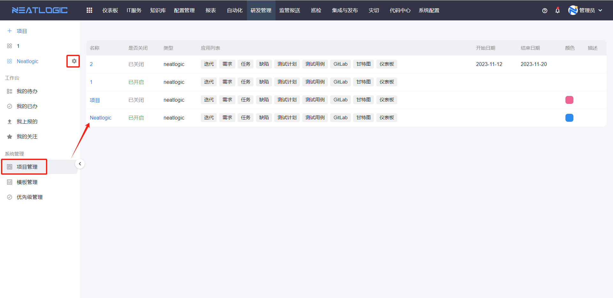
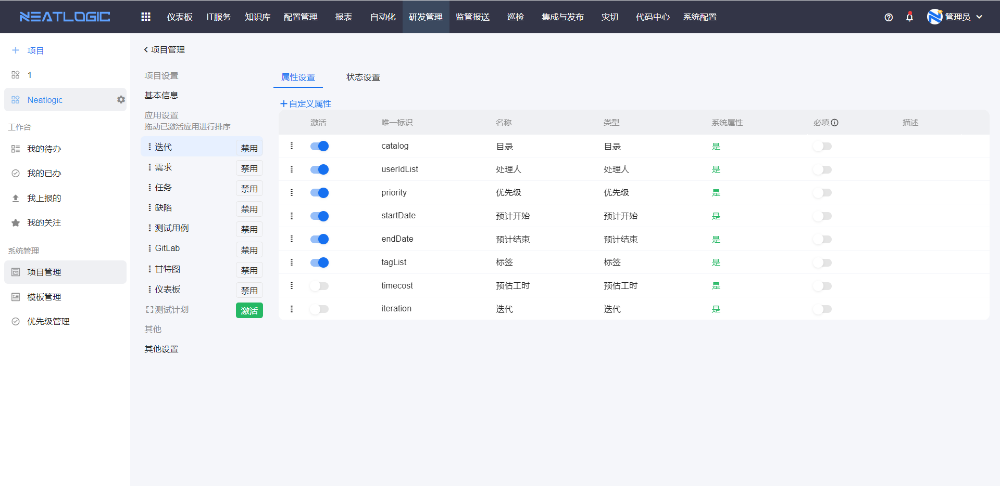
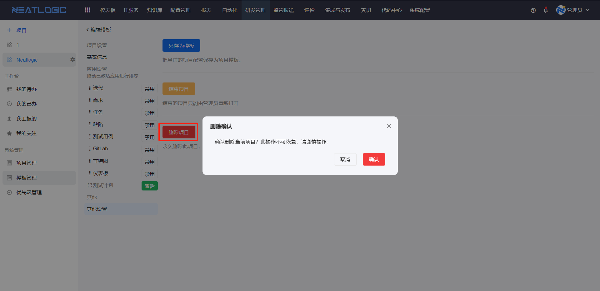
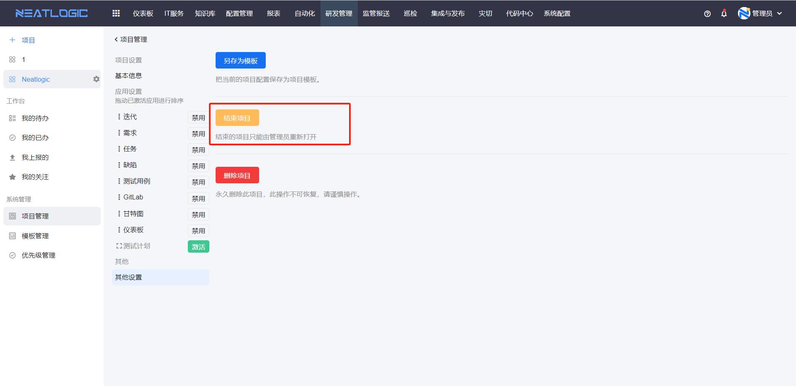
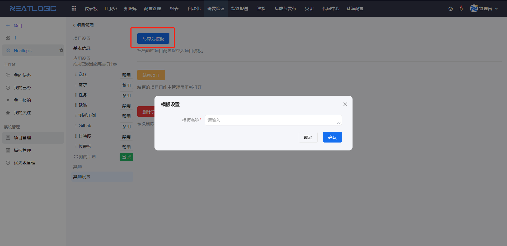

# 项目管理

项目是在引用模板的基础上创建的研发管理载体，用于集中管理迭代、需求、缺陷等数据。项目管理支持添加、编辑、删除项目、结束项目和另存为模板等操作。

## 阅读路径

可根据当前要解决的问题选择阅读入口。

- 如果需要创建项目，阅读“添加项目”。
- 如果需要调整项目基本信息或应用设置，阅读“编辑项目”。
- 如果需要停用一个已完成的项目，阅读“结束项目”。
- 如果需要清理不再使用的项目，阅读“删除项目”。
- 如果需要复用当前项目配置，阅读“另存为模板”。

## 权限

**操作权限**
- 配置：系统配置-[用户管理](../100.系统配置/1.用户和权限/用户管理.md)-授权-研发管理基础权限
- 包含操作：访问项目管理菜单，查看项目列表和项目基础信息
- 配置人员：系统超级管理员

**操作权限**
- 配置：系统配置-[用户管理](../100.系统配置/1.用户和权限/用户管理.md)-授权-项目管理权限
- 包含操作：新增、编辑、删除项目，结束项目，将项目另存为模板
- 配置人员：系统超级管理员

## 添加项目

点击左上角的添加项目按钮后，系统会打开添加项目弹窗。选择目标模板，并配置项目人员组成和基本信息后，保存即可创建项目。

## 编辑项目

项目所有人或拥有项目管理权限的用户可以编辑项目。

编辑入口如图：

编辑页面支持重新维护项目基本信息和应用设置。应用设置的具体说明可参考[模板管理](模板管理.md)-应用设置。

## 删除项目

在编辑项目页面的“其他配置”中，可以执行删除项目操作。项目删除后不可恢复，操作前需要确认该项目不再使用。

## 结束项目

项目结束后，不再显示在项目列表中，但项目管理员仍可以恢复该项目。

## 另存为模板

项目当前配置可以另存为新的模板。适合将已有项目的成熟配置沉淀下来，供新项目继续沿用。

