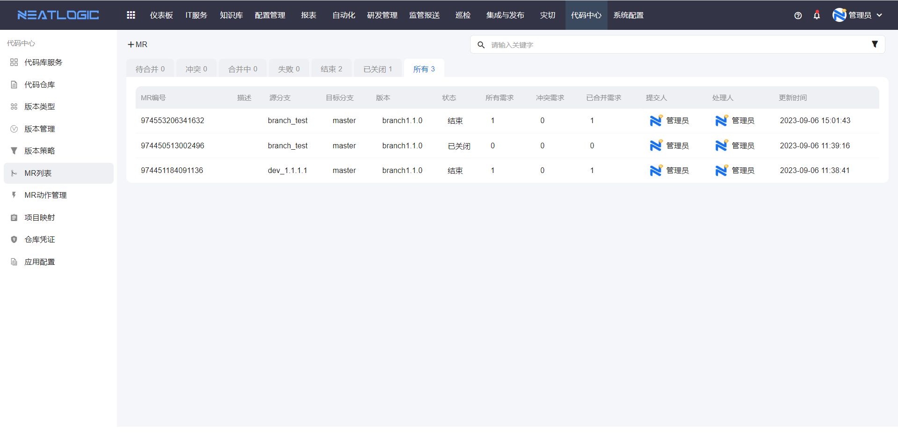
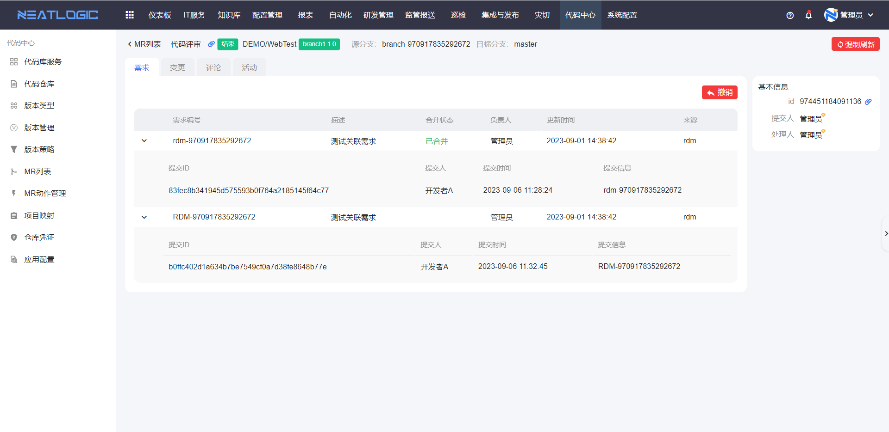
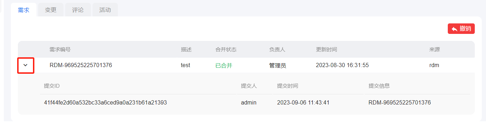
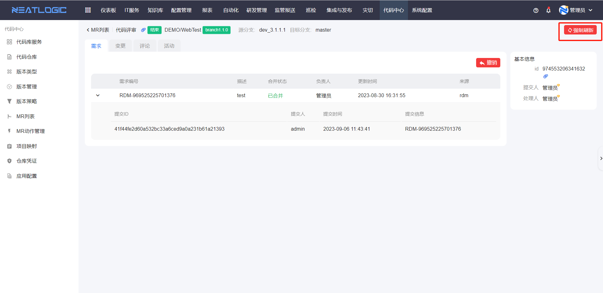
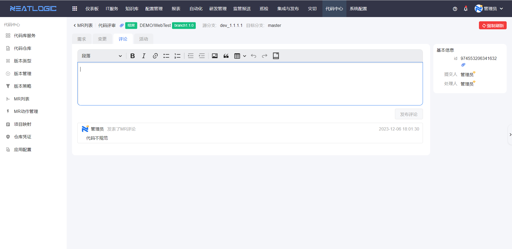
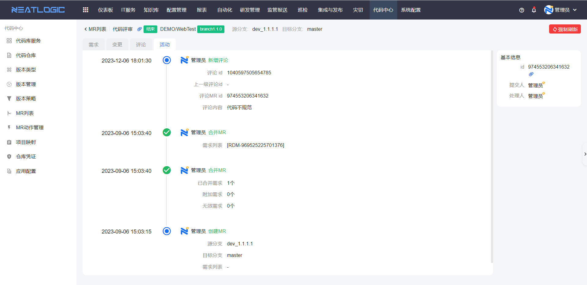

# MR列表
MR列表汇总了所有MR合并请求，并按照合并状态分类，支持快速添加MR合并请求和对合并结果进行代码评审。

## 添加MR
点击添加MR按钮即可跳转到添加页面，更多操作详情参考版本管理-[创建MR](版本管理.md/#创建mr)

## 代码评审
入口:可在版本管理、mr列表中创建mr后进入代码评审页，也可在mr列表中点击某一个mr进入该页面。

功能：代码评审页可对mr进行合并，并可对文件内容及mr进行评论，以及查看mr的相关信息，包括需求列表、commit列表、文件变更详情、评论内容、mr活动记录等。

界面介绍：在代码评审页中，顶部显示mr的描述信息、系统、子系统信息、版本号、mr状态、源分支及目标分支。其中，点击mr状态左侧的复制链接按钮，可复制当前mr的url。

中间主体部分分为4个栏目，分别是需求、变更、评论、活动。需求栏可查看需求及需求下的commit的相关信息，并可对mr进行合并；变更栏可查看commit下文件的变更详情，并对内容进行评论；评论栏可查看所有的行评论及mr评论，并可进行mr评论；活动栏展示整个mr的合并、评论记录。
在页面右测，上方有一个强制刷新按钮，只有在需求、变更栏中点击才有效果（具体作用后面会说）；在下方，展示了mr的id及人员信息。

### 需求
#### 需求型
1. 合并
   打开待合并MR的代码评审页面，点击合并即可。

   从第一个需求开始，合并需求下的所有commit到目标分支，根据合并状况来显示合并状态（见下表），接着合并第二个需求，以此类推。

   当需求为无效需求时，则不进行合并，合并状态变为无效。

   <table style="width:100%">
<thead>
    <tr>
        <td>当前状态</td>
        <td>可执行动作</td>
        <td>下一状态</td>
    </tr>
</thead>
<tbody>
    <tr>
        <td>待合并</td>
        <td>合并</td>
        <td>合并中</td>
    </tr>
    <tr>
        <td>冲突</td>
        <td>重试</td>
        <td>已合并，冲突</td>
    </tr>
    <tr>
        <td>合并中</td>
        <td>无</td>
        <td>已合并，冲突</td>
    </tr>
    <tr>
        <td>已合并</td>
        <td>无</td>
        <td>无</td>
    </tr>
</tbody>
</table>

2. 需求冲突时的处理
   
   当需求中的某个commit合并产生冲突时，则需求合并状态变为冲突。如果遇到冲突需求选择“终止”，则列表中出现第一个冲突的需求时，则不再往下执行合并，右下角出现“重试”按钮，mr状态变为为冲突；遇到冲突需求选择“继续”，则列表中出现一个冲突的需求时，依然往下执行合并，最终mr状态为冲突，右下角出现“重试”按钮。

3. commit列表
   
   在需求的任何状态下都可通过点击需求的下拉按钮来查看该需求下所有commit的信息，包括提交id编号、提交人、提交时间、合并状态（包括：已合并、待合并、冲突）、提交的commit信息（见下图）。
   
4. commit的变更列表
   
   点击一条commit，可进入跳转至变更tab，展示该条commit的变更信息。

5. 强制刷新
   
   当在线下修改commit的mssage强行改变需求与commit的关系时，需手动点击手动刷新按钮获取最新的commit。
   

6. 附加需求
   
   当mr状态为已合并状态，会扫描目标分支的commit。如果目标分支上扫描到不在mr中的需求，会被当成附加需求显示出来。另外如果在创建mr时需求状态为无效，却在目标分支中被扫描出来的需求也会当做是附加需求。
   
   附加需求无commit列表展示。

7. 撤销需求
   
   当要撤销的需求关联的所有mr状态均为已关闭或已完成，则可对这个需求进行撤销，点击需求右侧的撤销按钮可进行撤销。

   点击撤销后，会扫描包含该需求的所有mr状态。当所有mr状态为已完成或已关闭时，才可进入创建撤销mr页面。

   进入撤销mr创建页时，需求列表仅展示点击撤销的那条需求，且源分支与目标分支相同。此时可输入mr描述（如不输入描述，则mr描述统一为：Revert issue XXX），点击提交进入撤销mr处理页。

   撤销也会遇到冲突及失败的状况，与普通的mr一样。

8. MR状态
   
   合并需求完毕时，会根据所有的需求状态计算MR状态（见下表）。
   
   说明：
   
   （1）当MR下所有需求状态均为已合并，则MR状态为结束。合并中、关闭、结束状态的MR无法进行任何操作；
   
   （2）当代码在workingcopy中merge成功但push到远程失败，或workingcopy中的目标分支和远程有冲突，则状态为失败。
   <table style="width:100%">
<thead>
    <tr>
        <td>当前状态</td>
        <td>可执行动作</td>
        <td>下一状态</td>
    </tr>
</thead>
<tbody>
    <tr>
        <td rowspan="2">待合并</td>
        <td>合并</td>
        <td>以下的任一状态</td>
    </tr>
    <tr>
        <td>关闭</td>
        <td>关闭</td>
    </tr>
    <tr>
        <td>冲突</td>
        <td>重试</td>
        <td>冲突，失败，结束</td>
    </tr>
    <tr>
        <td>合并中</td>
        <td>无</td>
        <td>结束，冲突，失败</td>
    </tr>
    <tr>
        <td>失败</td>
        <td>重试</td>
        <td>失败，冲突，结束</td>
    </tr>
    <tr>
        <td>结束</td>
        <td>无</td>
        <td>无</td>
    </tr>
    <tr>
        <td>关闭</td>
        <td>无</td>
        <td>无</td>
    </tr>
    
</tbody>
</table>

#### 分支型
分支型合并的需求tab展示和功能与需求型大体一致，只是分支型mr不会展示附加需求、无效需求，未关联需求的commit会在未知需求中一并展示。

分支型mr是以分支为单位进行合并的，所以无法撤销需求。

### 变更
#### 需求型
1. 文件变更
   
   需求型mr中，直接进入变更栏，默认展示的是最新commit的变更情况。

   在左侧可查看当前的commit中包含哪些文件，文件名右侧展示了文件内容的变更总体情况，其中蓝色的数字显示新增多少行，红色的数字显示删减多少行。点击文件后，右侧跳转至对应的文件顶部，并会加粗显示以提示用户当前查看的是这个文件。

   在右侧展示当前commit下的所有文件的diff情况。Commit列表可选择当前mr中的所有commit。diff的展示分为两种：逐行对比及左右对比，逐行对比是新增行、删减行都在同一页展示；左右对比是删减行在左侧，新增行在右侧。

2. 文件下载
   
   当文件为二进制文件时，无法在线查看，只能下载。

#### 分支型
分支型的变更栏默认展示的是整个mr的diff情况。

### 评论
进入评论栏，可查看已有的mr评论和所有行评论，并可对当前mr发表mr型评论。

### 活动
进入活动栏，可查看整个mr的活动日志，包括：评论记录、合并记录。
