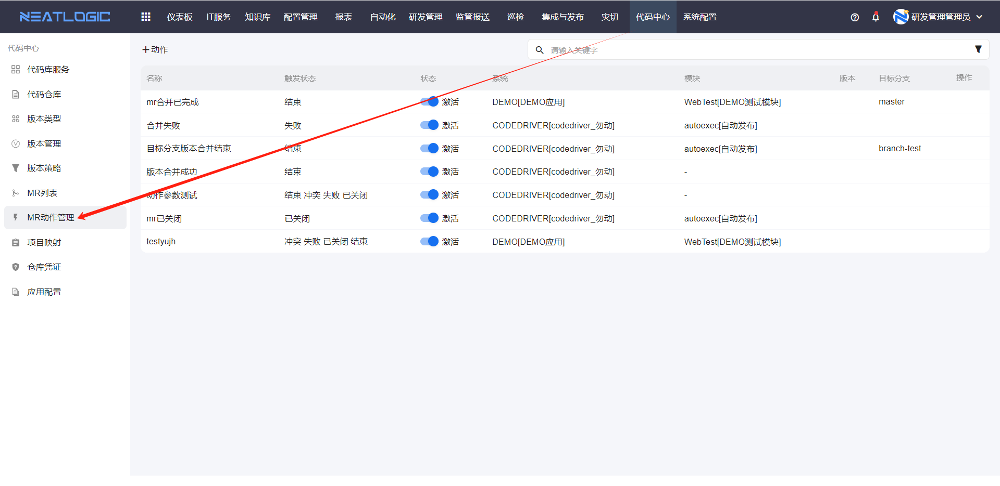
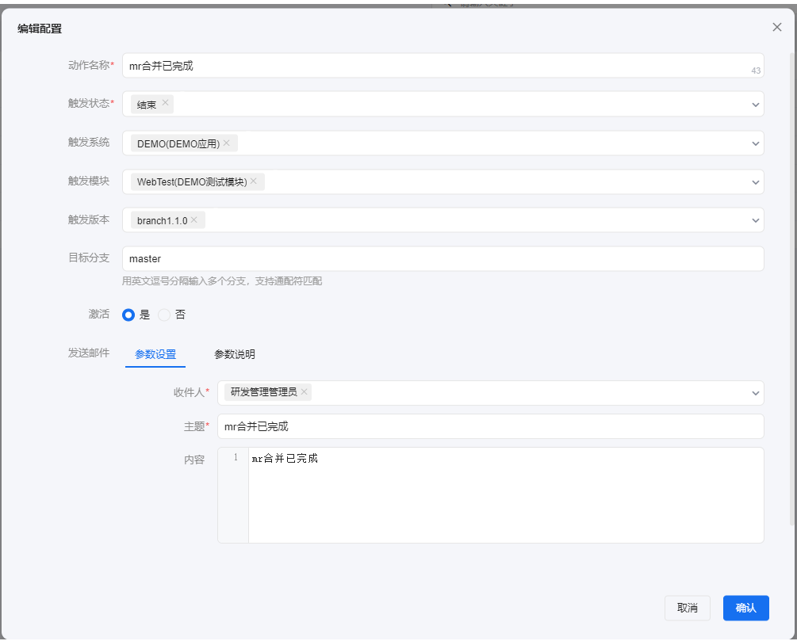
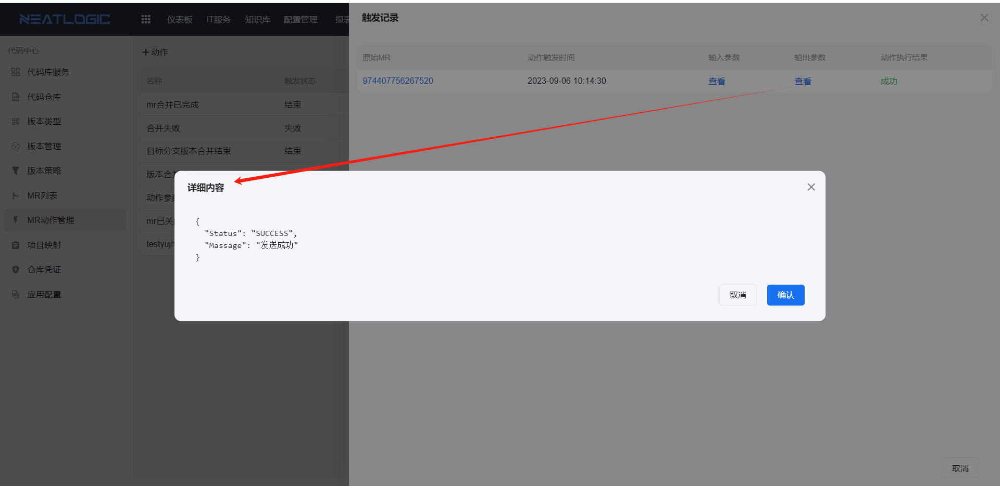

# MR动作管理
入口：代码中心-MR动作管理

作用：用于mr动作发生时触发通知的配置

## 添加动作配置
点击添加动作按钮，出现添加动作的弹窗。

动作配置主要内容包括触发状态、触发系统和模块、触发版本、目标分支和发送邮件配置。
- 触发动作：触发通知的mr动作，一共有四种，分别是冲突、失败、结束和已关闭。触发动作必填。
- 触发系统和模块：是指发起mr的版本所属的系统和子系统，填写了触发的系统和模块时，必须发起对于系统或子系统的mr才能满足触发的条件。
- 目标分支：mr合并的目标分支，非必填，如果填写了目标分支，则mr合并的目标分支与触发配置的目标分支一致才能满足触发的条件。
- 发送邮件配置：包括收件人、主题和内容的配置，收件人和主题必填，内容非必填。收件人是系统的用户，选择需要通知的对象，用户的邮件配置不能为空，否则收不到邮件。

## 查看触发记录
动作配置可以查看触发的记录，每条记录的内容又输入参数、输出参数和动作执行结果等。
