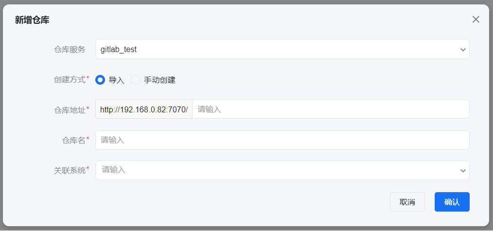
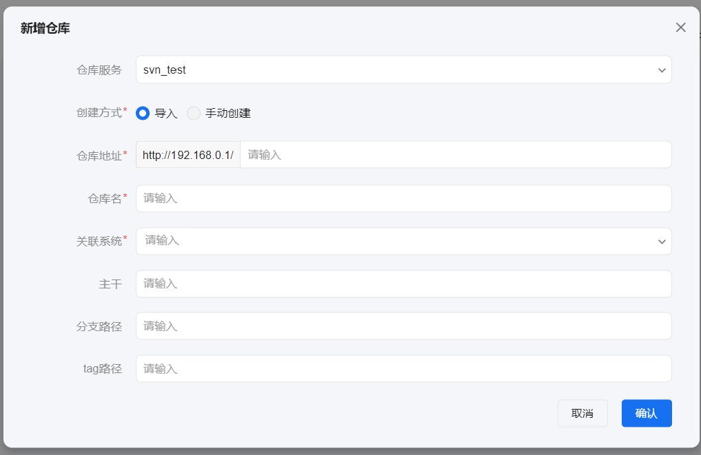
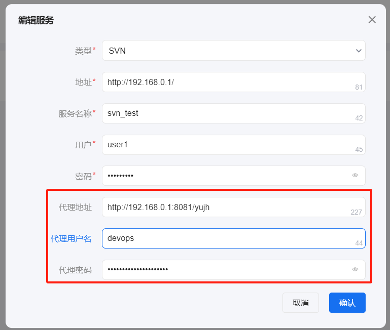

# 代码仓库
创建代码仓库的方式有导入和手动创建。
- 导入：根据填写的代码仓库配置，直接拉取已有的gitlab或者svn仓库到代码仓库页面。
- 手动创建：根据填写的代码仓库配置，在代码仓库中创建仓库成功，并在gitlab或者svn远程创建新的仓库。

## 导入

### git类型
添加git类型代码仓库时，仓库名称必须唯一，且关联的应用和模块未关联过其他仓库。

### SVN类型
当所选的代码库服务为svn时，会多出3个非必填项：主干、分支路径及tag路径。

- 主干不输入时，则仓库详情页的分支和标签均为仓库地址下的分支和标签。
- 输入主干时，则仓库详情页的分支和标签为主干下的分支和标签。
- 输入分支时，则仓库详情页的分支为所输入分支名下的分支。
- 输入标签时，则仓库详情页的标签为所输入标签名下的标签。

## 手动创建

### git类型
创建方式选择手动创建，仓库地址中需按如下格式输入：git用户名/新仓库名 或 组名/子组名（可省略）/新仓库名：

创建完毕后，在gitlab上创建一个新的仓库。

### svn类型
如果所选仓库服务为svn类型，在创建仓库前必须在仓库服务上配置代理相关信息。这里要注意的是，代理要与代码服务部署在同一机器上：

仓库服务的代理配置完毕后，进入代码仓库创建仓库时选择手动创建，仓库地址中的url必须得保持唯一性：

创建时也可配置初始仓库的主干、分支、标签。

创建完毕后，会在svn远程仓库中生成一个新的仓库。进入仓库详情页，如果未配置主干/分支/标签，则仓库是没有分支和标签的：

## 仓库详情
仓库详情中包括了活动、提交、分支、标签、浏览、设置。
- 活动：活动tab中展示用户在代码仓库详情页面的所有操作记录。
- 提交：提交tab中展示仓库的提交记录。
- 分支：分支tab可对分支进行新增、删除、查询操作，并展示分支的创建者、创建时间及创建时的提交id。
- 标签：标签tab可对标签进行新增、删除、查询操作，并展示标签的创建者、创建时间及创建时的提交id。
- 浏览：浏览tab可查看所有分支或标签的文件内容。
- 设置：设置tab中可编辑仓库的权限设置和分支保护。