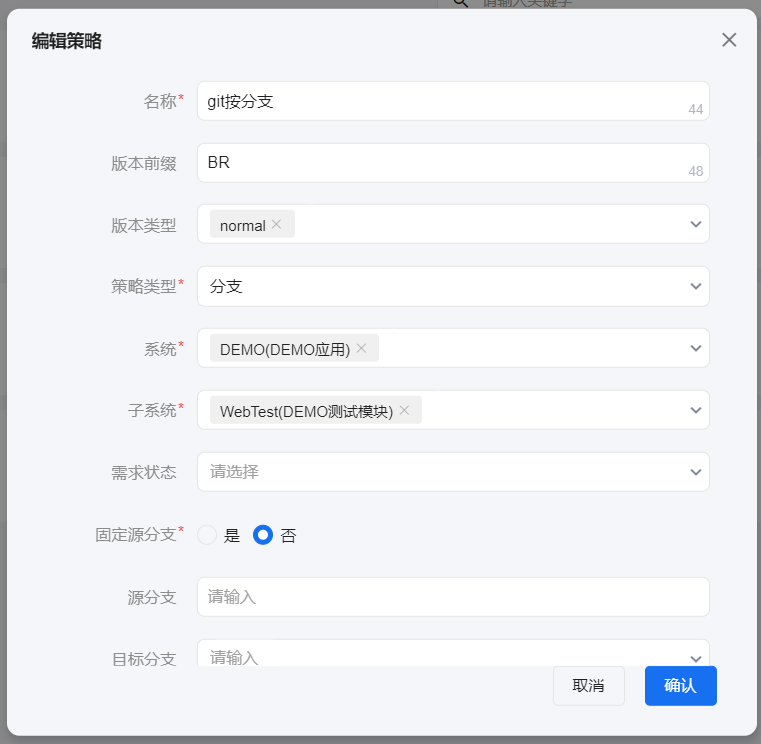
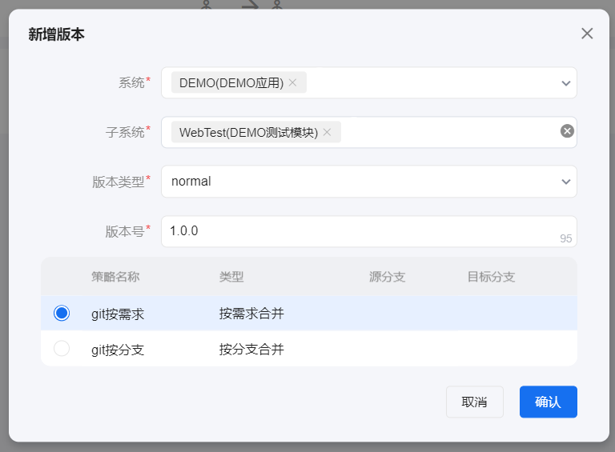

# 版本策略
入口：代码中心-版本策略

作用：为创建版本提供模板。一个版本策略下可创建多种版本类型的版本。

## 创建版本
新建策略所需填入的字段如下：

- 版本前缀
  
  创建版本时版本的前缀。如前缀设置成SIT_，在该策略下创建一个1.0.0的版本，则完整的版本号为：SIT_1.0.0

- 版本类型
  可选择默认的版本类型，也可不选。选择了其中一个版本类型时，创建版本时可自动拉取所选的默认版本类型，不必再手动选择（见下图），然后自动生成版本号。
  

- 策略类型
  
  可选类型：需求、分支。创建MR的类型。
  
  选择需求类型时，则创建的MR可选择需求进行代码合并。

  选择分支类型时，创建MR时不能选择合并的需求，只能直接合并（与gitlab中的merge一样）。
- 系统、子系统
  
  策略绑定的子系统，代码合并时只合并该子系统下的分支或需求。如所选的子系统下无绑定的代码仓库，则提示：子系统下未绑定代码仓库。
  
  绑定子系统有两个作用：（1）绑定子系统下的代码仓库。创建MR同步需求时拉取该仓库中带有需求编号的commit；（2）如子系统配置了与项目的映射关系，则同步需求时只同步这些项目下的需求。

- 需求状态
  
  同步需求时只同步所选需求状态对应的那些需求。需求状态的配置见codehub_issue_status表。

- 固定源分支、源分支、目标分支
  
  如MR时需要把A分支的代码合并到B分支。

  （1）源分支即为A，目标分支即为B。
  
  （2）固定源分支选择“是”，则源分支为下拉框，可选择子系统绑定代码仓库下的分支作为源分支，创建MR时只显示所选的该源分支；固定源分支选择“否”，则源分支为输入框，可输入正则表达式匹配仓库下的分支。如输入：branch-*，则匹配仓库下所有branch-开头的分支，创建MR的源分支筛选可下拉选择跟正则表达式匹配的分支。