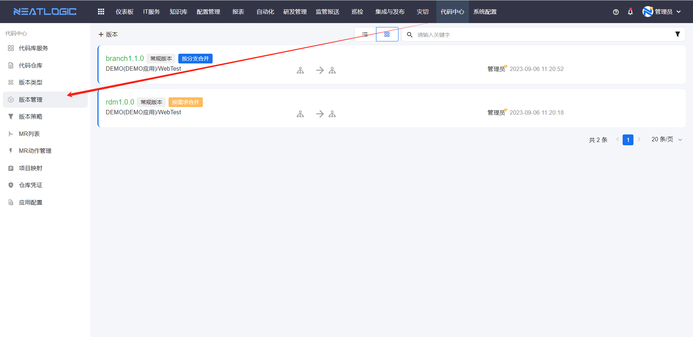
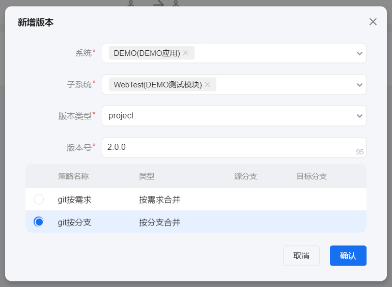
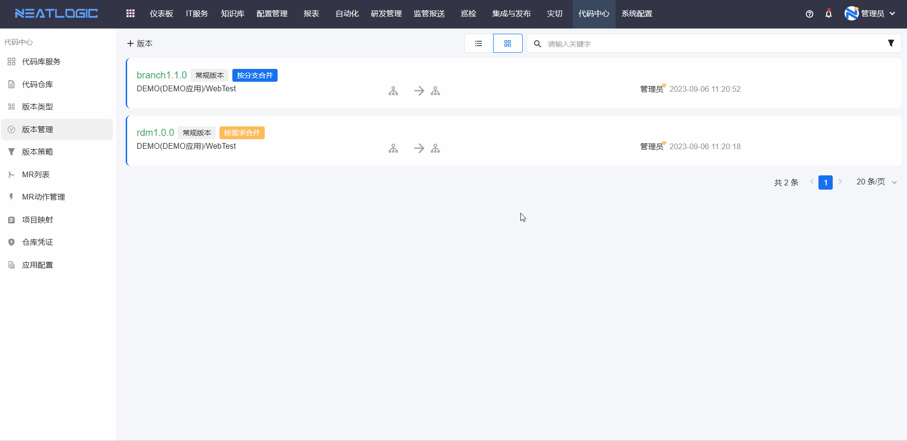
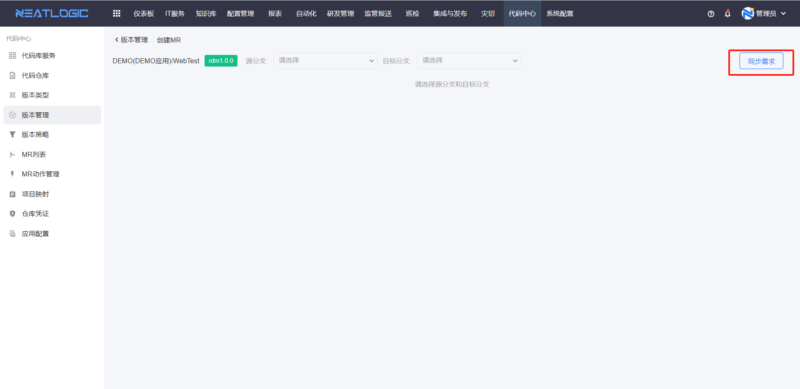
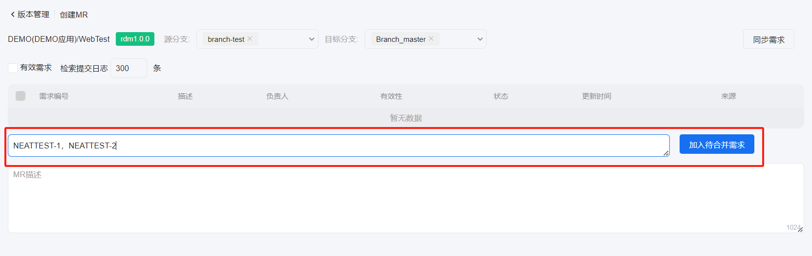
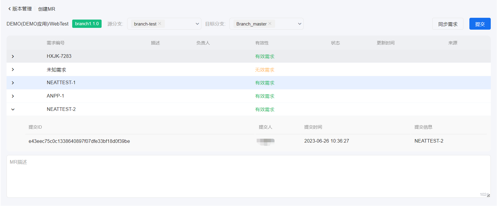

# 版本管理
入口：代码中心-版本管理

版本作用：根据版本类型及版本策略来创建MR。一个版本对应多个MR。

## 创建版本
点击新增版本，选择版本类型，选择子系统下的某个策略，输入版本号，即可根据所选版本类型及版本策略生成一个版本号，保存版本即可。

## 创建MR
创建MR就是创建代码合并，点击版本右侧的创建MR按钮，进入创建MR的页面。

### 需求型MR
按需求创建MR可选择合并的需求。

#### 同步需求
进入页面或点击同步需求就会从第三方项目平台（JIRA、RDM）和子系统下的代码仓库同步需求。

同步需求的流程如下：

根据所配置的子系统映射对应的项目，去对应的项目平台（JIRA、RDM）上拉取这些项目下符合版本策略所配置需求状态的所有需求。

接着去子系统下的代码仓库的源分支查找有没有commit与这些需求相匹配（如某条commit为：#CODEHUB-52 add file1，与编号为CODEHUB-52相匹配），如果有则把需求的有效性设为有效需求；如需求下无commit与其匹配，则有效性为无效需求。勾选有效需求，则只筛选有commit与其匹配的需求；去掉有效需求，则筛选所有有效需求+无效需求。

#### 源分支
当版本策略固定源分支选择“是”，则源分支不可选，只显示所选源分支下的需求；固定源分支选择“否”，则可下拉选择跟正则表达式匹配的分支，如下所示：

#### 加入待合并需求
如需求列表中无需要合并的需求，则可在加入待合并需求的输入框中自行输入需求号，点击加入待合并需求则把所输入的需求加入待合并需求列表中。需求与需求之间用逗号隔开。

#### 提交
将勾选的需求和加入待合并的需求一起进行MR，进入处理MR页。

### 分支型MR
按分支创建MR只能查看分支下有哪些需求，需求下有哪些commit，但无法选择需求以及手动添加需求。在选择完源分支和目标分支后提交即可。

