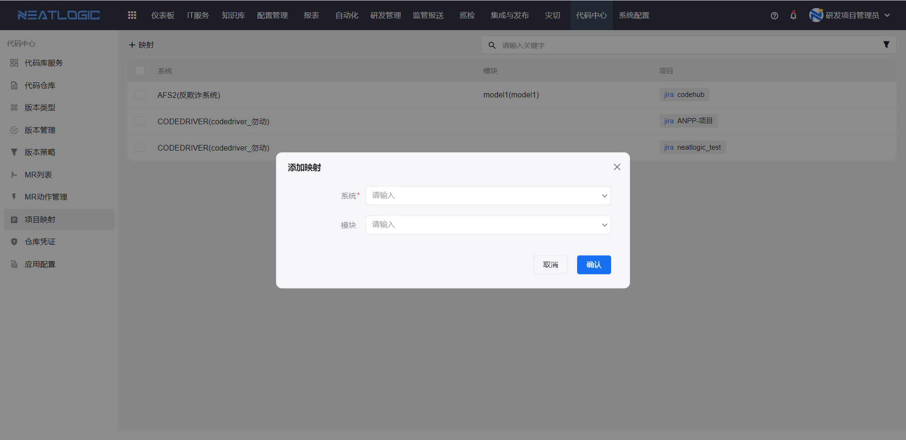
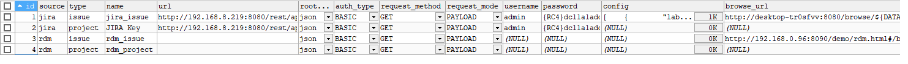

# 项目映射
作用：创建MR时需要同步需求，同步的需求的来源分为两部分，需求来源支持JIRA、本系统研发管理模块（下面简化为rdm）项目下的需求。而配置了子系统和这些项目的映射关系之后，同步需求时可以拉取配置的项目下的所有需求过来。

新增映射时，可以指定JIRA、rdm上的多个项目。其中系统必须指定，子系统可指定也可不指定，不指定时系统下所有子系统在创建mr时均同步所设置JIRA或rdm项目的需求。

## 配置需求来源

在数据库表codehub_sync_source中添加JIRA或rdm的需求来源配置。

需要到codehub_sync_source表新增两条记录，分别是需求配置及项目配置。需要配置的字段有：source（来源）、type（分类）、name（来源名称）、url（同步来源的url）、root_type（请求url返回数据的根节点类型）、auth_type（同步来源认证方法）、request_method（同步来源请求方法）、request_mode（同步来源请求模式）、username、password、config（同步查询条件配置）
