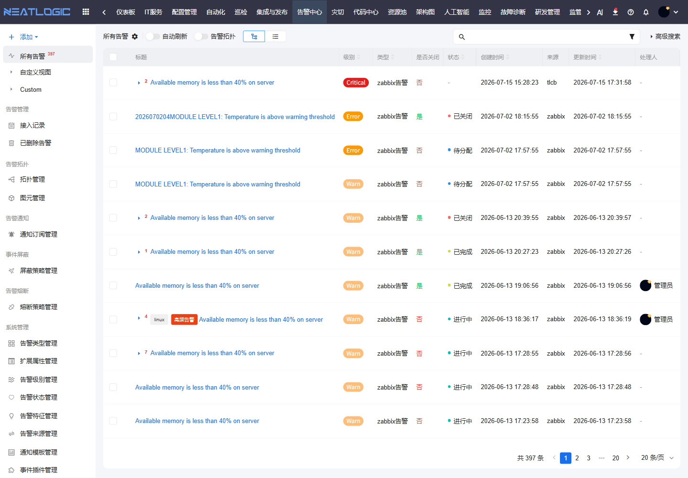
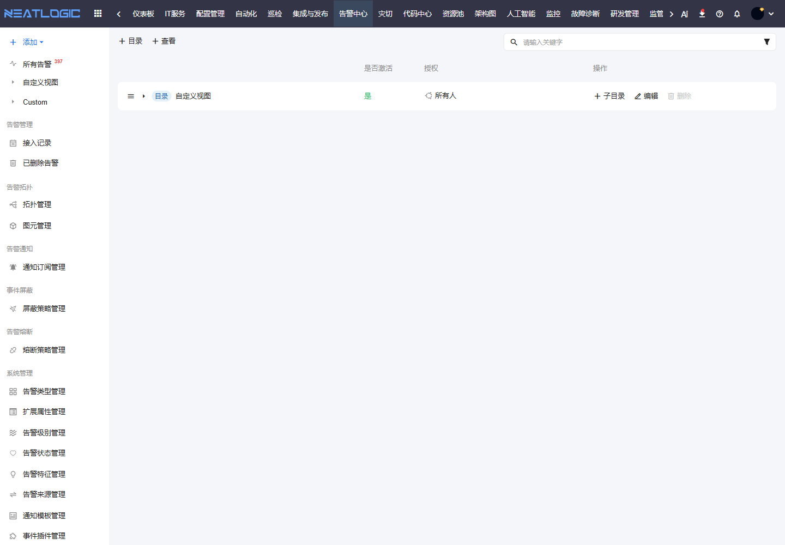
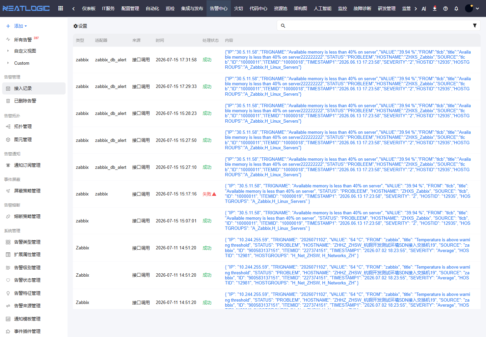
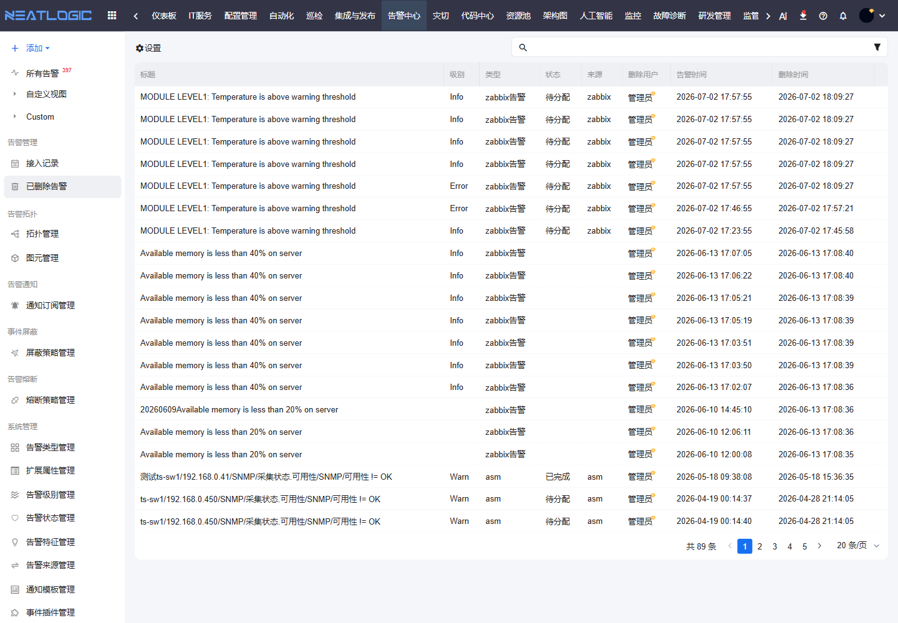

# 告警管理

告警管理用于承接告警中心的日常处理工作。值班人员可以在这里查看告警列表、筛选告警、进入告警详情、处理状态、查看接入记录，并在需要时查看已删除告警。

## 阅读路径

可根据当前要解决的问题选择阅读入口。

- 如果需要处理告警，阅读“所有告警”和“自定义视图”。
- 如果需要查看告警详情，阅读告警详情中的原始数据、操作记录和事件记录。
- 如果需要排查告警接入问题，阅读“接入记录”。
- 如果需要核对已删除数据，阅读“已删除告警”。

## 告警列表

告警列表集中展示当前可查看的告警。页面左侧是所有告警和自定义视图，右侧是列表区。列表字段包括标题、级别、类型、是否关闭、状态、创建时间、来源、更新时间、处理人和扩展属性。

列表适合持续值班和批量查看。页面支持自动刷新，新的告警接入或状态变化后，处理人可以及时看到最新结果。

### 视图入口

左侧视图用于保存常用查询条件。管理员可以按场景维护公共视图，例如“所有告警”“关键系统告警”“未关闭告警”等，并授权给不同用户或团队使用。

### 展示方式

告警列表支持列表视图和拓扑入口。列表视图适合批量比较字段；拓扑入口适合从对象关系中观察告警分布。

处理人可以根据当前关注点调整表头字段。常用字段包括告警标题、级别、状态、来源、更新时间、处理人、标签和扩展属性。

## 告警搜索

告警搜索用于在大量告警中快速定位目标。

常用筛选条件包括：

| 条件 | 说明 |
|:--|:--|
| 关键字 | 按标题或告警内容快速匹配 |
| 级别 | 按 Critical、Error、Warn 等严重程度筛选 |
| 类型 | 按告警类型筛选，例如 zabbix 告警 |
| 是否关闭 | 区分仍需处理的告警和已关闭告警 |
| 状态 | 按待分配、进行中、已完成、已关闭等状态筛选 |
| 来源 | 按监控系统或接入来源筛选 |
| 更新时间 | 查找最近变化或长期未更新的告警 |
| 处理人 | 查找分配给指定用户的告警 |
| 扩展属性 | 按 IP、主机、服务、对象类型等自定义字段筛选 |

当简单条件不够表达复杂场景时，可以使用高级搜索组合多组条件。

## 告警详情

点击告警标题可以进入告警详情。详情页用于集中查看一条告警的完整上下文，帮助处理人判断告警来源、影响范围和处理进展。

详情页常见内容包括：

| 内容 | 作用 |
|:--|:--|
| 基本信息 | 查看标题、级别、类型、状态、来源、创建时间、更新时间等核心字段 |
| 扩展属性 | 查看 IP、主机、服务、监控对象等接入字段 |
| 子告警 | 查看收敛到当前告警下的相关告警 |
| 原始数据 | 查看外部系统接入时的原始报文或原始字段 |
| 操作记录 | 追踪状态修改、关闭、打开、删除、转交等操作 |
| 事件记录 | 查看接入告警、创建告警、收敛告警、状态更新、屏蔽告警等系统事件 |
| 评论 | 记录排查过程、处理结论或协作信息 |
| 订阅历史 | 查看告警通知订阅的触发记录 |

## 告警处理

告警处理围绕“谁负责、处理到哪一步、是否还需要关注”展开。

常用操作包括：

| 操作 | 使用场景 |
|:--|:--|
| 修改状态 | 告警从待分配进入处理中、已完成或其他自定义状态 |
| 关闭告警 | 问题已恢复、误报确认或无需继续处理 |
| 打开告警 | 已关闭告警后续仍需跟踪 |
| 转交处理人 | 当前处理人不再负责，需交给其他用户或团队 |
| 添加标签 | 标记重复告警、重点告警、应用告警等分类 |
| 评论 | 补充排查过程、处理结论或沟通记录 |
| 删除告警 | 对不需要保留在当前列表中的告警执行删除 |

告警状态、标签和处理人会影响后续筛选、统计和协作，建议按团队约定统一使用。

## 接入记录

接入记录用于排查告警从外部系统进入告警中心的过程。它适合用来确认“告警有没有进来”“接入是否报错”“原始数据是什么”。

接入记录支持按关键字、状态、类型、适配器、异常信息和时间范围筛选。排查接入失败时，可以优先查看状态和错误信息，再根据原始数据判断字段映射或插件处理是否符合预期。

## 已删除告警

已删除告警用于查看从告警列表中删除的告警。

当需要核对误删、追踪历史处理记录或确认告警删除原因时，可以进入该页面查看。删除前建议先确认团队是否仍需要通过告警详情追踪处理过程。

## 告警事件

系统会在告警生命周期中记录关键事件。常见事件包括：

| 事件 | 说明 |
|:--|:--|
| 接入告警 | 外部系统发送告警到平台 |
| 创建告警 | 平台根据接入数据生成新告警 |
| 收敛告警 | 新告警被归并到已有告警 |
| 子告警加入 | 子告警加入当前告警集合 |
| 子告警移除 | 子告警从当前告警集合移除 |
| 更新告警状态 | 告警状态发生变化 |
| 关闭告警 | 告警被关闭 |
| 打开告警 | 已关闭告警被重新打开 |
| 删除告警 | 告警被删除 |
| 屏蔽告警 | 告警被屏蔽策略处理 |

这些事件可以帮助运维人员复盘告警从接入到处理的全过程。

## 操作权限

告警管理相关权限需在“系统配置 - 用户管理 - 授权”中配置。

| 权限 | 说明 |
|:--|:--|
| 统一告警平台基础权限（ALERT_BASE） | 使用统一告警平台模块 |
| 告警管理员权限（ALERT_ADMIN） | 可以对所有告警进行状态修改、关闭、删除等操作 |
| 告警视图管理权限（ALERT_VIEW_MODIFY） | 新增、修改和删除告警视图 |
| 所有告警配置管理权限（ALERT_ALLALERTCONFIG_MODIFY） | 修改所有告警页面的显示属性、条件和排序配置 |
| 告警导出权限（ALERT_EXPORT） | 导出告警数据 |
| 批量删除告警权限（ALERT_BATCH_DELETE） | 可以对命中高级搜索规则的告警进行批量删除 |
| 重建告警索引权限（ALERT_INDEX） | 可以单独重建单个告警的索引 |
| 告警内容AI分析权限（ALERT_TITLE_AI） | 调用大模型分析告警内容 |
