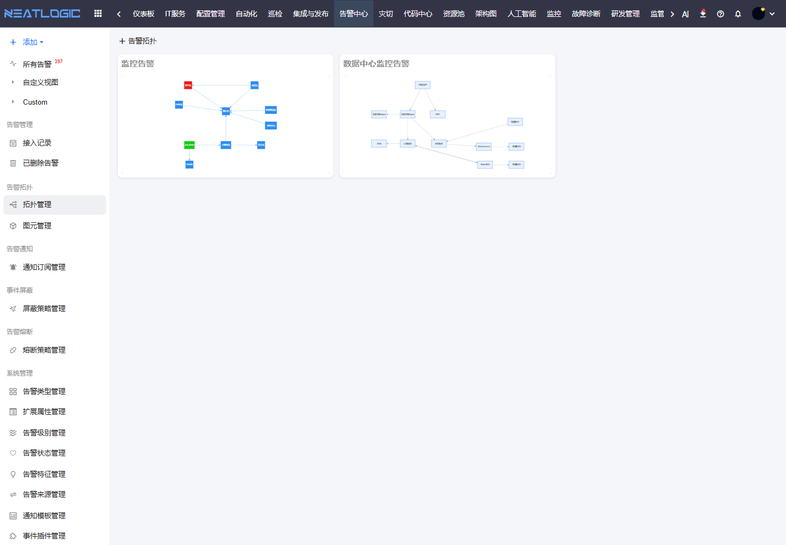

# 告警拓扑

告警拓扑用于把告警和对象关系放在同一张图中查看。它适合在告警数量较多、影响链路不直观时，帮助处理人从业务区域、服务依赖或资源关系中判断问题集中在哪里。

## 阅读路径

本页面对应告警中心左侧菜单中的“告警拓扑”。先在拓扑管理中维护或查看拓扑图，再根据需要进入图元管理统一节点样式；如果要处理具体告警，回到告警管理中的告警列表或告警详情。

## 拓扑管理

拓扑管理用于维护告警拓扑图，并在列表中预览拓扑关系。

拓扑图可以把告警、应用、服务、主机、网络区域或其他对象放在同一张图中展示。处理人可以从图上快速观察告警集中区域、上下游依赖和可能的影响范围。

适合使用拓扑的场景包括：

| 场景 | 说明 |
|:--|:--|
| 影响分析 | 判断告警集中在哪个业务区域或技术组件 |
| 根因定位 | 从同一链路上的多个告警推断可能的上游故障 |
| 值班大屏 | 在统一页面观察关键系统告警状态 |
| 演练复盘 | 通过拓扑关系复盘故障传播路径 |

## 图元管理

图元管理用于维护拓扑中的节点样式和展示对象。

当不同资源类型需要使用不同图标、颜色或展示规则时，可以先维护图元，再在拓扑图中复用。这样拓扑图既能表达对象关系，也能让处理人快速识别对象类型。

## 操作权限

告警拓扑相关权限需在“系统配置 - 用户管理 - 授权”中配置。

| 权限 | 说明 |
|:--|:--|
| 统一告警平台基础权限（ALERT_BASE） | 使用统一告警平台模块 |
| 告警拓扑管理权限（ALERT_TOPO_MODIFY） | 新增、修改和删除告警拓扑 |
