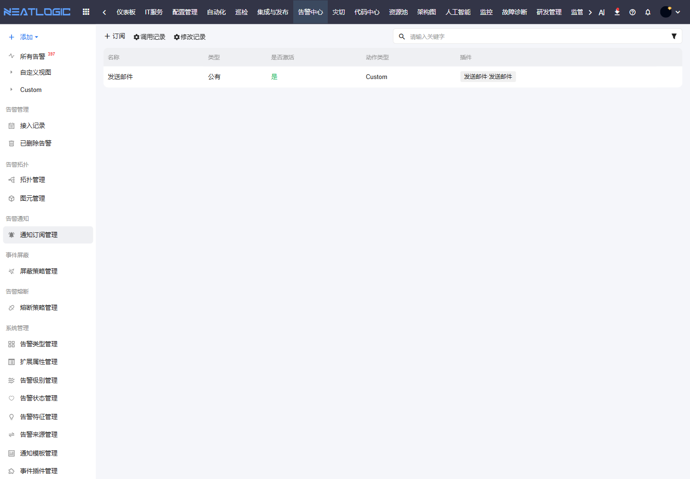

# 告警通知

告警通知用于把符合条件的告警推送给指定对象。它解决的是“关键告警已经产生，但相关人员没有及时知道”的问题。

## 阅读路径

可根据当前要解决的问题选择阅读入口。

- 如果需要配置告警通知，阅读“通知订阅管理”。
- 如果需要设置筛选条件，先确认告警级别、来源、状态和扩展属性等基础字段已配置。
- 如果需要统一通知内容，阅读[通知模板管理](../6.系统管理/通知模板管理.md)。

## 通知订阅管理

通知订阅管理用于配置哪些告警需要通知给哪些对象，以及通过什么动作发送。

订阅通常由订阅名称、是否激活、订阅类型、动作类型、通知插件、触发条件和通知对象组成。配置完成后，符合条件的告警会触发对应通知动作。

适合配置订阅的场景包括：

| 场景 | 说明 |
|:--|:--|
| 关键级别告警 | Critical 或 Error 告警触发后立即通知值班人 |
| 指定来源告警 | 某个监控平台接入的告警通知对应平台负责人 |
| 指定对象告警 | 某个应用、主机或服务的告警通知业务负责人 |
| 状态变化通知 | 告警关闭、重新打开或转交时通知相关人员 |

建议先为关键告警配置少量订阅，再根据实际噪声逐步细化条件。

## 操作权限

告警通知相关权限需在“系统配置 - 用户管理 - 授权”中配置。

| 权限 | 说明 |
|:--|:--|
| 统一告警平台基础权限（ALERT_BASE） | 使用统一告警平台模块 |
| 告警订阅管理权限（ALERT_SUBSCRIBE_MODIFY） | 新增、修改和删除告警订阅 |
