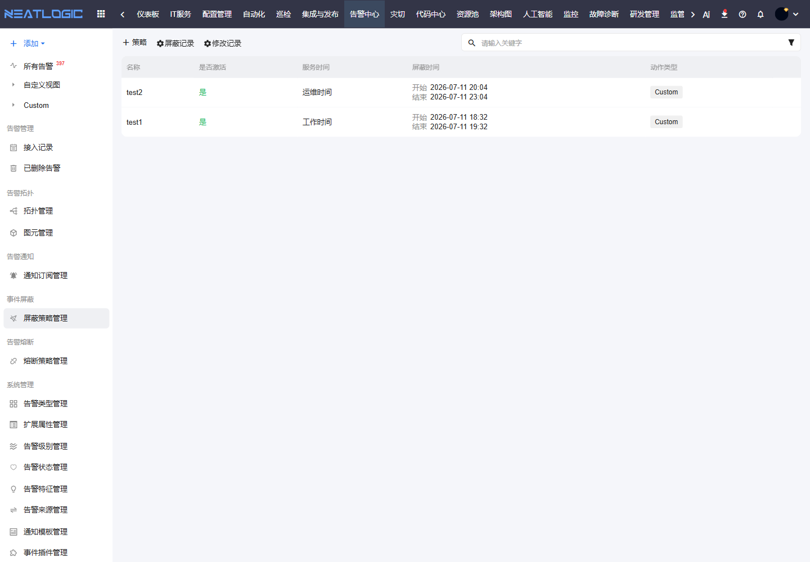

# 事件屏蔽

事件屏蔽用于在指定条件下抑制告警。它适合维护窗口、已知故障、重复噪声和临时误报等场景，避免无效告警干扰值班处理。

## 阅读路径

本页面对应告警中心左侧菜单中的“事件屏蔽 - 屏蔽策略管理”。配置屏蔽策略前，先从告警管理中确认需要屏蔽的告警特征、来源和对象范围；策略启用后，可通过接入记录和告警事件核对屏蔽效果。

## 屏蔽策略管理

屏蔽策略管理用于维护告警屏蔽规则。

屏蔽策略通常包含是否激活、服务窗口、屏蔽时间、动作类型、匹配条件和审计信息。配置后，满足条件的告警会按策略处理。

配置屏蔽策略时，需要确认三个问题：

1. 屏蔽对象是否足够精确，避免误屏蔽真实故障。
2. 屏蔽时间是否有限制，避免策略长期遗留。
3. 屏蔽后是否仍需保留接入记录，便于后续审计。

## 操作权限

事件屏蔽相关权限需在“系统配置 - 用户管理 - 授权”中配置。

| 权限 | 说明 |
|:--|:--|
| 统一告警平台基础权限（ALERT_BASE） | 使用统一告警平台模块 |
| 告警屏蔽管理权限（ALERT_SUPPRESSION_MODIFY） | 新增、修改和删除告警屏蔽策略 |
