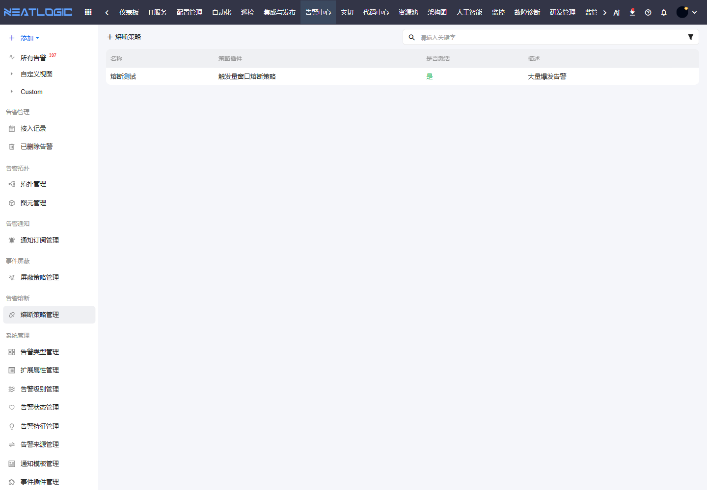

# 告警熔断

告警熔断用于控制短时间内异常爆发的告警。它面向告警风暴场景，避免通知、插件调用和处理动作被大量重复告警拖垮。

## 阅读路径

本页面对应告警中心左侧菜单中的“告警熔断 - 熔断策略管理”。配置熔断策略前，先通过告警管理和接入记录确认告警是否存在高频爆发；策略启用后，重点观察通知、插件和接入链路是否恢复到可处理状态。

## 熔断策略管理

熔断策略管理用于维护告警熔断规则。

当某个来源、类型或对象在短时间内持续产生大量告警时，熔断策略可以暂停或限制后续处理动作，避免问题继续扩大。

策略配置通常包含名称、插件、是否激活、描述和执行状态。建议把熔断策略用于明确的高频告警场景，并定期复盘触发记录。

## 操作权限

告警熔断相关权限需在“系统配置 - 用户管理 - 授权”中配置。

| 权限 | 说明 |
|:--|:--|
| 统一告警平台基础权限（ALERT_BASE） | 使用统一告警平台模块 |
| 告警熔断策略管理权限（ALERT_BREAKER_MODIFY） | 新增、修改和删除告警熔断策略 |
