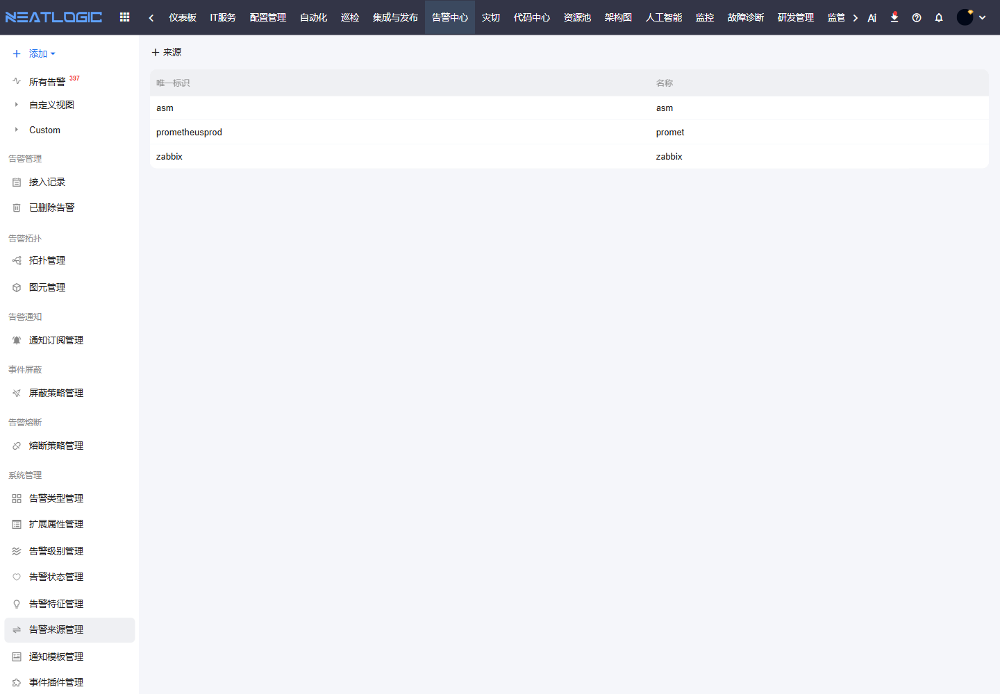

# 告警来源管理

告警来源管理用于标识告警来自哪个监控系统、插件或外部平台。来源字段常用于接入排查、责任划分、统计分析和视图过滤。

## 阅读路径

可根据当前要解决的问题选择阅读入口。

- 如果需要维护告警接入来源，阅读“告警来源管理”。
- 如果需要按来源配置规则，阅读告警类型、告警视图、通知订阅、屏蔽策略和熔断策略中的来源条件。

## 配置内容

告警来源通常包含来源名称、唯一标识、描述、排序和是否启用。若同一个监控平台有多个接入通道，建议用清晰的来源命名区分。

## 使用建议

来源命名应能让处理人快速判断告警来自哪里。例如按监控平台、接入通道、业务区域或环境区分，避免多个来源使用相近名称。

## 操作权限

告警来源管理权限需在“系统配置 - 用户管理 - 授权”中配置。

| 权限 | 说明 |
|:--|:--|
| 统一告警平台基础权限（ALERT_BASE） | 使用统一告警平台模块 |
| 告警来源管理权限（ALERT_SOURCE_MODIFY） | 新增、修改和删除告警来源 |
