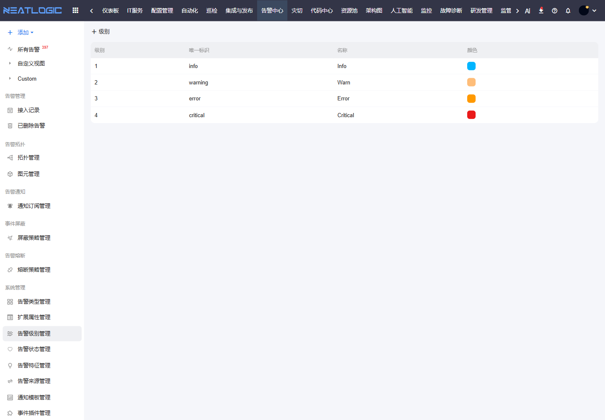

# 告警级别管理

告警级别管理用于统一告警严重程度。级别会影响列表颜色、搜索条件、视图过滤、通知订阅和处理优先级。

## 阅读路径

本页面对应告警中心左侧菜单中的“系统管理 - 告警级别管理”。先维护告警级别，再在告警视图、通知订阅、屏蔽策略和熔断策略中按级别配置条件。

## 配置内容

常见级别包括 Critical、Error、Warn 等。管理员可以维护级别名称、显示样式、排序和是否启用。

## 使用建议

建议在团队内明确每个级别的处理时效和升级规则。级别含义稳定后，通知订阅、屏蔽策略和统计分析才更容易保持一致。

## 操作权限

告警级别管理权限需在“系统配置 - 用户管理 - 授权”中配置。

| 权限 | 说明 |
|:--|:--|
| 统一告警平台基础权限（ALERT_BASE） | 使用统一告警平台模块 |
| 告警级别管理权限（ALERT_LEVEL_MODIFY） | 新增、修改和删除告警级别 |
