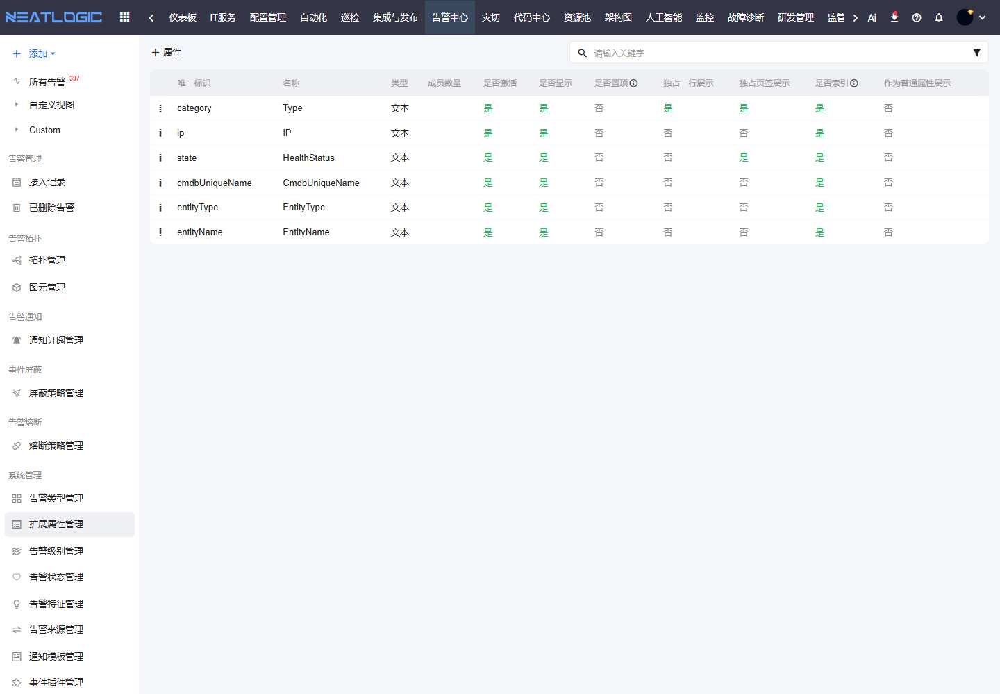

# 扩展属性管理

扩展属性管理用于维护外部告警中的业务字段，例如 IP、主机、应用、服务、对象类型、机房区域等。它决定这些字段是否能在告警列表、详情、搜索和视图中使用。

## 阅读路径

本页面对应告警中心左侧菜单中的“系统管理 - 扩展属性管理”。接入告警后，先根据原始数据梳理需要展示和搜索的字段，再在扩展属性中配置字段类型、展示方式和索引规则。

## 配置内容

扩展属性可配置字段类型、枚举值、是否激活、是否展示、是否置顶、是否整行展示、是否作为页签展示、是否参与索引和排序。

## 使用建议

建议把“定位告警对象”和“判断影响范围”所需字段配置为常用展示字段，例如 IP、主机名、应用系统、服务名称和对象类型。

## 操作权限

扩展属性管理权限需在“系统配置 - 用户管理 - 授权”中配置。

| 权限 | 说明 |
|:--|:--|
| 统一告警平台基础权限（ALERT_BASE） | 使用统一告警平台模块 |
| 告警扩展属性管理权限（ALERT_ATTR_MODIFY） | 新增、修改和删除告警扩展属性 |
