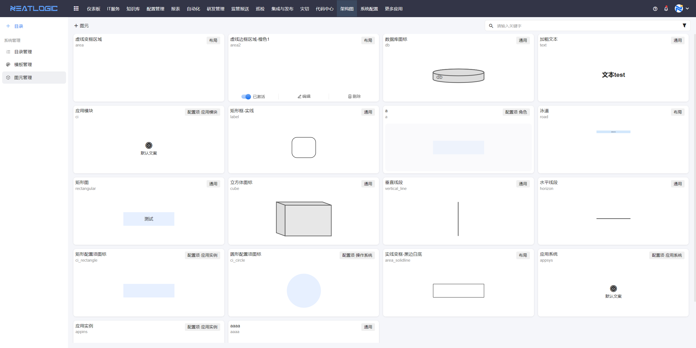
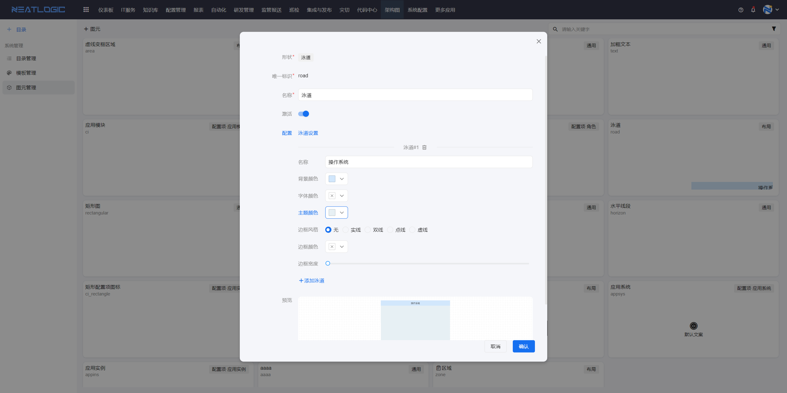
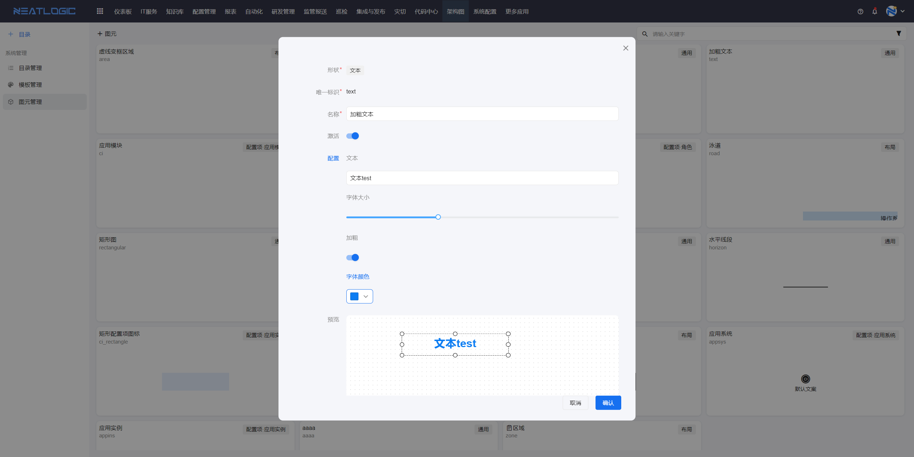
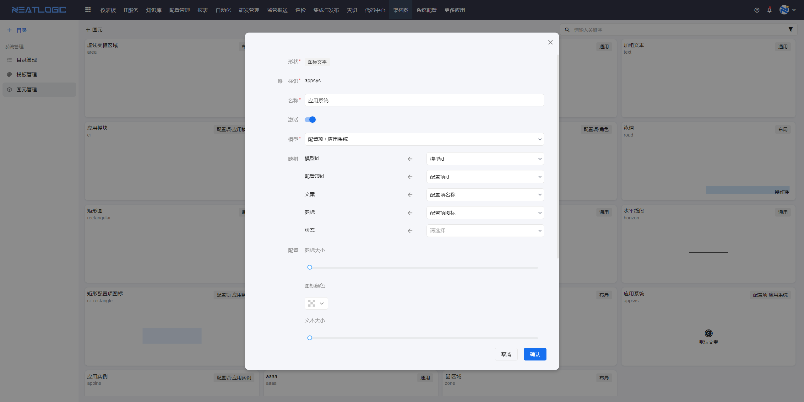
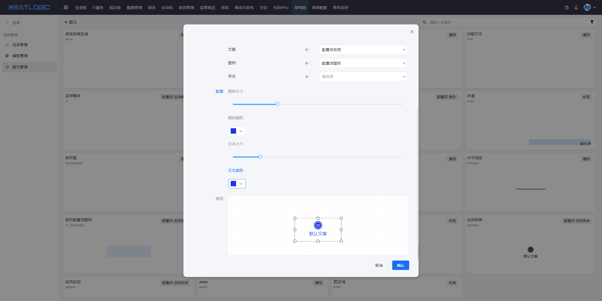

# 图元管理
图元管理页面可以添加、删除和编辑图元，图元是绘制架构图时所使用的最小的单元，有布局图元、基础图元和配置项图元三大类。图元应用于架构图模板。

相关权限：[权限管理](../100.系统配置/1.用户和权限/用户和权限.md)-图元编辑权限，控制用户能否访问图元管理并执行相关操作。

## 布局图元
布局图元是用于架构图布局的，布局图元包括泳道和区域两种。

## 基础图元
基础图元是可作为架构图中的节点元素，不承载数据，基础图元包括文本、数据库、矩形、立方体、垂直线、水平线。

## 配置项图元
配置项图元同样可作为架构图的节点元素，但同时有关联了配置模型，一个图元就隐射了一个配置项。

