# 新建知识文档

知识文档是知识库的核心内容，用于沉淀企业内部的操作手册、故障处理方案、FAQ、配置说明等知识资产。新建知识文档需要经过选择分类、编辑内容、保存草稿、提交审核等流程，审核通过后文档成为正式版本并展示给有权限的用户查看。用户也可以选择使用模板来快速生成标准化内容框架，但模板选择是可选操作，不是必须步骤。

相关权限：知识库基础权限

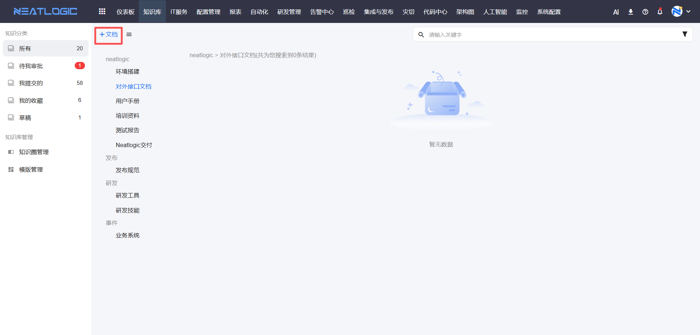

## 新建文档入口

用户可以通过以下方式新建知识文档：

### 从知识分类页面新建

进入所有知识页面后，在左侧分类目录中选择目标分类，点击【新建文档】按钮，可进入文档编辑页面。新建文档时需要选择所属分类，并填写标题和正文内容。

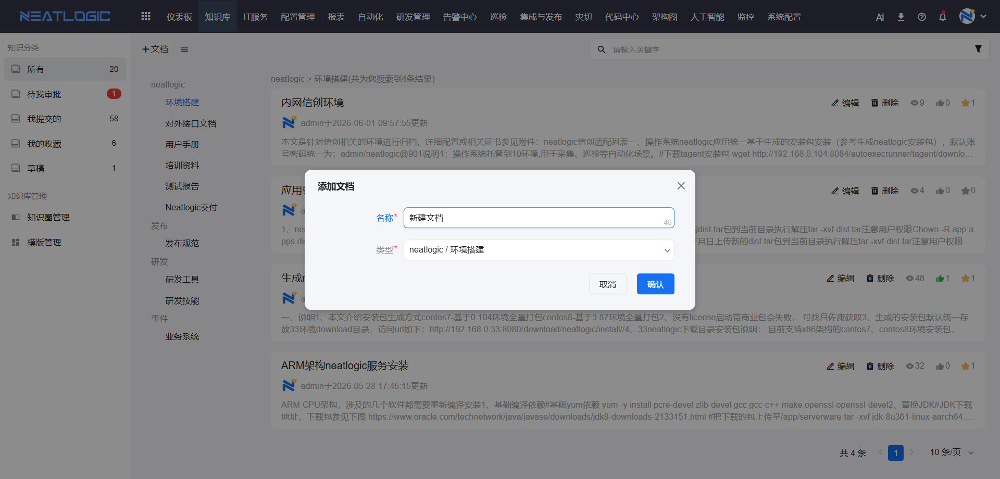

> 注意：新建文档时需要确认所属知识圈和分类，文档创建后分类不可随意修改，避免影响用户按分类查找文档。

## 文档编辑器

知识库编辑器用于编辑文档正文内容。编辑器以块为单位组织内容，适合维护操作说明、故障处理步骤、FAQ、表格记录和图文类知识。

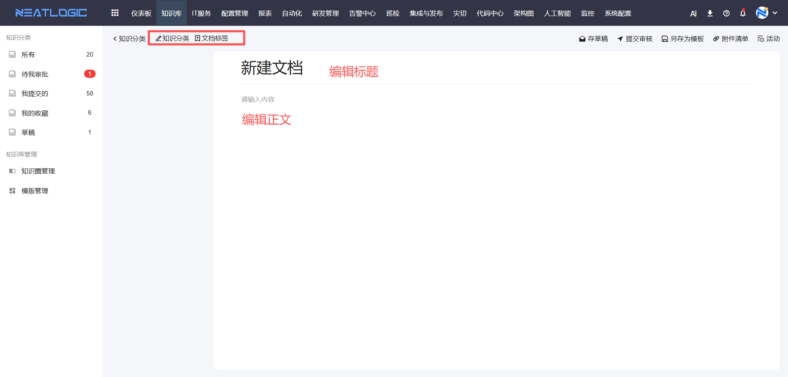

编辑器支持的常用内容包括：

1. 标题和段落：用于组织文档层级和正文说明。
2. 无序列表和有序列表：用于编写步骤、清单和注意事项。
3. 任务列表：可以通过勾选和取消来定义完成状态，适合用于跟踪任务进度。
4. 图片：支持上传图片，并可设置说明和对齐方式。
5. 附件：支持上传与文档相关的文件。
6. 代码块：适合记录脚本、命令和配置示例。
7. 表格：适合整理字段、参数、对比项和处理记录。
8. 链接：可插入外部链接或内部知识文档链接。
9. 引用：通常在段落后面作为补充内容，用于引用外部资料或补充说明。
10. 高亮块：起突出文本内容作用，用于强调重要信息或注意事项。
11. 分割线：用于分隔不同章节或内容块，提高文档可读性。
12. 知识分类和标签：用于文档分类和标签管理，方便检索和组织。
13. 视频：可在文档中维护视频类说明内容。

### 添加组件

在编辑文档时，可以通过添加组件来丰富文档内容。在每个需要添加内容的位置，鼠标点击会出现一个【+】号，点击【+】号可以新增组件。

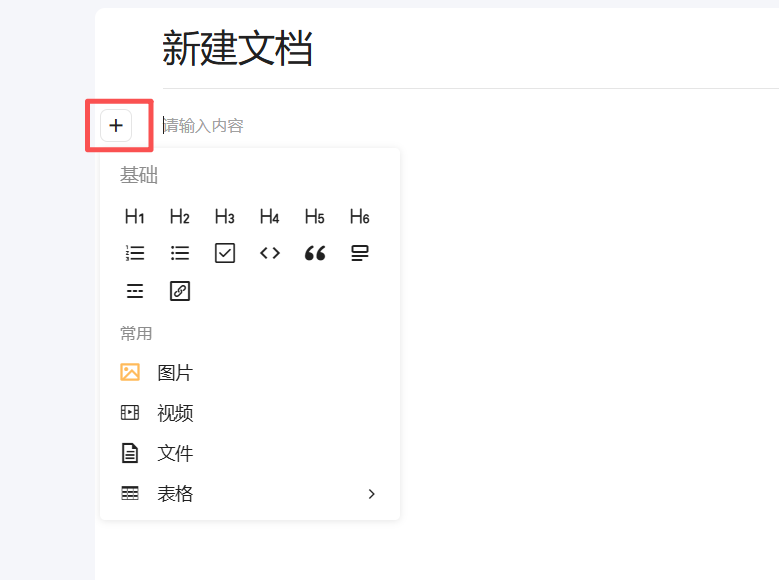

点击【+】号后，会弹出组件选择菜单，可根据实际场景选择合适的组件类型。组件添加后，会在光标位置插入对应的编辑区域，用户可以直接输入或编辑内容。

> **提示**：正文编辑时，支持markdown的书写格式。用户可以在编辑器中直接使用markdown语法进行内容编写，系统会自动识别并渲染markdown格式的内容。支持的markdown语法包括标题、列表、代码块、链接、图片、表格等常用格式。

### 无序列表使用

添加无序列表后，在光标位置后可直接输入内容，回车换行，可新加行。无序列表适合用于编写步骤、清单和注意事项。

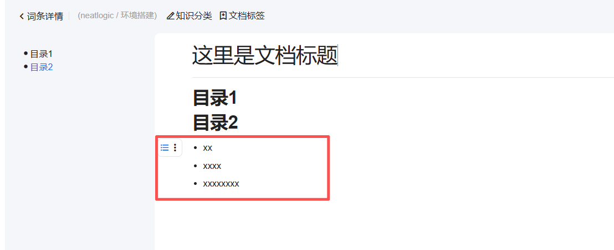

### 有序列表使用

添加有序列表后，在光标位置后可输入内容，回车换行，可新加行。有序列表适合用于编写有顺序要求的操作步骤。

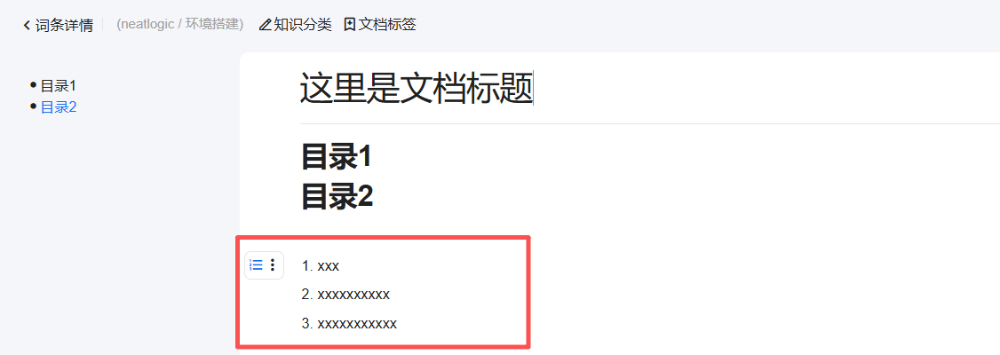

### 任务列表使用

添加任务列表后，在光标位置后可输入内容，回车换行，可新加行。任务列表支持勾选和取消勾选操作，通过勾选状态来定义任务的完成状态。

任务列表适合用于：
- 跟踪任务进度和完成情况
- 记录待办事项清单
- 标记文档中需要完成的工作项

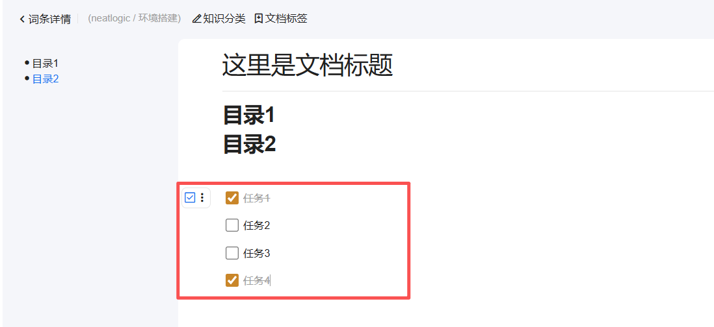

### 图片上传使用

图片适合用于说明页面位置、操作结果和配置效果。知识库编辑器支持两种图片上传方式：

#### 通过添加组件上传

点击+组件，会出现一个悬浮窗，选择图片。选择需要上传的图片文件，点击【完成】按钮即可将图片插入到文档中。

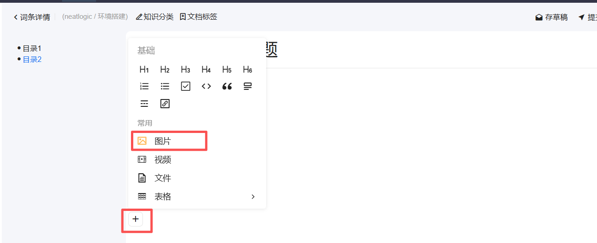

#### 通过复制粘贴上传

在编辑文档时，可以直接复制图片（从本地文件、网页或其他来源），然后在编辑器中粘贴。

### 代码块使用

代码块适合记录脚本、命令和配置示例。支持通过组件插入和markdown脚本插入两种方式。

#### 通过组件插入

在出现的代码块编辑器中，输入对应的代码内容，回车可进行换行。

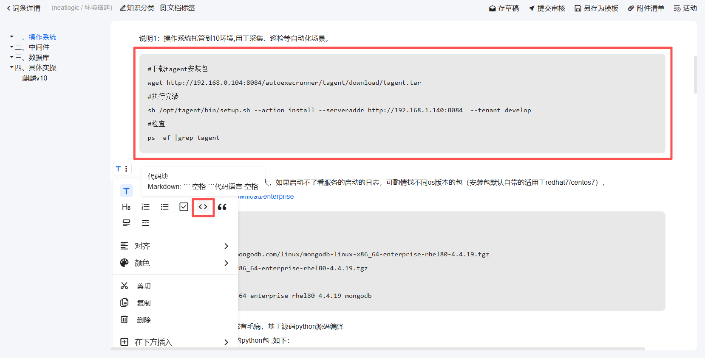

#### 通过markdown脚本插入

在编辑器中直接使用markdown语法插入代码块，可以指定语言类型实现语法高亮。

**常用语言类型**：
- python：Python代码
- java：Java代码
- javascript 或 js：JavaScript代码
- bash 或 shell：Shell脚本
- sql：SQL语句
- json：JSON数据
- xml：XML文档
- html：HTML代码
- css：CSS样式

### 表格使用

表格适合整理字段、参数、对比项和处理记录。表格支持新增行列、删除行列、合并单元格、取消合并、调整样式和设置对齐方式。

**使用说明**

鼠标经过选择表格组件，会出现一个表格7行7列的表格，鼠标经过可选择几行几列，选择好后，点击鼠标的左键，可看到选择表格。

表格主要有如下的功能：

1. 基础功能
   - 字体大小/颜色/边框/背景颜色/对齐方式样式
   - 删除表格
2. 拖拽列宽功能，行高自适应
3. 复制和粘贴文本内容功能
4. 回车可对文本进行换行

### 引用

引用通常在段落后面作为补充内容，用于引用外部资料、补充说明或标注来源。点击【引用】组件后，会在光标位置插入引用块，用户可以在引用块中输入内容。

引用适合用于：
- 引用外部文档或资料的原文
- 补充说明或注意事项
- 标注信息来源或参考文献

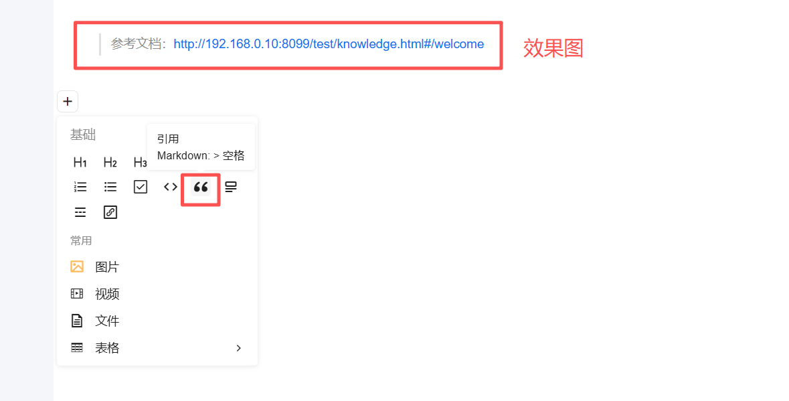

### 高亮块使用

高亮块起突出文本内容作用，用于强调重要信息或注意事项。点击【高亮块】组件后，会在光标位置插入高亮块，用户可以在高亮块中输入需要强调的内容。

高亮块适合用于：
- 强调重要信息或关键步骤
- 提示注意事项或警告信息
- 突出显示需要特别关注的内容

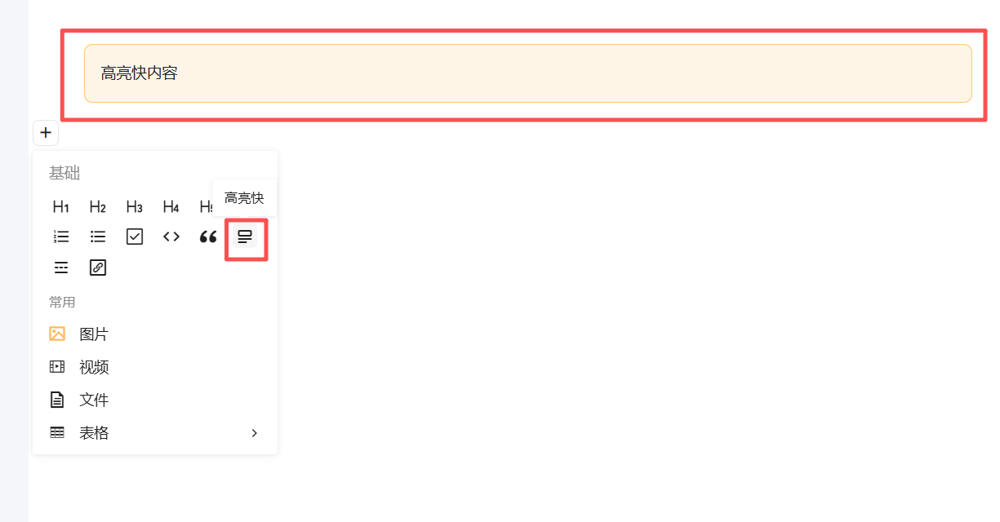

### 分割线使用

分割线用于分隔不同章节或内容块，提高文档可读性。点击【分割线】组件后，会在光标位置插入一条分割线，用于视觉上分隔不同的内容区域。

分割线适合用于：
- 分隔不同的章节或主题
- 区分不同类型的内容块
- 提高长文档的可读性和层次感

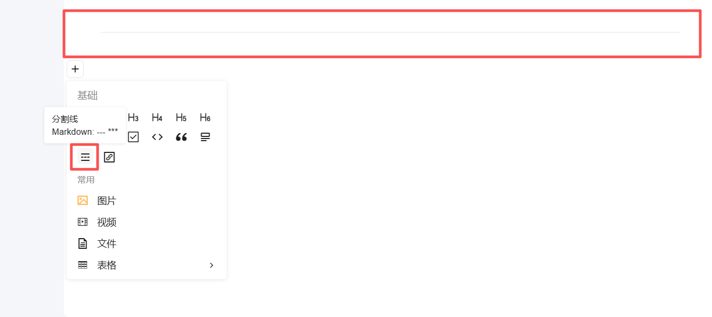

### 附件上传

附件适合上传模板文件、操作脚本、导入文件或其他补充资料。上传文件后，需要检查文件是否与当前文档内容匹配，避免上传无关附件。

### 查找和替换

编辑器支持在文档内容中查找关键字，并根据需要替换文本。对于篇幅较长的文档，可以使用查找功能快速定位需要修改的位置。

### 知识分类和标签

知识分类和标签用于文档分类和标签管理，方便检索和组织。在新建或编辑文档时，可以为文档设置分类和标签。

#### 知识分类

知识分类用于将文档归属到具体的分类目录中，方便用户按分类查找文档。文档创建时需要选择所属分类，分类选择后不可随意修改，避免影响用户按分类查找文档。

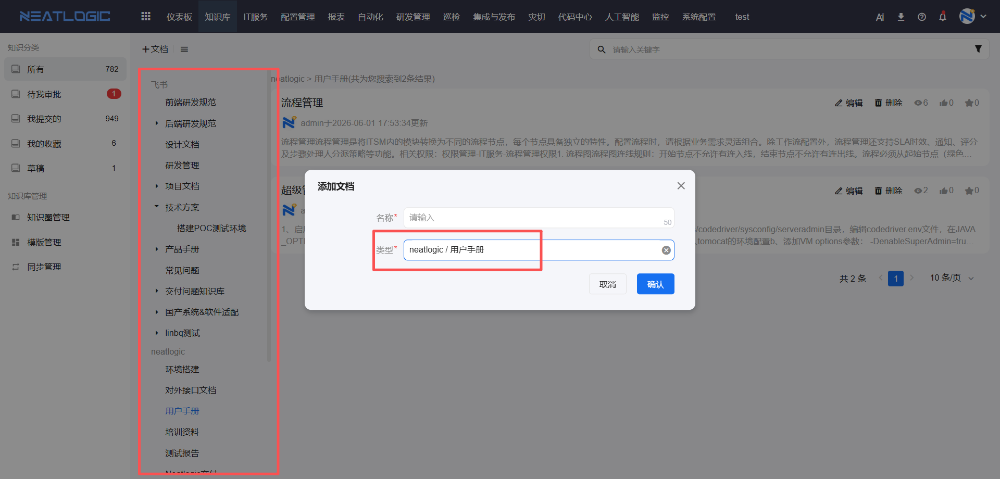

#### 标签管理

标签用于为文档添加关键词标记，方便用户按标签检索文档。一篇文档可以添加多个标签，标签之间用逗号分隔。

标签适合用于：
- 标记文档的关键主题或关键词
- 方便用户按标签快速检索相关文档
- 组织同一主题下的多篇文档

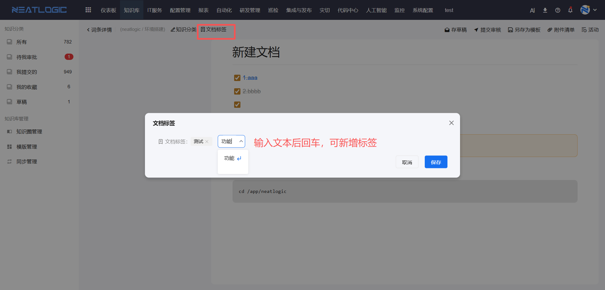

## 文档创建后的操作

文档编辑完成后，可以进行以下操作：

### 保存草稿

编辑文档时，点击保存草稿，系统会保存当前编辑内容。草稿不会立即成为正式版本，适合在内容未完成时临时保存。

保存草稿后，用户可以继续编辑，也可以在确认内容完整后提交审核。

### 提交审核

文档编辑完成后，点击提交审核，文档进入待审核状态。知识圈审批人可以在审核页面查看文档内容，并执行通过或退回操作。

提交审核前，需要确认文档标题、分类和正文内容完整。若文档需要作为模板沉淀，拥有知识模板管理权限的用户可以将当前文档保存为模板。

### 审核流程

审批人进入待审核文档页面后，可查看提交的文档版本。

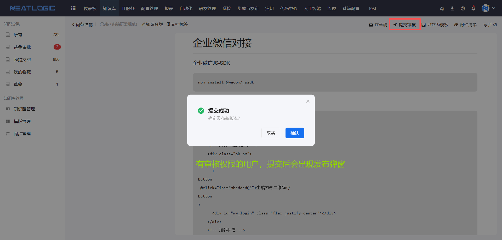

审核操作包括通过和退回：

1. **通过**：文档版本生效，并成为当前可查看的正式版本。
2. **退回**：文档不会发布为正式版本，提交人可根据退回意见继续修改。

审核时可填写说明，用于记录审核意见。审核结果会写入文档活动记录，方便后续追溯。

### 编辑已有文档

点击文档详情页的编辑按钮，可进入文档编辑页面。编辑后保存为新的草稿版本，并按审核流程提交。

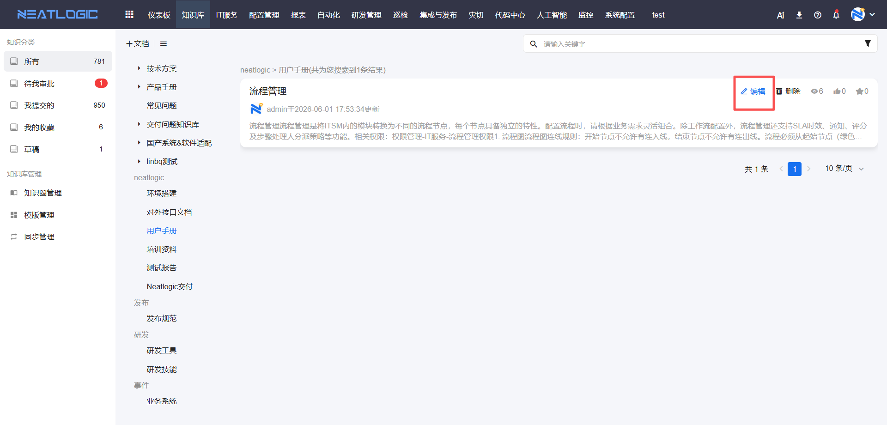

文档标题和分类是否可修改，受当前用户在知识圈中的权限控制。普通成员通常维护正文内容，审批人可参与标题、分类和审核相关操作。

### 删除文档

对有权限的文档，可执行删除操作。删除后文档不再出现在正常列表中。若删除操作需要审核，则会按草稿和审核流程生成待审核版本。

## 文档版本管理

知识文档支持历史版本。用户可在文档详情页查看当前版本和历史版本，了解文档在不同时间点的内容变化。

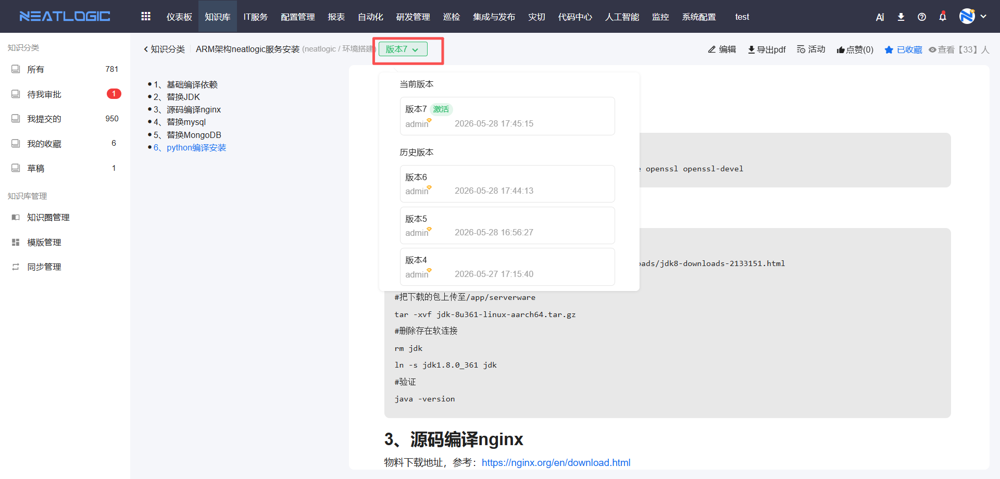

### 版本对比

当需要确认某次更新内容时，可选择历史版本与当前版本进行对比，查看新增、删除和修改的内容。

### 版本回退

当历史版本允许回退时，可将历史版本切换为新的当前版本。回退前需要确认该版本内容是否仍适用于当前业务场景。

### 版本删除

对可删除的历史版本，可执行删除操作。当前正式版本不能直接删除，避免影响正在使用的知识内容。

## 活动记录

活动记录用于追踪文档生命周期中的关键操作，包括创建、保存草稿、提交审核、审核通过、审核退回、编辑、删除、切换版本等。

查看活动记录时，可了解文档在不同时间点的修改内容和操作人。对于多人协作维护的知识文档，活动记录可以帮助定位变更来源。

## 权限说明

用户需要具备知识基础权限，才能进入知识库模块并查看有权限访问的文档。

知识文档操作同时受知识圈成员和审批人配置影响。

### 菜单权限
菜单权限在系统配置的权限管理中配置，具体路径：系统配置-[权限管理](../100.系统配置/1.用户和权限/权限管理.md)，搜索知识库模块。

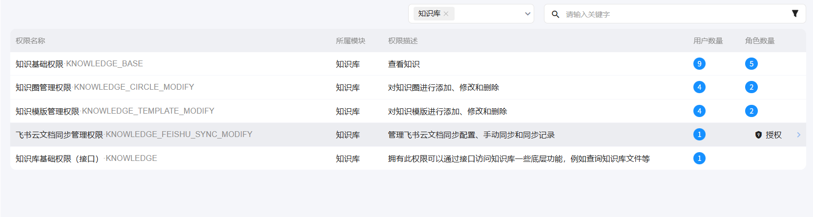

知识库模块包含以下菜单权限类型：

1. **知识基础权限**：提供知识库模块的访问权限，是其他知识库权限的基础。
2. **知识圈管理权限**：控制知识圈管理页面的菜单入口和操作权限，自动包含知识基础权限。
3. **知识模板管理权限**：控制模板管理页面的菜单入口和操作权限，自动包含知识基础权限。
4. **飞书云文档同步管理权限**：控制同步管理页面的菜单入口和操作权限，自动包含知识基础权限。

### 数据权限
知识圈之间数据相互隔离，每个知识圈的文档、成员和审批人配置独立管理。用户在知识圈中的角色决定了其对文档的操作权限。

**成员权限**：
- 查看知识圈下的文档
- 编辑知识圈下的文档
- 删除知识圈下的文档

**审批人权限**：
- 审核知识圈下的文档
- 同时拥有成员的所有权限（查看、编辑、删除文档）
