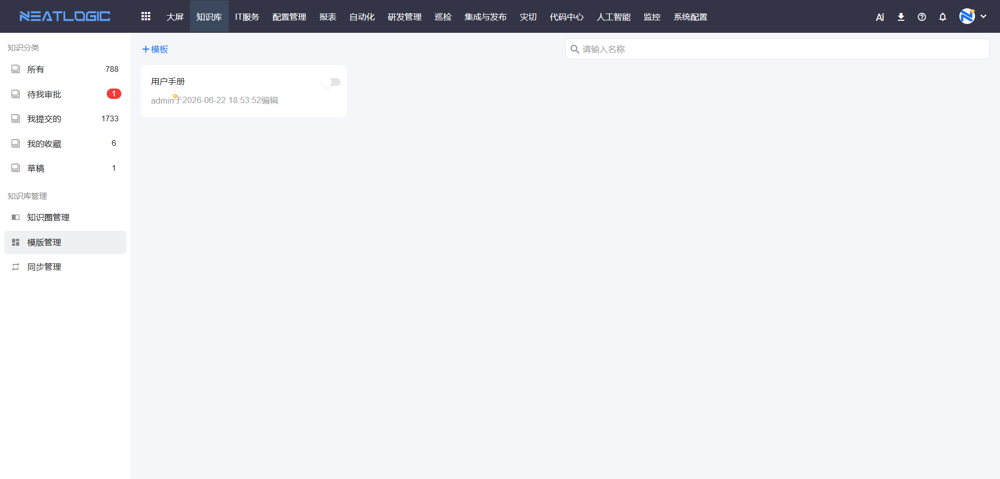
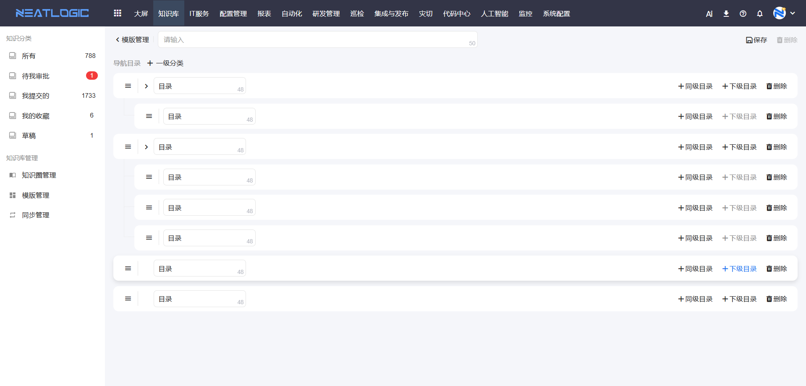
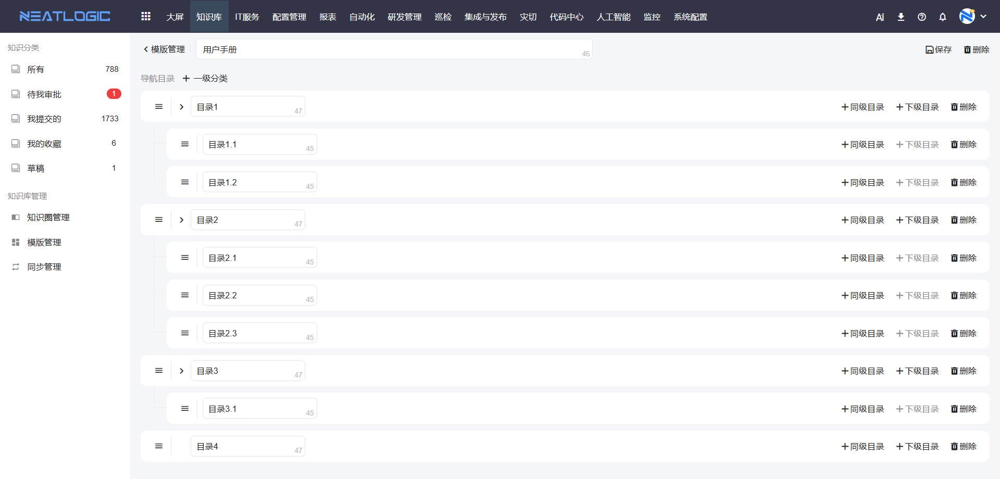
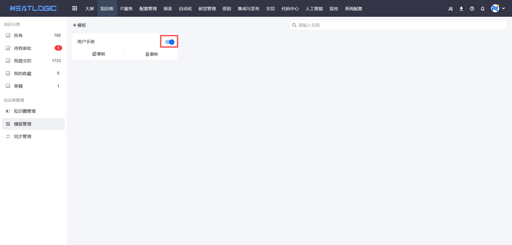
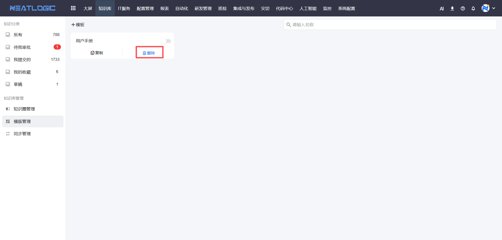

# 模板管理

模板管理用于维护知识文档的常用内容框架。团队经常编写操作手册、故障处理记录、应急预案时，可以先把固定章节做成模板，新建文档时直接套用，减少重复排版。

本文以“如何统一文档结构”和“如何维护模板生命周期”为主线，说明模板的新增、编辑、启用、禁用和删除。

## 权限说明

模板管理面向知识库管理员，用于统一新建知识文档时可选的内容结构。

**操作权限**
- 配置：系统配置-[权限管理](../100.系统配置/1.用户和权限/权限管理.md)-授权-知识模板管理权限
- 包含操作：添加、编辑、启用、禁用和删除模板
- 配置人员：系统超级管理员

**使用范围**
- 启用后的模板可在[新建知识文档](新建知识文档.md)时选择
- 禁用后的模板保留在模板列表中，但不会提供给用户选择
- 模板变更只影响后续新建文档，已创建的知识文档不会自动同步模板内容

## 添加模板

添加模板用于沉淀一套可复用的文档章节。

当团队反复编写同类文档时，可以把固定结构做成模板。例如故障处理记录可以包含问题现象、影响范围、排查过程、解决方案和验证结果；应急预案可以包含触发条件、处理步骤、联系人和回退方案。

点击添加模板，维护模板名称、模板内容和启用状态。

保存后，用户新建知识文档时可以选择该模板生成初始内容。模板只是初始内容框架，用户仍可根据实际情况继续补充和调整。

## 编辑模板

编辑模板用于维护已有模板的名称、内容和状态。

当团队写作规范变化，或模板中的章节已经不适合当前业务时，可以进入模板编辑页面调整。

模板修改后，只影响之后新建的知识文档；已经通过该模板创建的文档不会自动同步变更。如果需要调整已发布文档，需要进入具体文档单独编辑。

## 启用和禁用模板

启用和禁用用于控制模板是否出现在新建文档时的可选列表中。

- 启用：模板可在新建知识文档时选择。
- 禁用：模板保留在模板列表中，但用户新建文档时不可选择。

当模板暂时不用但仍有参考价值时，建议先禁用而不是删除。这样后续需要恢复时，可以重新启用。

## 删除模板

删除模板用于清理不再使用的文档结构。

不再使用的模板可执行删除。

删除模板不会影响已创建的知识文档。删除前建议确认模板是否仍被团队作为写作规范使用，避免影响后续文档统一性。

## 常见使用场景

### 统一故障处理文档格式

新增故障处理模板，预置问题现象、影响范围、排查过程、解决方案和验证结果等章节。用户新建文档时选择模板，就能按统一结构沉淀经验。

### 调整团队写作规范

编辑已有模板，更新章节名称和内容提示。调整后，新建文档会使用新模板结构，历史文档保持原内容不变。

### 下线过期模板

如果模板暂时不用，先禁用；如果确认不再使用，再删除。删除前先确认团队没有继续依赖该模板作为写作规范。
