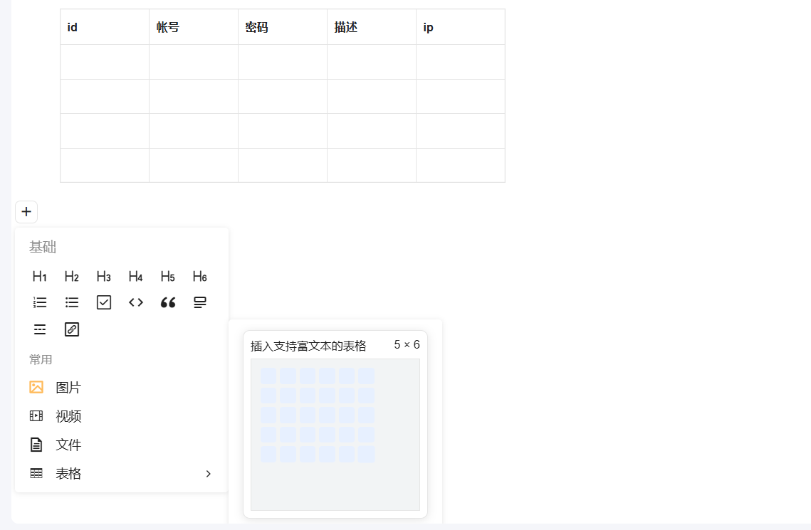
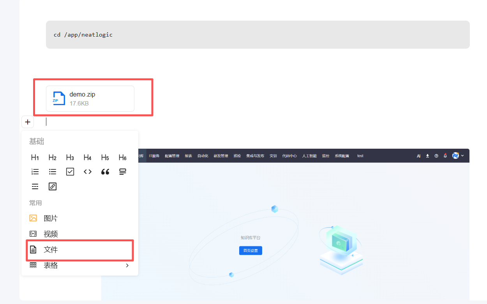
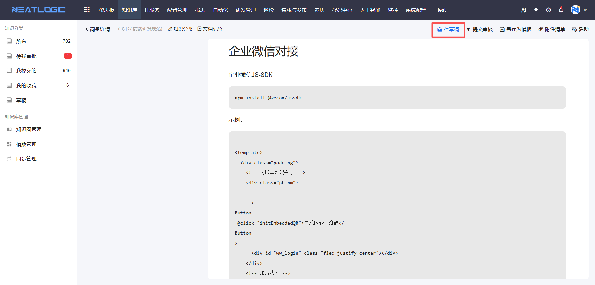
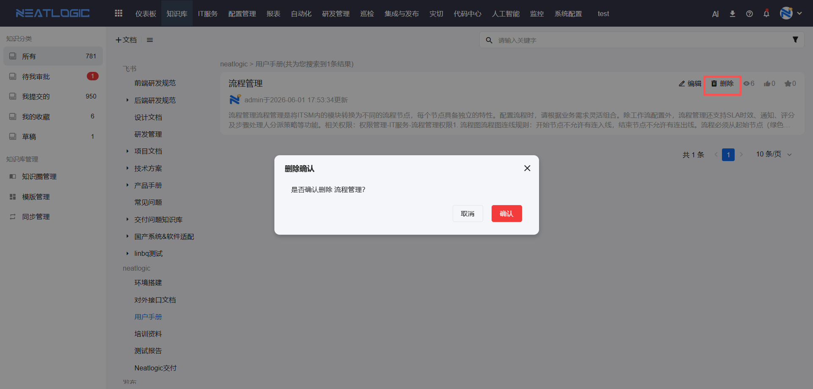
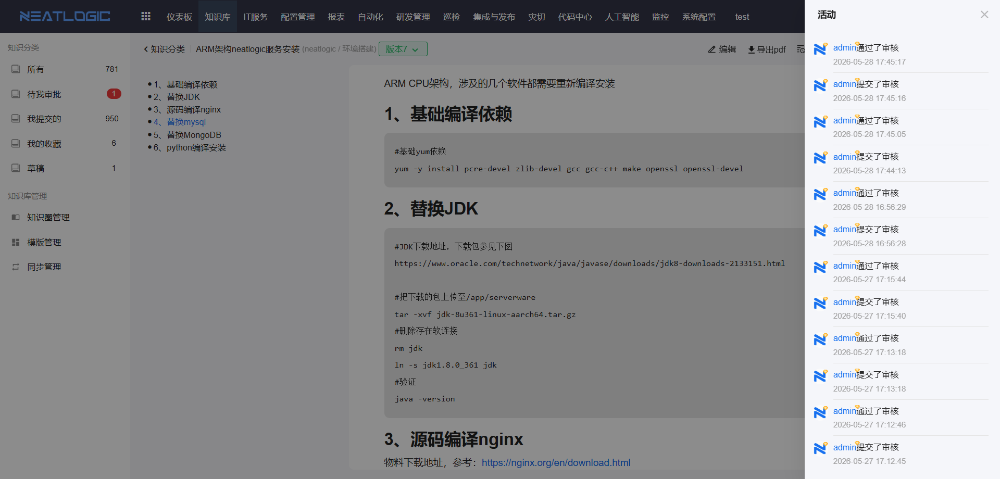

# 知识分类

知识分类用于按知识圈和目录组织知识文档。用户进入知识库后，可以先从左侧分类缩小范围，再查看分类下的文档、进入详情、收藏常用内容或继续编辑维护。

## 权限说明

**操作权限**
- 权限配置：系统配置-[权限管理](../100.系统配置/1.用户和权限/权限管理.md)-知识基础权限
- 配置人员：系统超级管理员

**数据权限**
- 数据范围：用户可见的分类和文档，受知识圈成员、审批人和文档状态共同影响
- 配置来源：分类目录在[知识圈管理](知识圈管理.md)中维护

## 分类目录

知识分类按知识圈组织。每个知识圈下可以维护多级分类，适合按业务域、知识类型、系统范围或组织范围拆分。

点击左侧分类后，页面展示当前分类下有权限查看的知识文档。若分类下还有子分类，可继续进入子分类查看更细的内容。

## 新建文档

在知识分类页面点击新建文档，可进入知识文档编辑页面。新建时需要选择所属分类，并填写标题和正文内容。

若文档需要固定结构，可选择已有模板生成初始内容。模板只是辅助写作，用户仍可在模板基础上继续补充和调整。

## 文档编辑器

知识库编辑器以内容块组织正文，适合维护操作步骤、FAQ、故障处理方案、配置说明和图文类知识。

常用内容包括标题、段落、列表、图片、附件、代码块、表格、链接、引用和高亮块。

### 表格编辑

表格适合整理字段、参数、对比项和处理记录。编辑时可新增行列、删除行列、合并单元格、调整样式和设置对齐方式。

### 图片和附件

图片用于说明页面位置、操作结果和配置效果；附件适合上传模板文件、操作脚本、导入文件或其他补充资料。

上传文件后，需要确认文件与当前文档内容匹配，避免把无关附件沉淀到知识库中。

## 保存和提交

文档编辑过程中可先保存草稿，草稿不会立即成为正式版本，适合内容未完成时临时保存。

内容确认后可提交审核。提交后，知识圈审批人可对该版本执行通过或退回。

审核通过后，文档版本生效并成为当前可查看的正式版本；退回后，提交人可根据意见继续修改。

## 查看和编辑文档

进入文档详情页，可查看标题、所属分类、正文、版本、浏览次数、点赞数和收藏状态。

对有权限的文档，可进入编辑页面维护内容。编辑后会形成新的草稿版本，并按审核流程提交。

## 删除文档

对有权限的文档，可执行删除操作。删除后，文档不再出现在正常列表中。

如果删除动作需要审核，系统会按草稿和审核流程生成待审核版本，审批通过后删除才会生效。

## 版本查看

知识文档支持历史版本。用户可在文档详情页查看当前版本和历史版本，了解不同时间点的内容变化。

当需要确认某次更新内容时，可选择历史版本与当前版本进行对比。若历史版本允许回退，可将历史版本切换为新的当前版本。

## 活动记录

活动记录用于追踪文档生命周期中的关键操作，包括创建、保存草稿、提交审核、审核通过、审核退回、编辑、删除和版本切换。

多人协作维护文档时，可通过活动记录确认变更时间、操作人和处理结果。

## 使用建议

1. 查找文档时，优先从业务分类进入，先缩小范围。
2. 高频使用的文档建议收藏，方便后续快速打开。
3. 大幅修改文档时，可通过历史版本和活动记录追溯变更。
