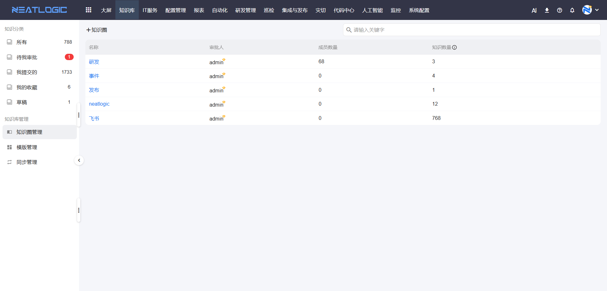
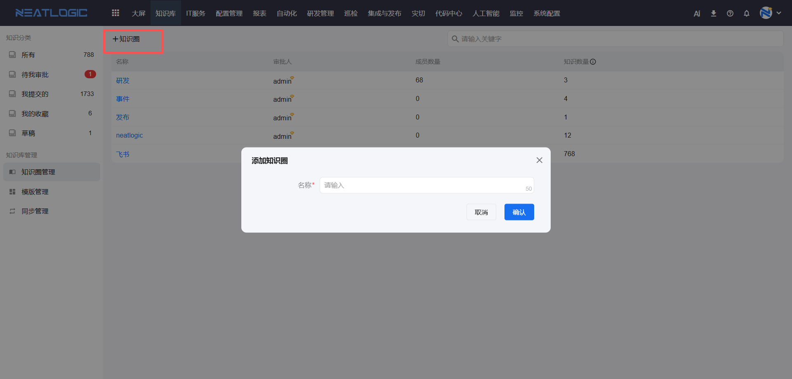
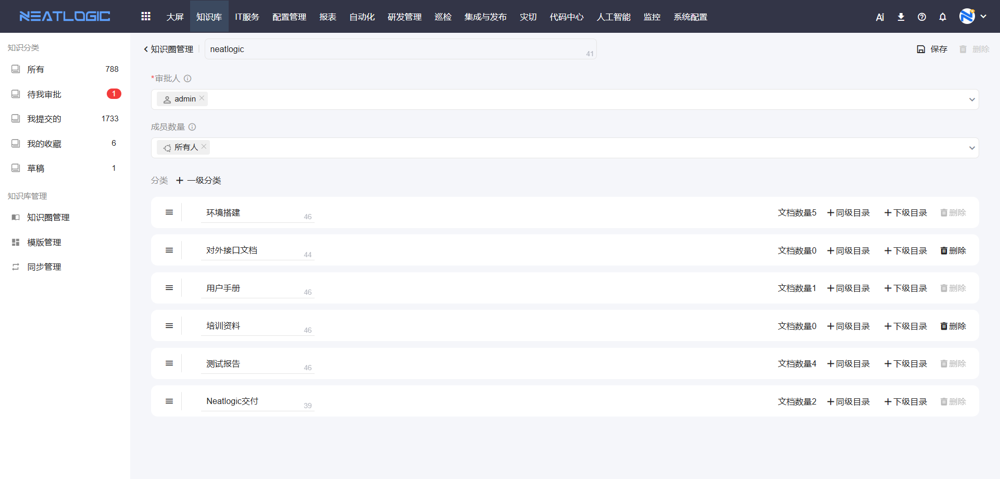
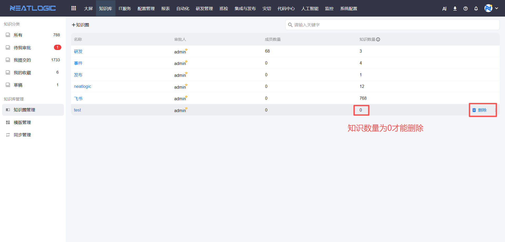

# 知识圈管理
知识圈是知识库中管理文档范围、成员和审批人的基础单元。不同知识圈可以配置不同的成员、审批人和知识分类，用于区分不同团队、业务域或管理范围内的知识内容。

**相关权限**：系统配置-[权限管理](../100.系统配置/1.用户和权限/权限管理.md)-知识圈管理权限

进入知识圈管理页面后，可查看已有知识圈列表，并进行添加、编辑和删除操作。

## 添加知识圈
点击添加按钮，可新增知识圈。

知识圈配置包括名称、审批人、成员和知识分类。

- **名称**：用于标识知识圈，名称不能重复。
- **审批人**：负责审核该知识圈下提交的知识文档，可选择用户、分组或角色。
- **成员**：可以参与该知识圈文档维护和查看的用户范围，可选择用户、分组或角色。
- **知识分类**：用于维护知识圈下的分类目录，文档需要归属到具体分类中。

## 编辑知识圈
在知识圈列表中选择需要调整的知识圈，进入编辑页面后可修改名称、审批人、成员和知识分类。

保存知识圈时，系统会根据最新的分类结构重新生成知识分类树。调整分类时，需要确认已有文档的分类关系，避免影响用户按分类查找文档。

## 删除知识圈
知识圈下没有知识文档时，可删除该知识圈。若知识圈下已有知识文档，需要先处理相关文档后再删除。

