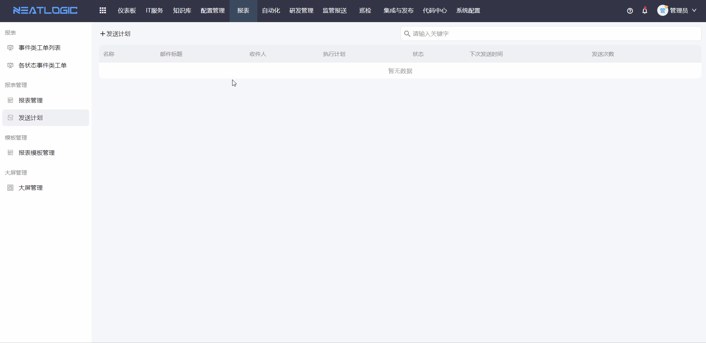
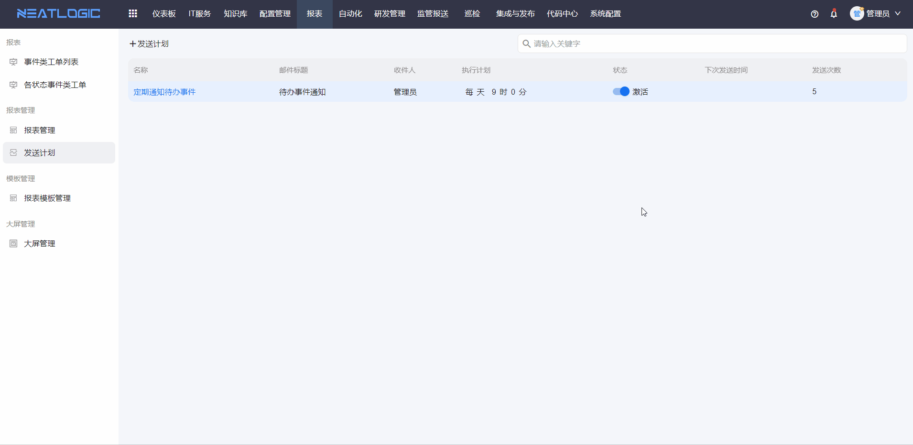

# 发送计划

发送计划用于定时发送报表给指定用户。适合日报、周报、月报等固定频率的数据通知场景。

管理员可以新增、编辑和删除发送计划，也可以查看计划的发送记录，确认报表是否按预期发送。

## 权限

**操作权限**
- 配置：系统配置-[用户管理](../100.系统配置/1.用户和权限/用户管理.md)-授权-报表管理员权限
- 包含操作：新增、编辑、删除发送计划，查看发送记录
- 配置人员：系统超级管理员

## 添加发送计划

添加发送计划时，需要选择要发送的报表、接收用户和发送时间。

如果报表设置了过滤条件，发送计划会按配置生成报表内容，并在计划触发时发送给指定用户。

## 查看发送记录

发送记录用于查看发送计划的执行结果。

管理员可以通过发送记录确认发送时间、发送对象和发送状态，便于排查报表未收到或发送异常的问题。

