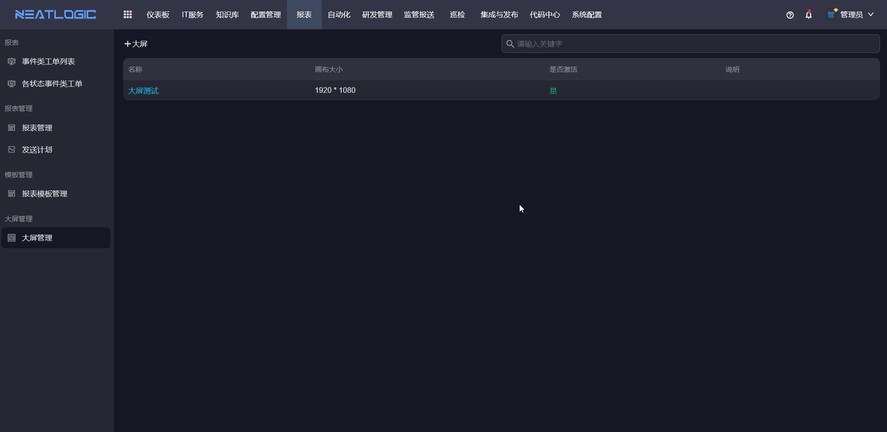
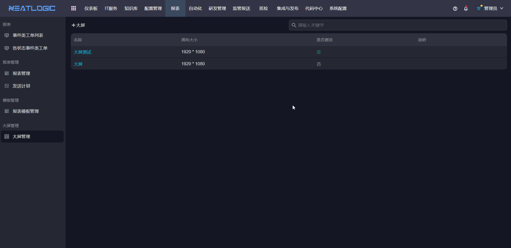
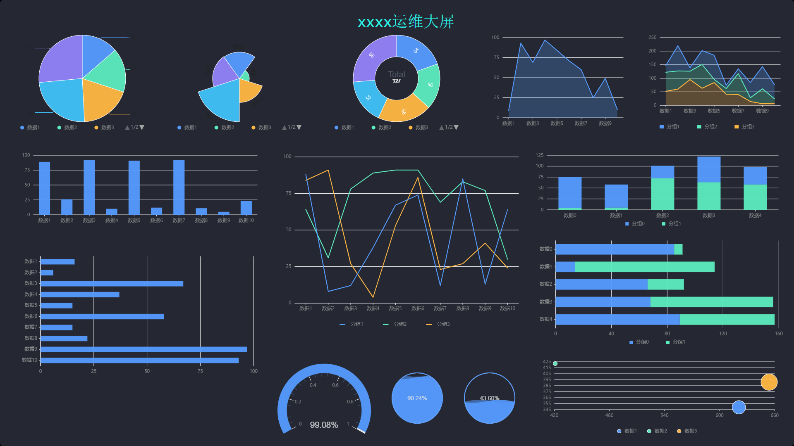

# 大屏管理

大屏管理用于配置可视化大屏，适合实时监控、数据展示、运营分析和辅助决策等场景。

大屏支持多种可视化组件，数据源配置自由度高，并支持数据实时更新。编辑页面主要由画布区、组件选择区和配置区组成。

## 权限

**操作权限**
- 配置：系统配置-[用户管理](../100.系统配置/1.用户和权限/用户管理.md)-授权-大屏管理权限
- 包含操作：新增、编辑、删除和预览大屏，维护大屏组件、图层和数据配置
- 配置人员：系统超级管理员

## 添加大屏

添加大屏的一般流程为：打开添加大屏页面，添加组件，编辑组件配置，然后保存。

大屏配置过程中，需要结合展示目标选择合适的组件类型，并为组件配置数据来源、样式和刷新方式。

## 画布区

画布区是大屏的核心编辑区域，用于摆放和调整组件。

管理员可以在画布中移动组件位置，也可以调整组件图层，使不同组件按照预期的前后关系展示。

## 组件选择区

组件选择区提供饼图、折线图、柱形图等可视化组件。

配置大屏时，可以根据数据类型和展示目的选择组件。例如，趋势类数据适合使用折线图，占比类数据适合使用饼图，对比类数据适合使用柱形图。

## 配置区

配置区用于维护画布和组件的具体配置。

选中画布中的组件时，右侧配置区会展示该组件的配置项；未选中组件时，右侧配置区展示画布配置。数据配置的数据源来自系统配置模块的数据仓库。

## 预览大屏

保存大屏后，可以通过预览查看最终展示效果。

预览时建议检查组件布局、数据刷新、图层关系和内容展示是否符合预期。

