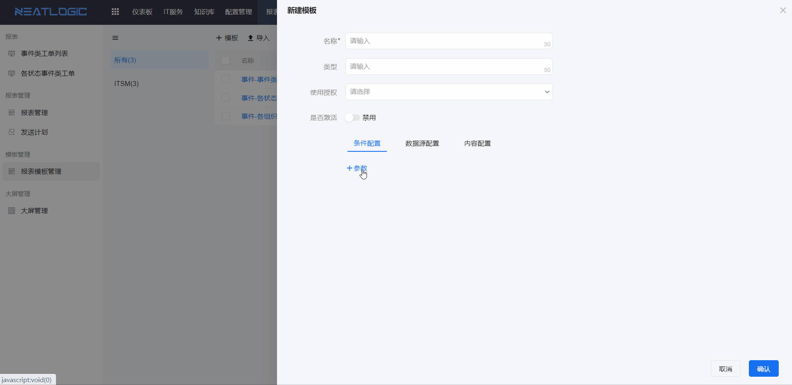
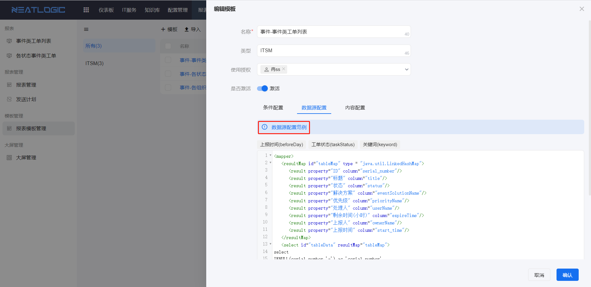
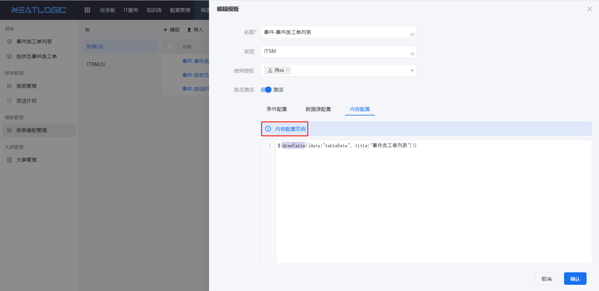
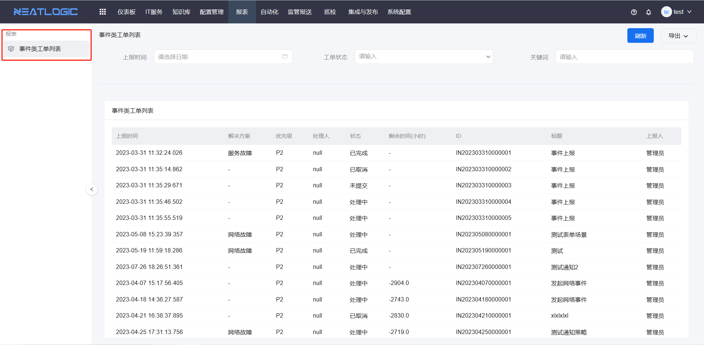
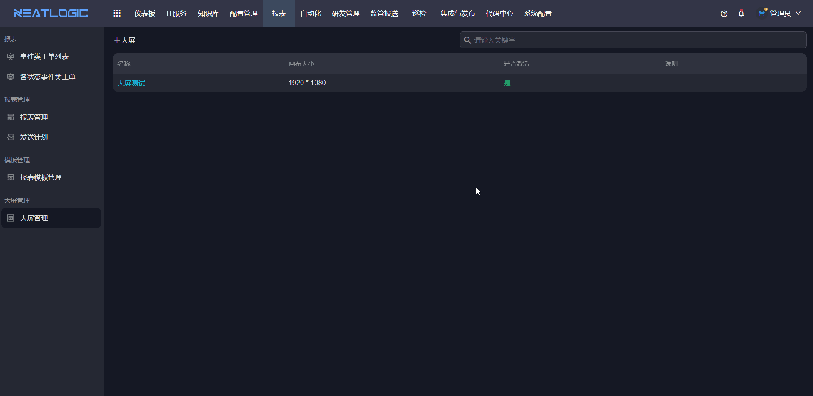

# 报表
报表模块支持用户根据需求场景配置报表数据源和过滤条件，如用报表汇总最近一个月的所有工单，模块自带报表模板、报表管理、发送计划、大屏管理等功能。

相关权限：报表基础权限、报表管理员权限、报表模板管理员权限、大屏管理权限、报表模板超级管理员权限

## 报表模板
报表模板是由条件配置、数据源配置和内容配置组成的模板，用户可将使用频次高且数据源及展示样式一样的场景定义成报表模板，再由管理员授权使用。

- 条件配置：条件是指报表展示时的过滤条件，可以自定义配置，目前支持的控件类型有文本框、下拉框、单选框、复选框、时间范围和日期等。
  
- 数据源配置：数据源配置是通过sql脚本查询数据库的数据，并把返回的字段定义为模板的数据参数。光标聚焦提示可查看示例。
  
- 内容配置：配置渲染数据的脚本，光标聚焦输入框上方的提示查看示例。
  

## 报表管理
报表管理页面可添加、编辑、删除报表，普通用户只能查看被授权的报表。

### 添加报表
添加报表时，可控制展示的条件和默认过滤值，还设置显示字段和字段排序。

### 查看报表
报表列表中只显示当前用户被授权查看的报表，点击报表标题跳转到报表查看页面，报表支持导出为pdf、word或excel文档。

## 发送计划
发送计划是用于实现定时发送报表给指定用户，支持添加、编辑和删除发送计划，还可查看发送记录。

添加发送计划

查看发送记录

## 大屏管理
大屏可以解决用户对数据实时监控和决策、宣传和展示的场景需求，大屏的特点有样式丰富多样、数据源自由度高、数据实时更新、可视化组件类型多等。大屏编辑页面分成三个区域：画布区、组件选择区、配置区。

添加大屏的步骤：打开添加大屏页面-添加组件-编辑组件-保存

- 画布区：即中间的核心编辑页面，支持移动组件位置，支持修改组件图层。
- 组件选择区：即饼图、折线图、柱形图等一系列的可视化图表选择。
- 配置区：当选中画布中的组件，右侧图层呈现组件的编辑配置，未选中组件，右侧呈现的是话不的编辑配置。数据配置的数据源来自系统配置模块的数据仓库。

预览大屏的效果
