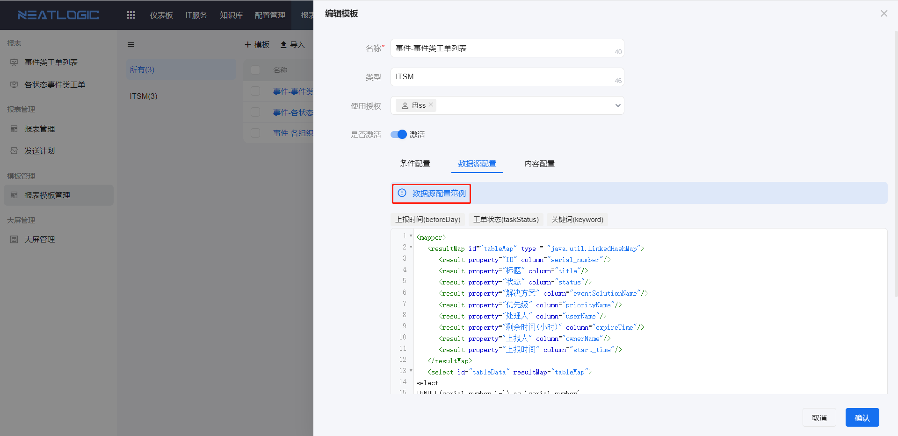
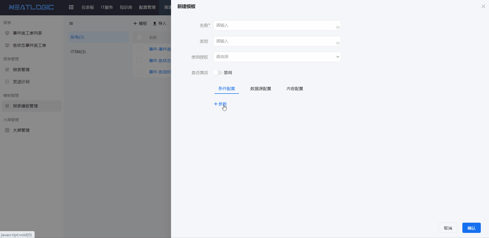
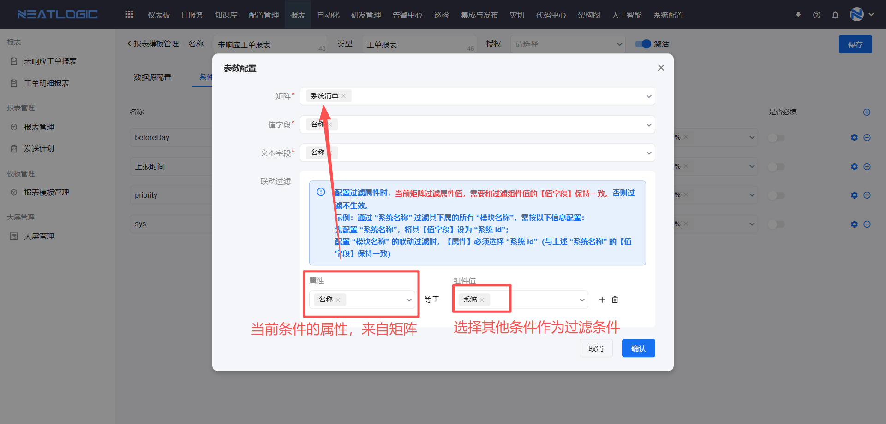
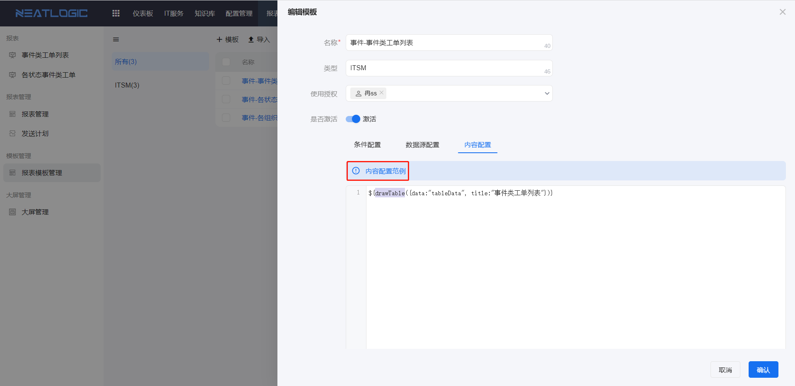

# 报表模板管理

报表模板管理用于维护报表模板。模板由数据源配置、条件配置和内容配置组成，适合将数据来源和展示方式相对固定的统计场景沉淀为可复用模板。

配置完成后，管理员可以基于模板创建具体报表，并授权给需要查看报表的用户。

## 权限

**操作权限**
- 配置：系统配置-[用户管理](../100.系统配置/1.用户和权限/用户管理.md)-授权-报表模板管理员权限
- 包含操作：新增、编辑、删除报表模板，配置数据源、过滤条件和内容展示方式
- 配置人员：系统超级管理员

**操作权限**
- 配置：系统配置-[用户管理](../100.系统配置/1.用户和权限/用户管理.md)-授权-报表模板超级管理员权限
- 包含操作：管理全部报表模板及模板授权
- 配置人员：系统超级管理员

## 数据源配置

数据源配置用于定义报表模板可查询的数据。管理员通过 SQL 脚本查询数据库数据，并将返回字段定义为模板的数据参数。

配置数据源时，需要关注 SQL 返回字段是否与后续内容配置一致。字段定义不准确时，报表内容可能无法正确渲染。光标聚焦到提示区域，可查看系统提供的配置示例。

## 条件配置

条件配置用于定义报表查看时的过滤条件。用户查看报表时，可以根据这些条件筛选数据。

目前支持的控件类型包括文本框、下拉框、单选框、复选框、时间范围和日期等。条件配置完成后，可在报表管理中控制哪些条件对用户展示，并设置默认过滤值。

条件之间支持过滤联动。配置联动后，可以根据前一个条件已选择的值，过滤后一个条件的可选范围。

例如，先选择系统名称，再根据系统名称过滤下属模块名称。配置过滤属性时，当前矩阵过滤属性值需要与过滤组件值字段保持一致，否则过滤不生效。

## 内容配置

内容配置用于定义报表数据的展示方式。管理员需要编写渲染脚本，将数据源返回的数据转换为报表页面中展示的内容。

配置内容时，需要保证脚本中引用的数据字段与数据源配置中的返回字段一致。光标聚焦到输入框上方的提示区域，可查看系统提供的配置示例。

