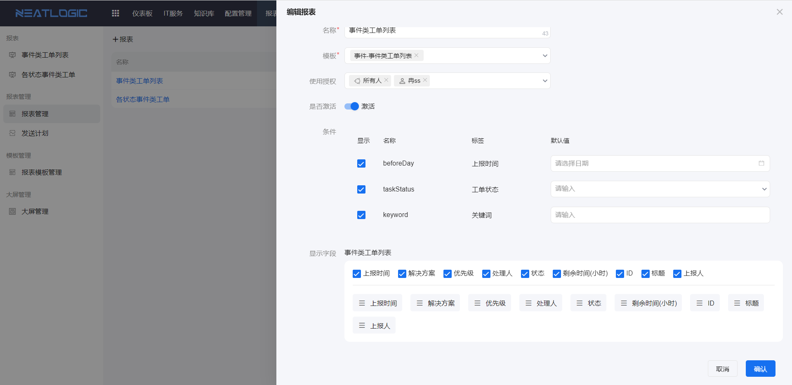
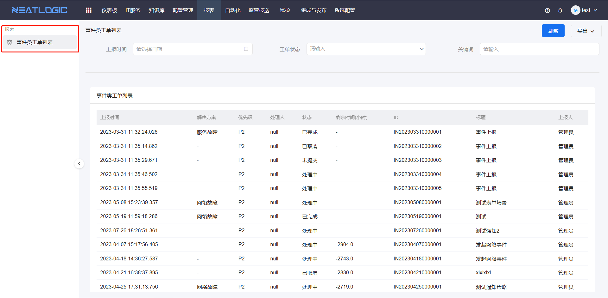

# 报表管理

报表管理用于基于报表模板创建具体报表，并控制报表的展示条件、默认过滤值、显示字段和字段排序。

普通用户只能查看被授权的报表。管理员需要根据实际使用范围进行授权，避免报表数据被无关人员访问。

## 权限

**操作权限**
- 配置：系统配置-[用户管理](../100.系统配置/1.用户和权限/用户管理.md)-授权-报表管理员权限
- 包含操作：新增、编辑、删除报表，配置报表展示条件、默认过滤值、显示字段和字段排序
- 配置人员：系统超级管理员

## 添加报表

添加报表时，需要先选择报表模板，再根据模板中已有的条件和字段完成报表配置。

管理员可以控制报表页面展示哪些过滤条件，并为条件设置默认过滤值。同时，也可以设置报表的显示字段和字段排序，使用户进入报表后看到更符合业务场景的数据视图。

## 查看报表

报表创建并授权后，用户可在报表页面查看。

报表列表只显示当前用户被授权查看的报表。点击报表标题后，可进入报表查看页面，按条件查询数据，并导出为 PDF、Word 或 Excel 文档。

