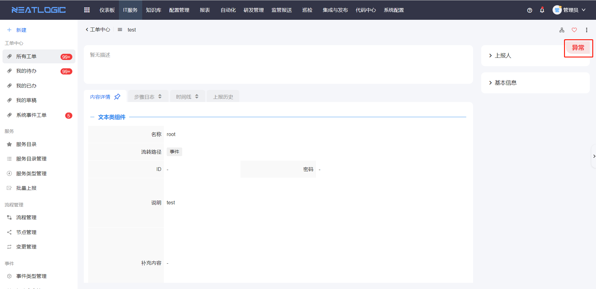
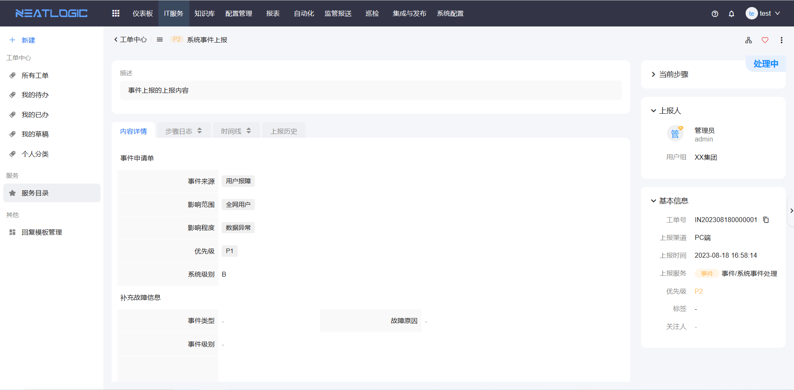
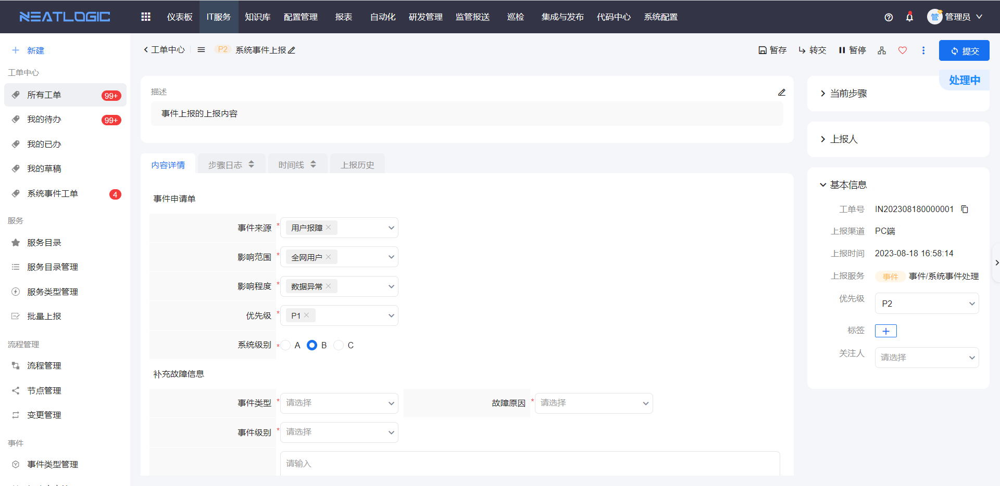
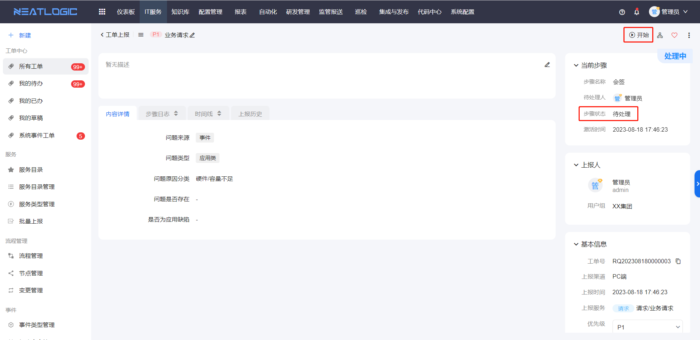
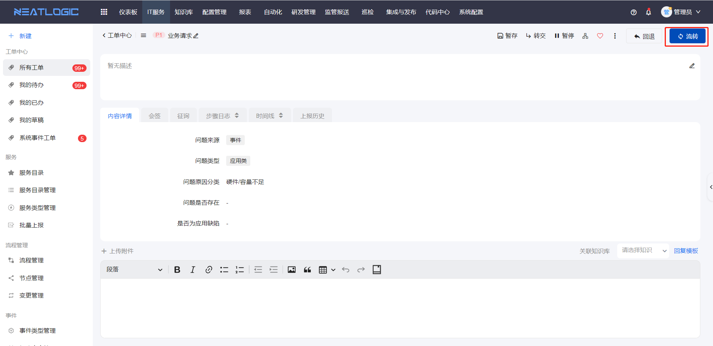
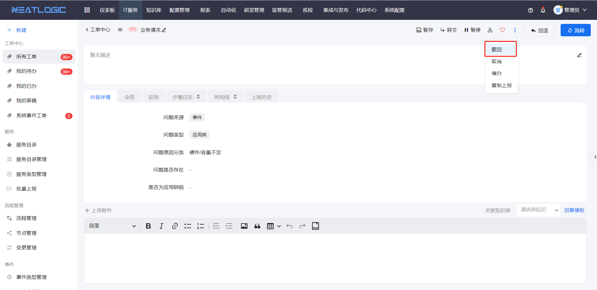

# 工单处理
工单处理是指处理人填写工单的信息并向后流转，直到工单处理完成。在工单处理页面，有工单维度的操作和节点维度的操作。 
工单维度的操作有：修改上报内容、催办、取消/恢复工单、转报、关联重复事件等。 
节点维度的操作有：开始、流转、撤回、回退、暂停、转交、表单、回复、子任务、评分等。

## 名词解释
### 工单状态
- 未提交：工单目前还没有提交，只能由上报人或代报人来提交。
- 处理中：工单目前有步骤未处理完成，只有处理人和工单干系人能进行处理。
  
- 异常：工单目前已经失败，无法正常处理。
  
- 已完成：工单已经处理完成。
- 已取消：工单已取消。
- 已评分：工单已处理完成并且完成评分。

### 步骤状态
- 待处理：当前步骤节点还没有开始处理。
- 处理中：当前处理步骤已开始处理，还未处理完成。
- 异常：当前步骤节点处理异常，例如条件分流节点没有匹配到任何流转规则
- 已完成：步骤已经处理完成
- 已挂起：步骤节点挂起，无法继续处理。例如撤回到上一步骤，当前步骤挂起。

### 变更步骤状态
- 待处理：变更步骤还未开始处理，此时待处理人可进行取消、开始和回复操作。
- 进行中：变更步骤正在处理中，还未完成，此时处理人可进行取消、开始和回复操作。
- 已完成：变更步骤已经处理完成，此时处理人可对步骤进行回复操作。
- 已取消，步骤直接取消，无法再进行操作。

## 工单展示信息
查看工单时，如果用户是当前节点（步骤）处理人，会跳转到处理页，若用户不是当前节点（步骤）处理人，则跳转到详情页。

详情页只能查看工单的基本信息、表单信息、步骤日志、时间线、上报历史。

处理页显示的信息有处理详情页信息外，还显示当前可执行的处理操作，包括流转、暂停、撤回、编辑表单、修改上报内容等。

## 工单操作
- 开始：工单节点的状态为待处理时，显示开始操作，开始后才能处理工单，只有待处理人有操作权限。
  
- 流转：流转到下一步，只有处理人有操作权限。
  
- 撤回：撤回到上一个处理节点，这个操作只有上一个节点的处理人有操作权限
  
- 回退：回退到前置步骤，有回退线的节点才显示这个操作，只有处理人有操作权限。
  
- 修改上报内容：修改工单标题、优先级、上报描述、标签、关注人等内容，有修改上报权限的用户才能操作，权限详情参考[流程管理](../流程管理/流程管理.md)
  
- 转交：把当前步骤转交给其他用户处理，有节点转交权限的用户才能执行转交操作，支持转交给用户、分组或角色，权限详情参考流程管理-节点设置-权限设置。