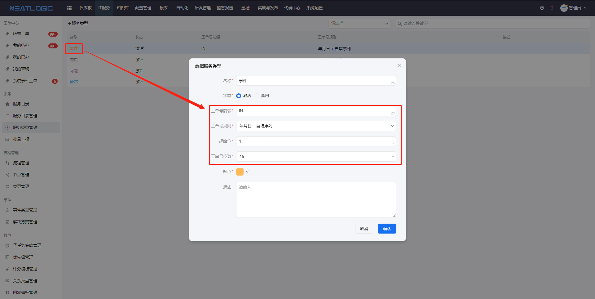
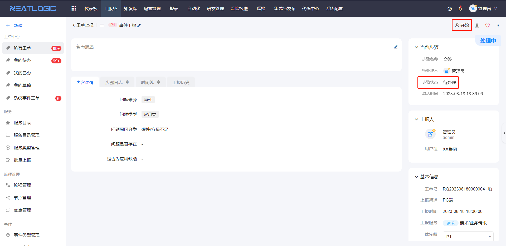

### 1、 工单生成策略在哪里配置？
打开IT服务-服务类型管理页面，点击服务类型名称，重新编辑服务类型并保存即可。

### 2、 提交工单后，打开处理工单页面，没有处理的文本框。
这个是因为工单当前步骤的状态是待处理，人工点击开始按钮即可。

如果不想每次都人工操作开始，需重新编辑流程，修改步骤对应的节点设置，启用自动开始，并且分配处理人的策略最终匹配到的处理人只能有一个，详情参考[流程管理](流程管理/流程管理.md)。