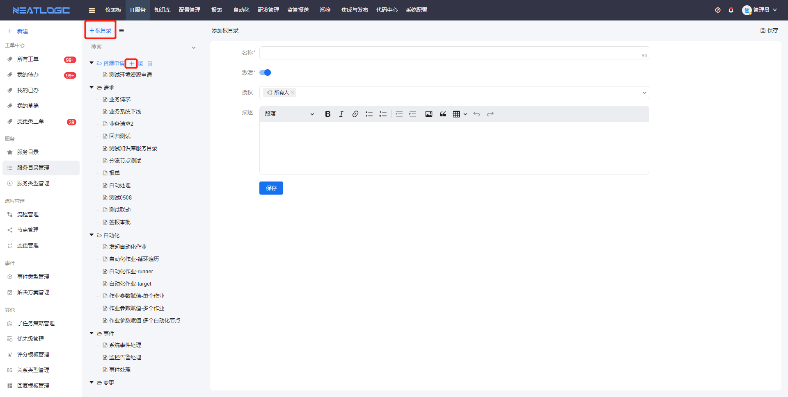
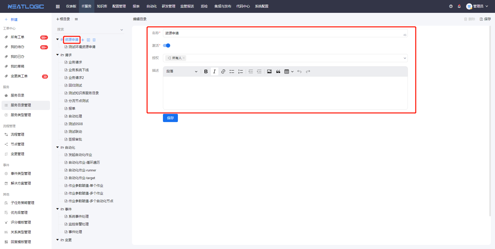
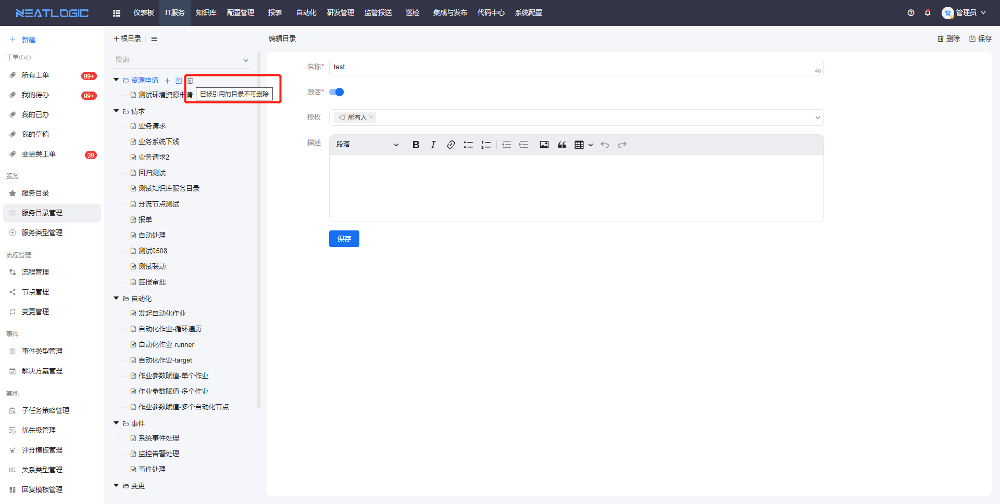

# 服务目录管理
服务目录管理包括[目录](#目录)和[服务](#服务)的新增、修改、删除和授权等功能，服务可建立与流程的联系，并个性化配置服务的字段属性，如优先级、并用于发起工单。 
关于目录和服务的权限，父目录的权限 > 子目录的权限 > 目录下服务的权限 
若目录未授权给用户，目录下级的子目录和服务均不显示在服务目录页面中，无论用户是否被授予子目录和服务的权限。
## 目录

- 添加
  
- 编辑
  
- 删除
  
  

## 服务

- 添加
- 编辑
- 删除
- 权限
  
|  目录激活状态  |  服务激活状态  |  使用范围  |  查看权限  |  工单上报权限  |
| ---- | ---- | ---- | ---- | ---- |
|  已激活  |  已激活  |  所有  |  pc端和移动端都可以查看  |  pc端和移动端都可以上报  |
|  已激活  |  未激活  |  所有  |  pc端和移动端都不可以查看  |  pc端和移动端都不可以上报  |