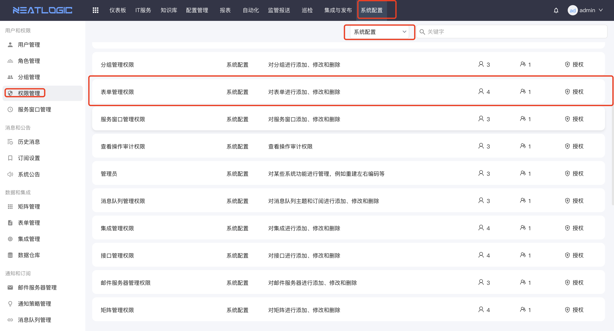
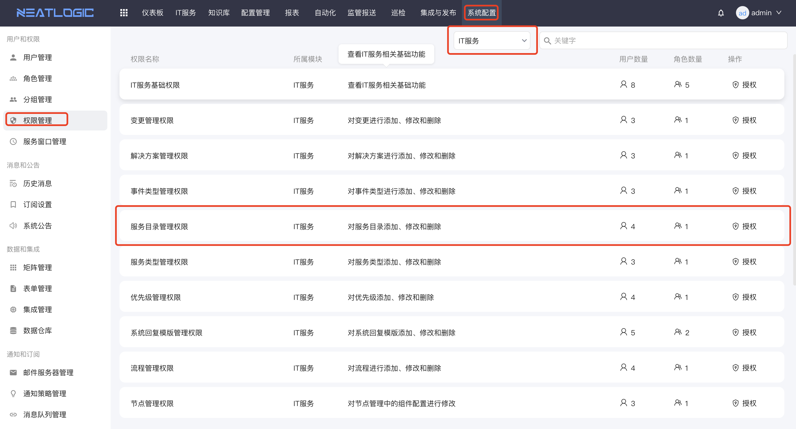
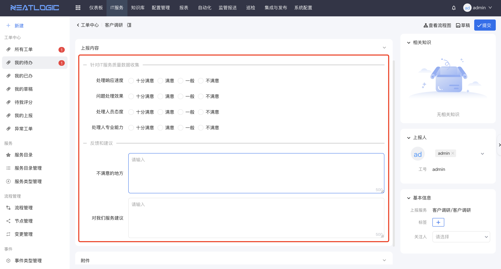
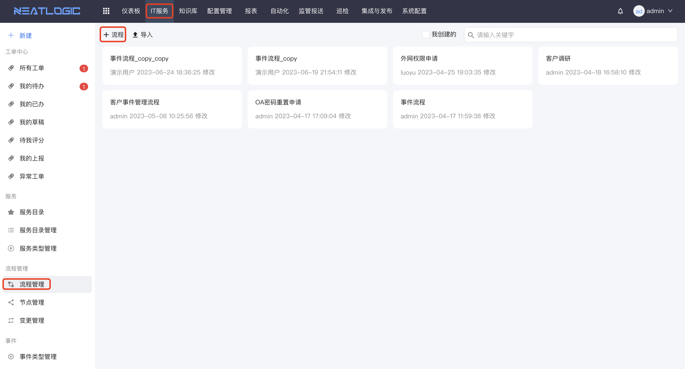
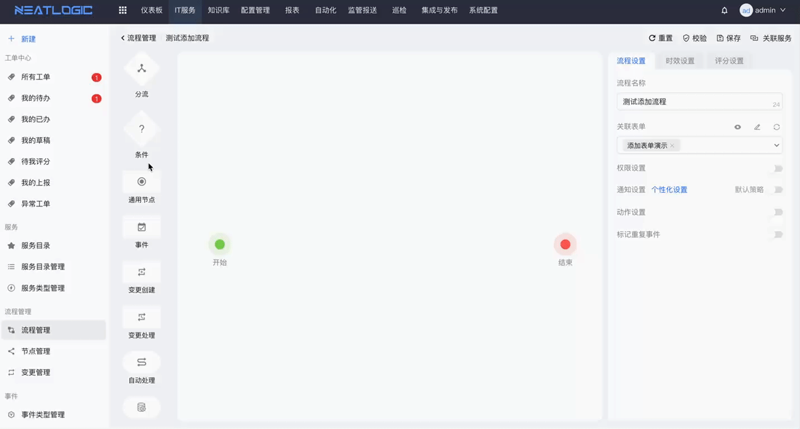
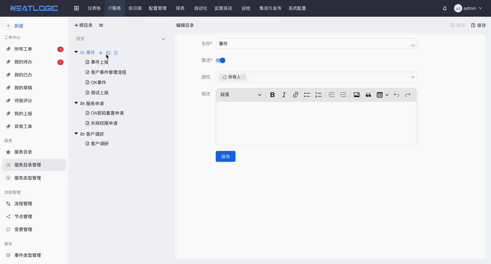

# 添加第一个服务目录

## 权限
添加服务目录为系统管理功能，需要当前用户拥有以下权限

- 表单管理权限

- 流程管理权限

- 服务目录管理权限
 

## 创建表单

**表单**：即用户在上报页面填写的上报内容，如下图

ITSM系统，需要用户根据不同的工单上报场景，添加自定义表单

- 添加表单入口

系统配置->表单管理->添加表单

- 添加表单控件

支持文本框、富文本框、下拉、单选、多选、时间、等组件，根据服务需求，将需要的控件拖拽到表单区域即可
 

## 添加流程

**流程**：即用户上报工单后，后台的处理过程，如下图

ITSM系统，需要用户根据不同的工单上报场景，添加自定义流程

- 添加入口

- 设置流程属性

选择关联表单、设置权限、选择通知策略

- 拖拽流程节点步骤

- 设置流程节点

设置节点名称、处理人、权限、通知策略等

  
## 添加服务目录

- 添加入口

- 添加服务目录
设置服务名称、选择流程、选择优先级、服务窗口、服务类型等

## 完成

