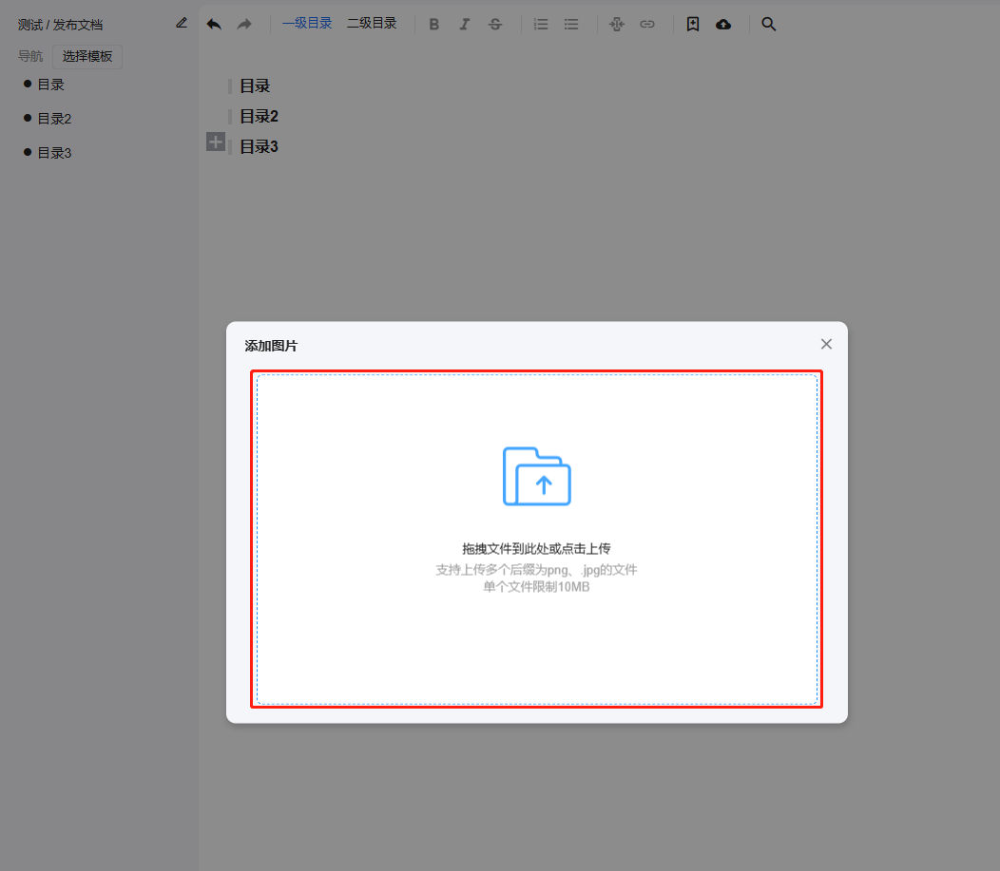
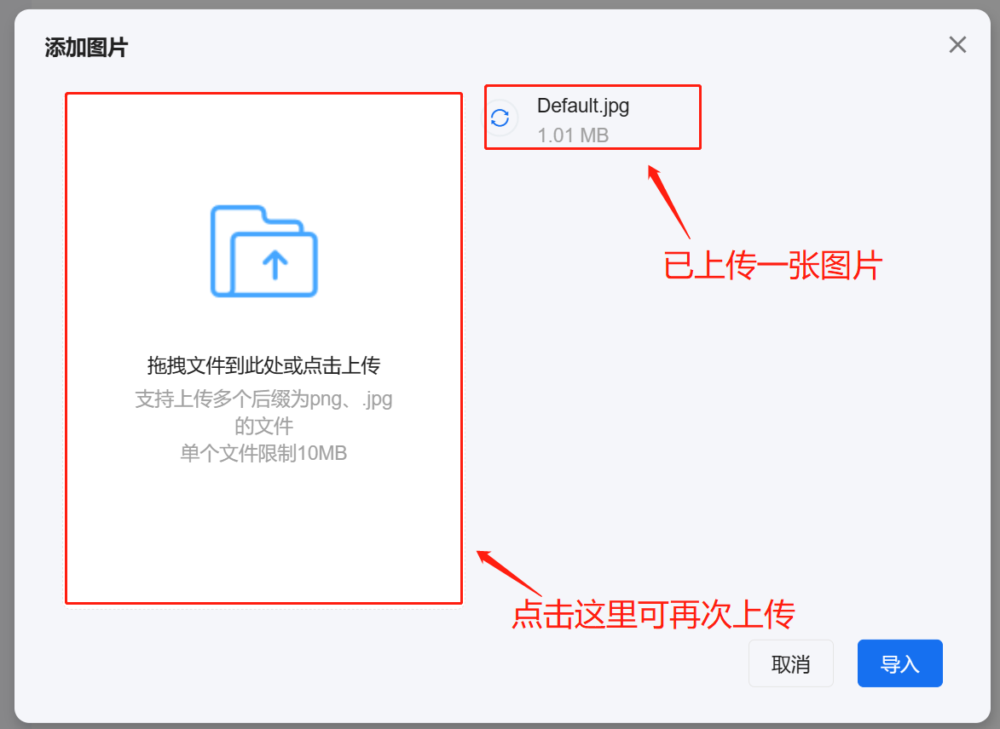
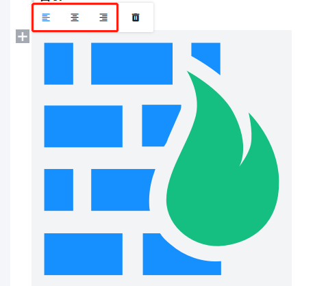
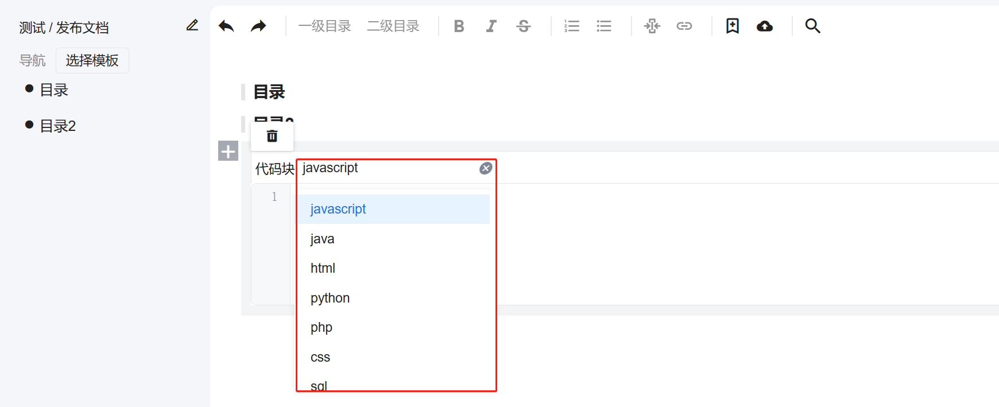
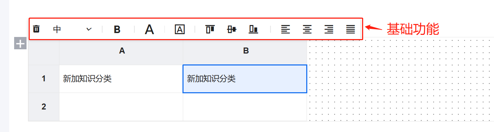
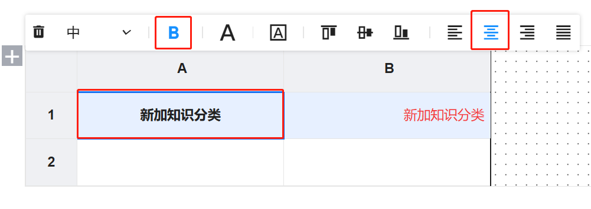
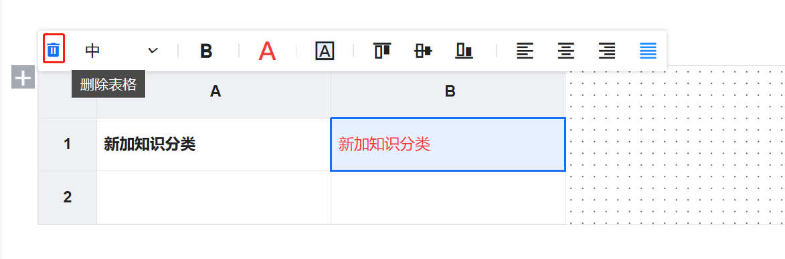
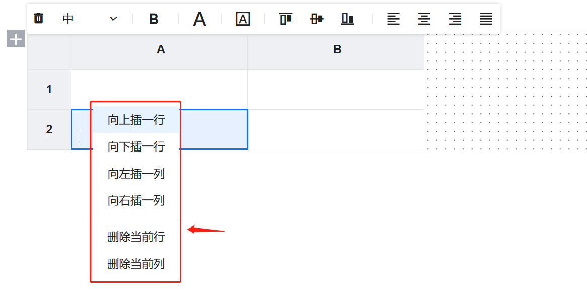
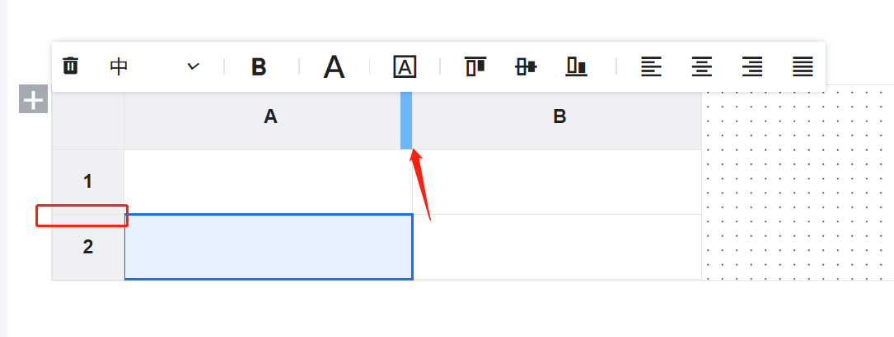

# 新建知识文档

## 选择模板

> 新建知识文档的第一步，需要先选择模板。

点击左侧菜单【选择模板】按钮，在弹出对话框中，选择已有模板或者新建模板。

## 选择需要使用的组件

首先，在每个模板标题处，鼠标点击，会出现一个【+】号，点击【+】号，可以新增组件，目前支持的组件有

1. 无序列表
2. 有序列表
3. 图片上传
4. 代码块
5. 表格
6. markdown

可根据实际的场景自行选择。

### 无序列表使用

点击【无序列表】组件后，在光标位置后可直接输入内容，回车换行，可新加行。

### 有序列表使用

点击【有序列表】组件后，在光标位置后可输入内容，回车换行，可新加行。

### 图片上传使用

点击图片上传，会出现一个添加图片弹窗，然后点击【上传图片或者拖拽图片】按钮，选择需要上传的图片，选择一张图片完成后，可继续选择图片上传，最后图片都选择好后，点击底部的【导入】按钮，可完成图片上传。

#### 上传图片

##### 上传一张图片

在弹出添加图片弹窗中，点击上传或拖拽文件到此处，可上传图片。

##### 上传多张图片

上传一张图片成功之后，点击左边的【拖拽文件到此处或点击上传】按钮，可继续选择上传图片。

> 注意：每次只能选择一张图片

##### 上传图片成功

提示图片上传成功，点击【完成】按钮，即可看到上传的图片。

#### 图片描述添加

上传成功的图片，在图片下方可添加描述说明，鼠标放在【请输入图片描述】文字上，可输入图片描述内容，具体见下图。

#### 其他

##### 删除图片

鼠标上移到图标时，左上角会出现【垃圾桶删除图标】，点击图标，即可删除这张图片。

##### 图片对齐设置

鼠标上移到图片时，左上角出现菜单栏图标，点击【居左/居中/居右】图标，可调整图片的对齐方式。

### 代码块使用

点击【代码块】按钮，在出现的代码块编辑器中，选择代码块的语言类型，然后在【请输入内容】文本框中输入对应的代码内容，回车可进行换行。

> 鼠标经过代码编辑器时，头部会出现【删除】图标，点击该图标，可删除代码块编辑器。
>
> 选择代码快的语言类型，主要是为了代码块的语法高亮。

### 表格使用

#### 使用说明

鼠标经过选择表格组件，会出现一个表格十行十列的表格，鼠标经过可选择几行几列，选择好后，点击鼠标的左键，可看到选择表格，列是用A-Z的字母排序，行是用1-100的数字表示，表格主要有如下的功能。

1. 基础功能
   - 字体大小/颜色/边框/背景颜色/对齐方式样式
   - 删除表格编辑器
2. 右键菜单功能
   - 新增(删除)行列单元格
   - 合并(取消合并)单元格
3. 拖拽行高和列宽功能
4. 复制和粘贴文本内容功能
5. 回车可对文本进行换行

#### 基础功能

基础功能，主要是针对文本的内容进行设置，主要包括基础样式的设置，选择某个单元格后，然后点击对齐的功能键，例如`B` 字体加粗，对应的文本就会加粗，其他的功能也是相同使用方法。

##### 字体大小/颜色/边框/背景颜色/对齐方式样式

选中需要设置单元格，然后点击菜单功能栏中对应的功能，即可设置对应的样式，例如下图表格中，设置字体加粗还有居中对齐。

##### 删除表格编辑器

鼠标移动到【表格编辑器】，在左上角出现的菜单栏，选择【删除(垃圾桶)】图标，鼠标上移会出现【删除表格】的文案，点击即可删除表格编辑器。

#### 单元格右键菜单功能

##### 右键菜单插入(删除)行列功能

在每个单元格，鼠标右键可出现插入行列，删除行列功能，点击对应的操作按钮，可删除对应的行列，新增对应的行列。

##### 选择多个单元格合并行列功能

鼠标选中多个单元格，选中的单元格，会有浅蓝色的背景色，选择后单元格后，鼠标右键，在弹出的右键菜单中，选择【合并】按钮，即可对选中的单元格进行合并，列合并功能如此。

##### 单元格取消合并行列功能

在合并好后的单元格，鼠标右键点击，在弹出的右键菜单中，选择【取消合并】按钮，即可取消合并单元格。

#### 拖拽行高和列宽功能

在行和列的表头，A-Z列，1-100行，每个分割线鼠标上移会有一个【左右箭头】的图标，左右拖动或者上下拖拽，可调整行高和列宽。

#### 单元格文本复制粘贴功能

选择需要复制的文本，使用快捷键`ctrl + c`，然后使用快捷键`ctrl+v`粘贴到对应的单元格里。

### `markdown`编辑器使用

#### 使用说明

`markdown`编辑器，是编辑器里面完全使用的是`markdown`的语法。

目前`markdown` 编辑器支持的语法有

- 字体加粗
- 倾斜
- 链接
- 中划线
- 无序列表
- 有序列表
- 代码块
- 表格
- 图片上传
- markdown预览

使用方法，点击菜单栏中的对应功能按钮，会在下方文本框内容中显示对齐的`markdown`语法，自行编辑语法里面的文本内容，修改完成，点击【眼睛图标】可预览转换后的内容。

