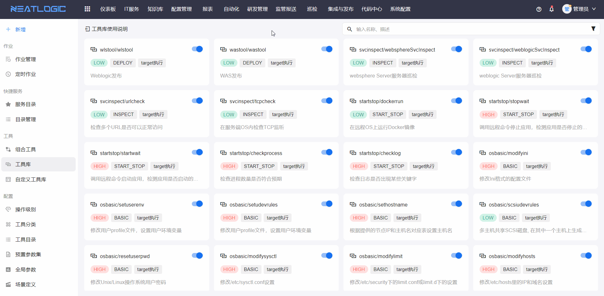

# 工具库
工具库页面是管理系统自带的工具，工具不可编辑，可通过注册来接口。

### 权限说明
相关权限：“工具、自定义工具维护权限”、“工具、自定义工具管理权限”、“工具、自定义工具查看权限”
* 当用户拥有“工具、自定义工具维护权限”时，可查看、编辑、复制和测试工具。
* 当用户仅有“工具、自定义工具管理权限”时，可进行工具的所有操作。
* 当用户仅有“工具、自定义工具查看权限”时，可查看工具详情。

### 工具详情
点击工具卡片，支持查看工具详情，包括查看工具描述、输入和输出参数的说明、工具基本信息和关联组合工具。

### 测试工具
通过发起测试作业来测试工具脚本，若测试的工具要远程执行，执行目标范围是带“test”标签的资产对象，详情参考[资产清单](../../配置管理/资源中心/资产清单.md)。

点击工具上的测试按钮，发起测试作业

### 发布为组合工具
组合工具只需要一个脚本时，可以通过一键将工具发布为组合工具，这种情况下新增的组合工具不能编辑，只允许发起作业。
