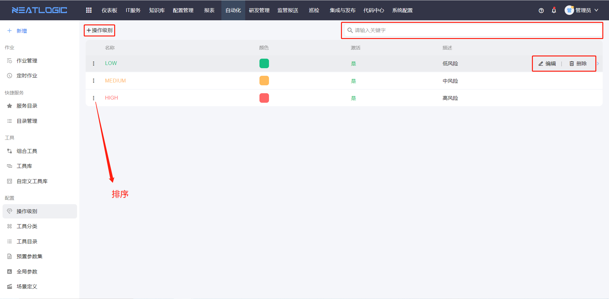
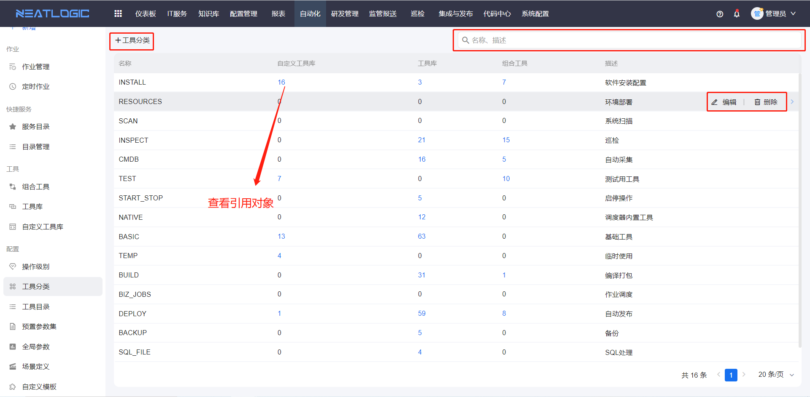
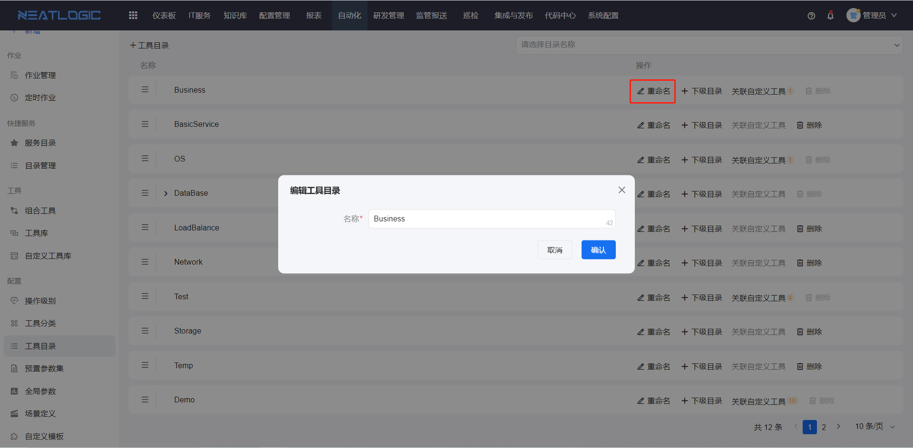
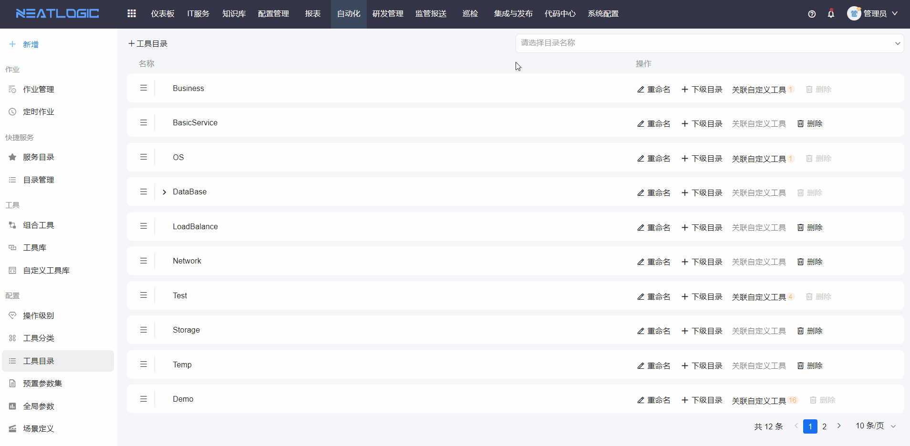
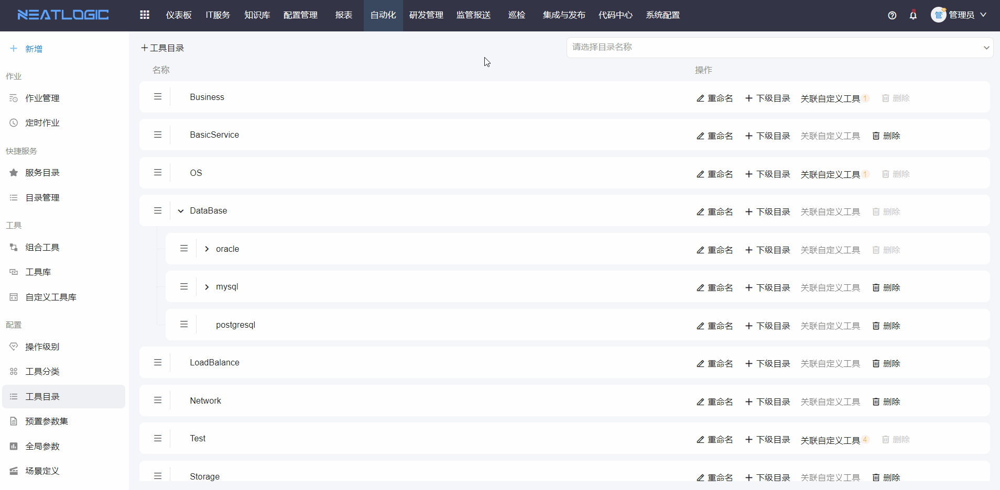
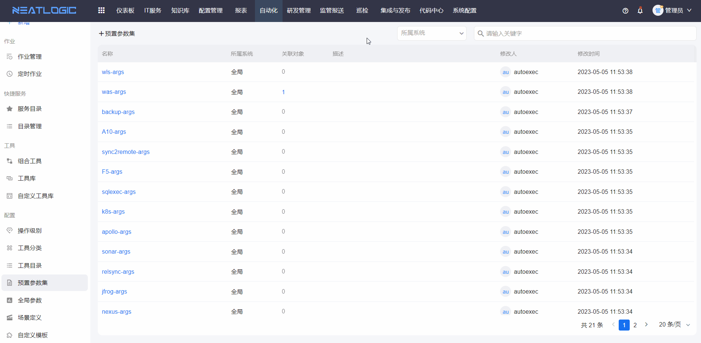
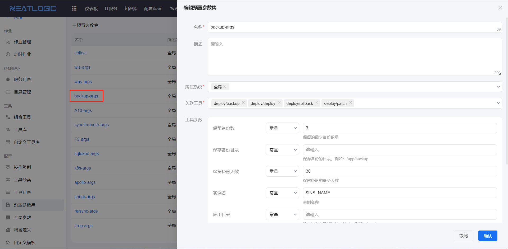
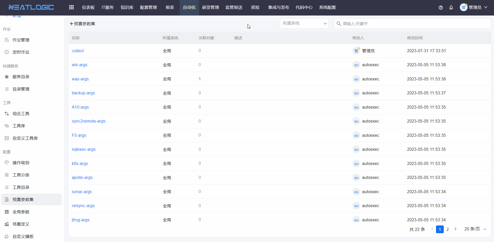
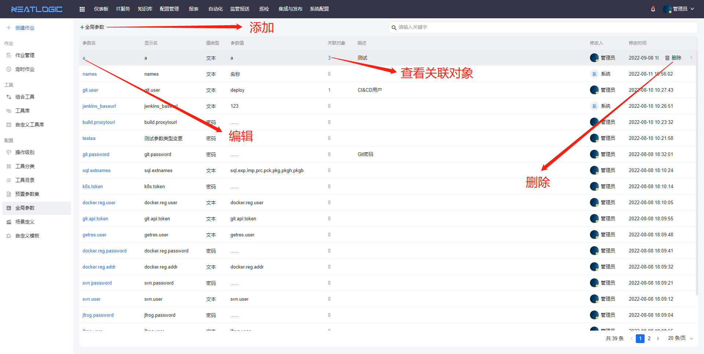

# 自动化基础配置

自动化的基础配置包括操作级别、工具分类、工具目录、预置参数集、全局参数、场景定义和自定义模板。相关权限：自动化管理权限

## 操作级别
操作级别应用于工具和组合工具的基本信息中，管理页面包括添加、编辑、删除、搜索和排序功能。

## 工具分类
工具分类应用于工具的基本信息，管理页面包括添加、编辑、删除、搜索和查看引用功能。

## 工具目录
工具目录应用于工具的基本信息，管理页添加、重命名、删除、查看关联工具、搜索、修改排序和层级等功能。

* 添加目录

* 重命名

* 删除，只能删除未被引用的目录

* 修改排序和层级

## 预置参数集
预置参数集通过引用一个或多个工具脚本，预设参数值保存为参数集合，组合工具阶段添加工具时，可启用关联预置参数集，并引用预置参数集为工具参数映射对象。
* 添加
  
* 编辑
  
* 复制
  
* 查看引用
  

## 全局参数
全局参数应用于组合工具的工具参数映射。

## 场景定义
场景可应用于自动化-组合工具场景和集成和发布-应用配置-流水线场景。

## 自定义模板
工具和自定义工具可引用自定义模板，执行作业时，执行引用自定义模板的工具时，会按模板配置回显模板内容。
