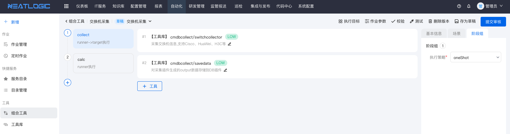
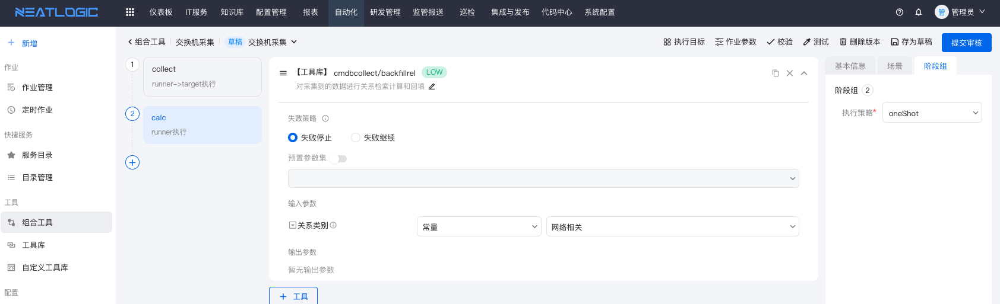

# 网络设备采集
网络设备采集主要包括交换机、路由器、负载均衡设备资产设备数据采集，同时计算设备之间的调用关系。
<br>
<b>说明：</b>建议不同的资产对象设置统一的只读团体字，同时支持smnpv2协议（snmpv3情况较多需要二次开发支持）。
## 支持设备列表
<table style="width:100%">
<thead>
    <tr>
        <td>设备类型</td>
        <td>设备型号</td>
        <td>支持协议</td>
        <td>推荐协议</td>
        <td>采集概要描述</td>
    </tr>
</thead>
<tbody>
    <tr>
        <td rowspan="5">网络设备</td>
        <td>Cisco</td>
        <td>snmpv2/v3</td>
        <td>snmpv2</td>
        <td>设备基础信息、端口、状态、流量、cdp等</td>
    </tr>
    <tr>
        <td>H3C</td>
        <td>snmpv2/v3</td>
        <td>snmpv2</td>
        <td>设备基础信息、端口、状态、流量、lldp等</td>
    </tr>
    <tr>
        <td>Juniper</td>
        <td>snmpv2/v3</td>
        <td>snmpv2</td>
        <td>设备基础信息、端口、状态、流量、lldp等</td>
    </tr>
    <tr>
        <td>华为</td>
        <td>snmpv2/v3</td>
        <td>snmpv2</td>
        <td>设备基础信息、端口、状态、流量、lldp等</td>
    </tr>
    <tr>
        <td>锐捷</td>
        <td>snmpv2/v3</td>
        <td>snmpv2</td>
        <td>设备基础信息、端口、状态、流量、lldp等</td>
    </tr>
    <tr>
       <td rowspan="2">负载均衡</td>
        <td>A10</td>
        <td>snmpv2/v3</td>
        <td>snmpv2</td>
        <td>设备基础信息、VS、Pool、Member等</td>
    </tr>
    <tr>
        <td>F5</td>
        <td>snmpv2/v3</td>
        <td>snmpv2</td>
        <td>设备基础信息、VS、Pool、Member等</td>
    </tr>
    <tr>
        <td rowspan="5">防火墙</td>
        <td>华为</td>
        <td>snmpv2/v3</td>
        <td>snmpv2</td>
        <td>设备基础信息等</td>
    </tr>
    <tr>
        <td>CheckPoint</td>
        <td>snmpv2/v3</td>
        <td>snmpv2</td>
        <td>设备基础信息等</td>
    </tr>
    <tr>
        <td>Juniper</td>
        <td>snmpv2/v3</td>
        <td>snmpv2</td>
        <td>设备基础信息等</td>
    </tr>
    <tr>
        <td>HillStone</td>
        <td>snmpv2/v3</td>
        <td>snmpv2</td>
        <td>设备基础信息等</td>
    </tr>
    <tr>
        <td>TopSec</td>
        <td>snmpv2/v3</td>
        <td>snmpv2</td>
        <td>设备基础信息等</td>
    </tr>
</tbody>
</table>


# 编排工具和插件
网络设备类采集以snmp协议为主，待采集的设备必须开启snmp服务和设置采集执行节点IP白名单策略。
采集插件分为基础采集插件和特定类型厂商采集插件，基础采集插件定义公共的OID，各类厂商插件继承公共采集插件可以重载和重写基础采集采集的OID，
针对同一个属性采集数据，支持定义多个OID。

<b>说明：</b>
* 此处只枚举一个案例，更多同类插件和使用参见[工具库](../../自动化/工具库/工具库.md)的插件帮助和说明。
* 网络设备采集和巡检在[资产中心](../资源中心/资产清单.md)中不同的网络设备资产配置统一用户，如inspect，简化组合工具的入参配置。

## 网络设备类组合工具示例
采集插件和把采集的数据归档到DB

计算采集数据关系


## 采集插件参数详解


# 常见FAQ

## 网络设备采集找不到命令
```shell
# 安装工具
yum -y install net-snmp-utils
yum -y install net-snmp

# 测试
snmpwalk -h
```

## 团体字校验

```shell
# 安装工具
# 格式
snmpwalk -v snmp版本 -c 只读团体字  设备IP OID
# 示例
snmpwalk -v 2c -c public 192.168.0.1 system
```


