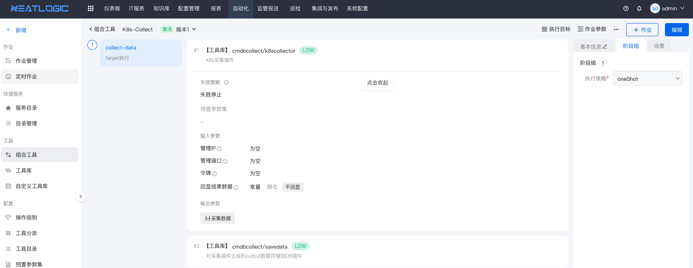
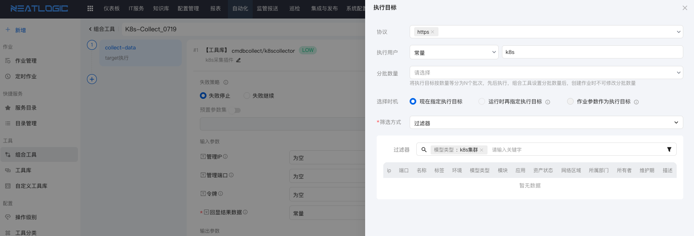

# 容器平台采集
目前主要是针对k8s容器管理平台的数据采集，主体包括：deployments、ReplicaSets、Pods、nodes等数据采集，同时也是对[操作系统采集](2.操作系统采集.md)的数据进行关系计算和数据补充。

## 支持容器平台列表
<table style="width:100%">
<thead>
    <tr>
        <td>类型</td>
        <td>协议</td>
        <td>必要条件</td>
        <td>采集概要描述</td>
    </tr>
</thead>
<tbody>
    <tr>
        <td>k8s</td>
        <td>https</td>
        <td>提供管理账号/密码</td>
        <td>采集基础信息、数据中心、集群、物理机、存储等</td>
    </tr>
</tbody>
</table>

# 编排工具和插件
k8s采集插件是调用k8s的API进行数据采集和关系计算。

## 采集组合工具示例
虚拟化采集插件和把采集的数据归档到DB

## 采集目标和节点范围
容器采集以配置模型内的容器数据为执行节点，插件执行时自动获取节点的IP、端口、以及用户和密码。

## 采集数据同步到配置管理
<b>关于配置映射和策略执行:</b> 详细参考[同步数据配置映射](0.同步数据配置映射.md)。

