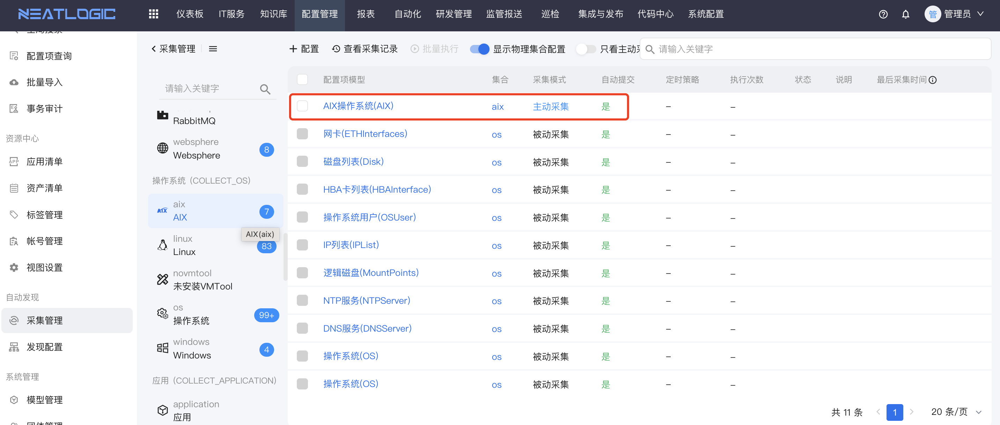
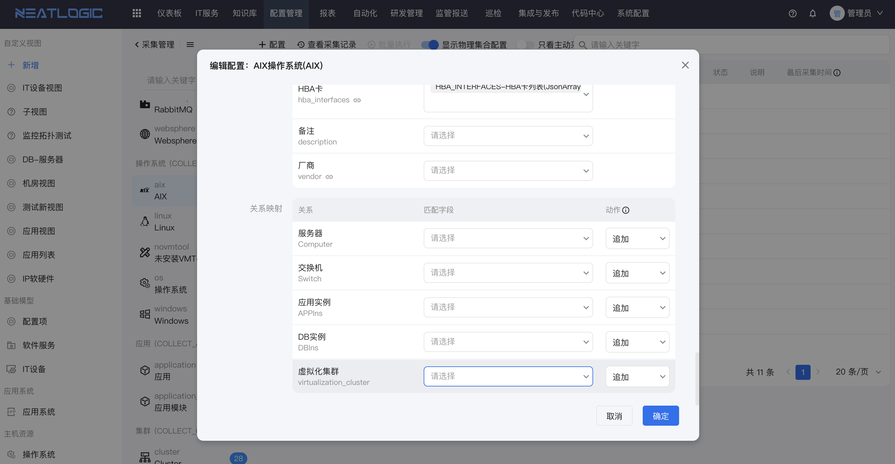
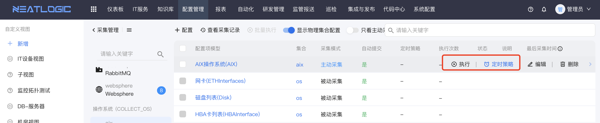
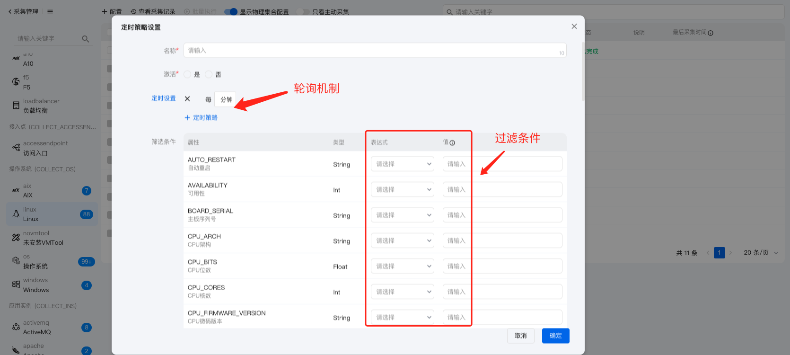
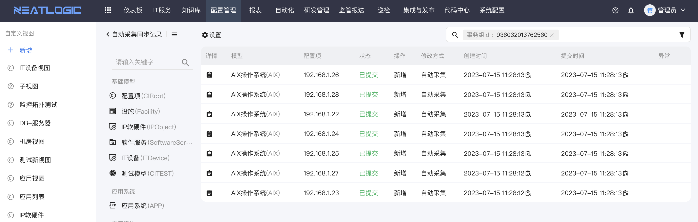

# 同步数据映射配置
把采集到MongoDB内的数据与系统配置管理模块内定义的管理模型进行字段、关系映射和配置。
当人工执行或定时发起映射配置策略时，根据配置策略把采集的数据抽取转换到配置管理内。
 
<b>说明：</b>
* 同步策略配置并不是一成不变，是随着模型管理属性、关系调整而调整。
* 同步策略配置可以在父模型定义也可以在子模型定义，从维护成本上建议被动以父级为准。
* 配置模块的管理和使用详细参见[模型管理](../配置模型管理/配置模型.md)。

## 同步数据逻辑
待同步数据的管理配置模型，引用模型关系对端管理配置模型可能是父模型，而真实采集数据有可能是各个不同的子模型，
因此需要做如下处理：
* 1、通过采集数据内包含关系(jsonArray数据)成员中的_OBJ_TYPE找到相应的主动采集配置模型（已经规定一个集合只能关联一个主动采集配置模型）。
* 2、如果找到目标模型，则检查找到的模型是否属于关系对端模型的子模型（子模型列表包括自己）。
* 3、如果2成立，则检查关系对端模型（可能是父模型）是否配置了当前集合的被动采集配置。
* 4、如果有3成立，则把采集配置的父模型id切换成第一步中真正的子模型id。
* 5、把修改后的映射配置传下去继续下一步数据同步操作。
* 6、以上任意一步不满足或找不到，则这部分数据不再同步。
* 7、当同步策略执行成功后，下一次同步数据时间是以上一次成功的时间作为同步数据的起点（同步策略编辑重新保存后数据起点时间重置，再次执行第一次全量）

## 同步数据方式
* 人工执行 --适用于配置测试验证。
* 定时执行 --适用于定期更新配置数据。

## 同步数据模式 
* 主动采集：一个集合只能关联一个主动采集模型。
* 被动采集：一个集合可以关联多个被动采集模型，在主动采集模型采集过程中，如果当前模型被主动采集模型引用了，当前模型才会写入数据。

## 同步数据策略
* 提交事务：只会保存为配置项事务，等待人工提交，在配置项查询列表内不可见。
* 自动提交：配置项数据自动提交，在配置项查询列表内可见。

## 同步示例说明
以操作系统为例，大致介绍同步策略的配置、执行、以及数据审计。
### 映射配置
蓝色图圆内表示已采集到的数据数量。

查看已采集到的数据入口

查看类型采集明细数据

#### 父模型映射配置
父模型定义基础数据同步策略，如网卡、逻辑磁盘、用户等父模型上的基础依赖关系导入，配置均为被动采集，
当子模型执行同步时根据配置关系自动找到对应的配置被动策略，执行对应的被动导入配置。

#### 子模型映射配置
子模型默认继承父类映射配置，只需要单独定义自己的主动采集。
 
定义子模型同步策略主入口

同步策略

字段映射

关系映射

### 执行同步策略
人工执行入口

定时执行策略

定时执行策略配置

执行审计

同步记录

配置模型内数据查询，详细参见[配置项查询](../配置项查询/配置项查询.md)
