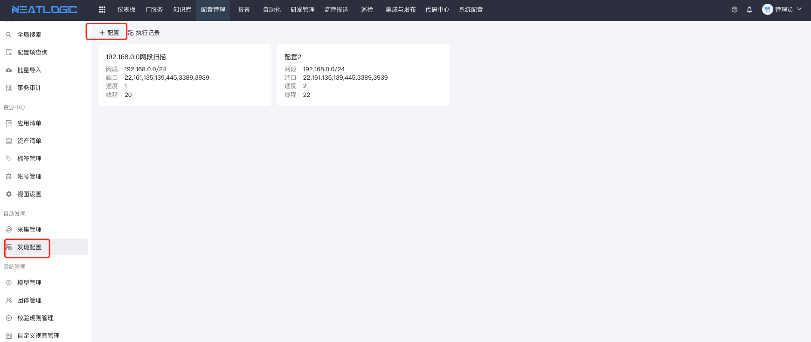
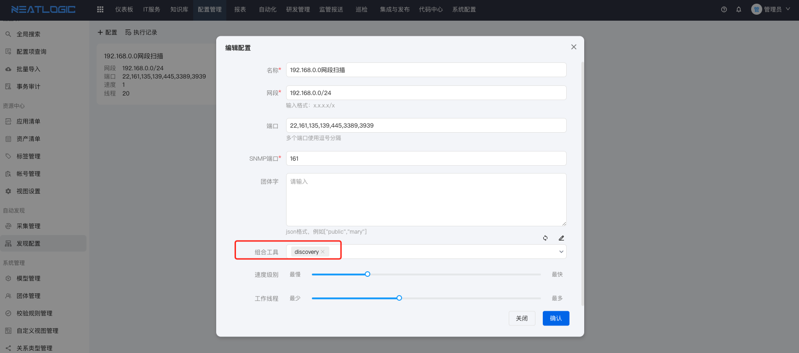
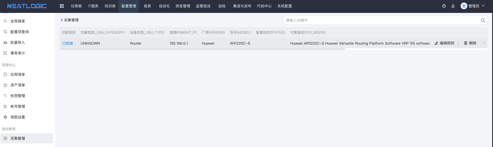

# 自动发现
适用场景：系统新建或新的网段进行资产扫描发现场景，使用[nmap](https://nmap.org/)根据提供的网段，对网段内的资产进行网段扫描，根据枚举常用服务端口、团体字以及导入的特征库内容进行资产对象识别，并自动归并到对应的采集数据列表内。

<b>说明:</b> 网段扫描只匹配对应的IP、端口是什么服务、大概是哪一类设备、厂商，并不涉及具体的详细指标采集，更多详细目标对象指标请参考[数据采集](../数据采集/1.数据采集和巡检.md)帮助文档。

## 特征库
特征库管理资产特征列表，包括：资产的OID、匹配规则、对象分类、对象名、厂商、型号，网段扫描匹配具体对象的oid归档到对应的对象分类目录，如资产对象不在资产特征库内统一归档到"未知设备"内。

* 特征库支持用户前端界面人工维护和从"未知设备"归到已知对象分类内。
* 支持特征库后台批量导入和导出

### 批量导入特征库
在neatlogic-runner执行节点上，后台批量导入和导出特征库
```shell
# 导入特征库
python3 /app/autoexec/discovery/dislibtool --action savetodb
# 导出特征库
python3 /app/autoexec/discovery/dislibtool --action exportfile --savepath /tmp/dict
```

### 特征库管理入口
在线管理和查看存量的特征库信息。


## 网段扫描配置
网段扫描配置入口和扫描频率、速度以及必要的组合工具。



### 编排工具
网段扫描对应的编排工具有以下特点：
* 编排工具必须是带有网段扫描插件阶段或步骤。
* 编排作业入参参数是已知的固定的变量。
* 编排阶段和后续处理环节可按实际情况自由组合。

编排工具内截图示例


### 运行网段扫描


### 未知设备列表
管理入口

未知设备清单

人工标记资产特征，并自动导入到特征库


### 同步网段扫描数据到配置管理项
网段扫描的数据存储到后台的db内，同步发现数据到实际的管理模型内，详细参考帮助文档[同步配置项数据](../数据采集/0.同步数据配置映射.md)。